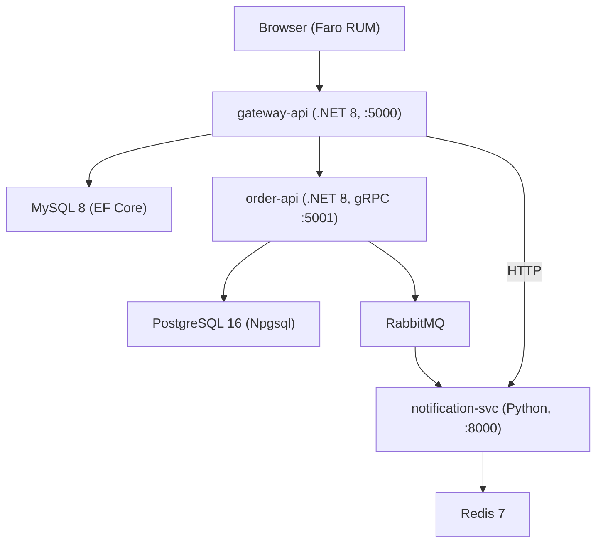
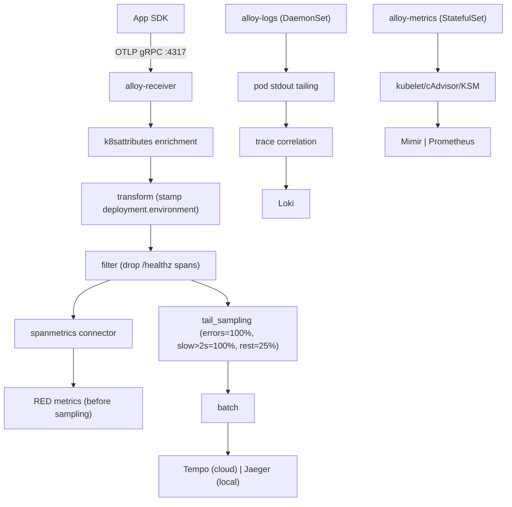
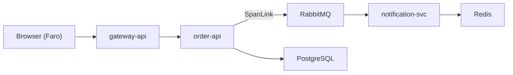

# SignalForge — OTel Microservices Validation Lab

> End-to-end OpenTelemetry instrumentation lab across .NET 8, Python/FastAPI, and Angular 17,
> deployed on k3d with Helm-managed Grafana Alloy agents as the collector stack.

**What it validates:** traces (5-hop cross-language), span metrics, exemplars, async trace
propagation via RabbitMQ, frontend RUM with Faro, log-to-trace correlation via Loki, and tail-based
sampling.

Work outside-in, purpose → design → implementation:

| Step | File                           | Why                                                                                  |
| ---- | ------------------------------ | ------------------------------------------------------------------------------------ |
| 1    | https://shipsolid.github.io/notes/projects/app-signal-forge/spec/ | The "what" — all services, patterns to validate, the validation checklist at §11     |
| 2    | https://shipsolid.github.io/notes/projects/app-signal-forge/architecture/overview/ | Topology diagram, signal flow per type, port map                                     |
| 3    | https://shipsolid.github.io/notes/projects/app-signal-forge/architecture/adrs/ | 10 ADRs that explain the non-obvious "why" (most important before touching anything) |
| 4    | conf.yml                       | The single control file — every knob deploy-local.sh reads                           |
| 5    | https://shipsolid.github.io/notes/projects/app-signal-forge/observability/pipeline/ | Alloy River config stage-by-stage; the heart of the lab                              |
| 6    | src/order-api/                 | Richest service: gRPC, Outbox, RabbitMQ publish with W3C traceparent injection       |
| 7    | src/notification-svc/          | Python consumer, SpanLink, cross-language async propagation                          |
| 8    | src/gateway-api/               | .NET BFF, exemplars, UpDownCounter, fan-out pattern                                  |
| 9    | src/frontend/                  | Angular + Faro RUM — browser-to-backend trace propagation                            |
| 10   | k8s/                           | Manifests: infra/ → datastores/ → app/ → monitoring/                                 |

For ops understanding: deploy-local.sh → scripts/debug.sh → .github/workflows/ci.yml.

---

## Purpose

SignalForge exists to provide a portable, reproducible environment for validating OpenTelemetry
instrumentation patterns across multiple runtimes and communication protocols. It is not a toy: it
models production-grade concerns — tail-based sampling, async context propagation, exemplar
plumbing, SLO recording rules, and supply-chain controls — in a self-contained k3d cluster that any
engineer can spin up on a laptop.

The lab is consumed by engineers who need to test instrumentation changes before they land on
production clusters, and by anyone building familiarity with the Grafana Alloy / k8s-monitoring Helm
chart. It is a reference implementation, not a template — copy patterns from it, but do not fork it
as application scaffolding.

It lives here rather than inside the main monorepo because it has its own `k3d` cluster lifecycle,
separate image builds, and Grafana Cloud credentials that are scoped to a dev stack and should not
bleed into production pipelines.

---

## Architecture



All services push OTLP to `alloy-receiver` (Helm-managed DaemonSet, `monitoring` namespace):



The single most important configuration knob is `monitoring.mode` in [conf.yml](conf.yml):

| `monitoring.mode` | Alloy destinations                              | In-cluster backends                            |
| ----------------- | ----------------------------------------------- | ---------------------------------------------- |
| `cloud` (default) | Grafana Cloud Tempo / Mimir / Loki              | none                                           |
| `local`           | In-cluster Jaeger / Prometheus / Loki / Grafana | Jaeger :16686, Prometheus :9090, Grafana :3000 |

The two modes are mutually exclusive — there is no dual-export. Any doc saying otherwise is stale.

In **cloud mode**, the chart's Alloy agents are the entire pipeline — no in-cluster Jaeger /
Prometheus / Loki / Grafana are deployed. In **local mode**, a parallel bespoke Alloy DaemonSet in
[k8s/monitoring/grafana/](k8s/monitoring/grafana/) exports to in-cluster backends; the Helm chart is
still installed and still serves as the app OTLP ingress, but its destinations point at the
in-cluster services.

`alloy-logs` tails pod stdout/stderr with trace-id correlation. `alloy-metrics` scrapes cluster
infra metrics. See [docs/observability/pipeline.md](https://shipsolid.github.io/notes/projects/app-signal-forge/observability/pipeline/) for the full
signal flow and [docs/OTEL-PATTERNS.md](https://shipsolid.github.io/notes/projects/app-signal-forge/otel-patterns/) for per-runtime instrumentation
choices.

### Alloy roles (Helm release, `monitoring` namespace)

| Alloy role        | Kind        | Responsibility                     | Destination (cloud) | Destination (local)      |
| ----------------- | ----------- | ---------------------------------- | ------------------- | ------------------------ |
| `alloy-metrics`   | StatefulSet | Scrapes cluster infra metrics      | Grafana Cloud Mimir | in-cluster Prometheus    |
| `alloy-singleton` | Deployment  | Cluster events, kube-state-metrics | Cloud Mimir + Loki  | in-cluster Prom + Loki   |
| `alloy-logs`      | DaemonSet   | Pod + node log tailing             | Grafana Cloud Loki  | in-cluster Loki          |
| `alloy-receiver`  | DaemonSet   | OTLP push receiver (app telemetry) | Cloud Tempo + Mimir | in-cluster Jaeger + Prom |
| `alloy-profiles`  | DaemonSet   | Disabled — no Pyroscope            | —                   | —                        |

Values: [values-local.yaml](k8s/monitoring/grafana-helm/values-local.yaml) or
[values-cloud.yaml.tmpl](k8s/monitoring/grafana-helm/values-cloud.yaml.tmpl) (rendered at deploy
time from conf.yml).

### Trace propagation

A single "Create Order" click produces a 5-hop trace across three runtimes. The RabbitMQ hop uses a
SpanLink (not parent-child) because message processing is async; both spans share the same `traceId`
and appear as a dashed arrow in Jaeger.



See [docs/architecture/overview.md](https://shipsolid.github.io/notes/projects/app-signal-forge/architecture/overview/) for the full signal flow
diagrams.

---

## Ownership Boundary

| Dimension       | Detail                                                    |
| --------------- | --------------------------------------------------------- |
| Team            | Personal lab / portfolio (Amit Singh)                     |
| Primary owner   | Amit Singh — see GitHub profile / repo issues for contact |
| On-call         | None — lab environment, no production SLA                 |
| Escalation path | GitHub issues on this repo                                |

This component does not own anything in shared infrastructure. It creates and manages its own k3d
cluster (`otel-lab`) and its own Kubernetes namespace (`otel-lab`). The only external dependency
with shared ownership is the Grafana Cloud stack (`example-org.grafana.net`) and the Azure Key Vault
(`example-org-prd-kv`) — those are the parent organization's platform resources and are consumed
read-only by this lab.

The lab does not own the Grafana Cloud instance, the AKV vault, or any network resources outside the
k3d cluster. Changes to Grafana Cloud credentials are fetched from AKV; they are never committed as
live values.

---

## Deployment Model

| Environment            | Method              | Trigger                       | Target                                |
| ---------------------- | ------------------- | ----------------------------- | ------------------------------------- |
| local (lab)            | `./deploy-local.sh` | manual                        | k3d cluster `otel-lab` on localhost   |
| CI (build + test only) | GitHub Actions      | push / PR / workflow_dispatch | no cluster — tests + image scans only |

There is no staging or production deployment of this lab. The k3d cluster is ephemeral and local.

```bash
# Full deploy: cluster + Docker builds + manifests + Helm (5-15 min cold)
./deploy-local.sh

# Subsequent iteration, manifests only (<1 min)
./deploy-local.sh --skip-cluster --skip-build

# Local mode: also install the Helm monitoring chart
./deploy-local.sh --with-helm

# Rollback: re-run the deploy — it is idempotent
./deploy-local.sh --skip-cluster --skip-build

# Teardown: delete the k3d cluster entirely
./deploy-local.sh --teardown
```

### Two deployment tools — do not mix them

| Tool                              | Config source               | Credentials                                                         | Use                                                    |
| --------------------------------- | --------------------------- | ------------------------------------------------------------------- | ------------------------------------------------------ |
| **`./deploy-local.sh`** (primary) | [conf.yml](conf.yml)        | `./scripts/fetch-grafana-cloud-conf-from-akv.sh` → updates conf.yml | Recommended for all new work                           |
| `Makefile` (legacy)               | `.env` + hand-edited values | `make secrets-fetch-akv` → writes Secret directly                   | Reference only — prefer `deploy-local.sh` for new work |

`make secrets-fetch-akv` used to write a stale `GRAFANA_CLOUD_MIMIR_ENDPOINT` (`/api/v1/otlp`) that
didn't match the chart's expected `/api/prom/push` — fixed, it now writes the correct format. Still
secondary/legacy; the script-based flow remains the recommended path.

### Credentials (Grafana Cloud, cloud mode only)

```bash
# Preview credential diff against AKV
./scripts/fetch-grafana-cloud-conf-from-akv.sh --dry-run

# Pull and write into conf.yml (creates conf.yml.bak)
./scripts/fetch-grafana-cloud-conf-from-akv.sh

# Re-deploy with new credentials (no cluster rebuild)
./deploy-local.sh --skip-cluster --skip-build
```

Auth: `az login` first, or export `ARM_CLIENT_ID` + `ARM_CLIENT_SECRET` in the shell. See
[docs/deployment/grafana-cloud.md](https://shipsolid.github.io/notes/projects/app-signal-forge/deployment/grafana-cloud/) for the full credential model
and rotation procedure.

### Helm upgrade invocation (used by deploy-local.sh, cloud mode)

```bash
helm upgrade --install grafana-k8s grafana/k8s-monitoring \
  --version 3.8.4 \
  --namespace monitoring --create-namespace \
  --values k8s/monitoring/grafana-helm/values-cloud.yaml \
  --wait --timeout 5m
```

The values file is rendered from
[values-cloud.yaml.tmpl](k8s/monitoring/grafana-helm/values-cloud.yaml.tmpl) using credentials from
`conf.yml`. Do not edit the rendered file — edit the template or `conf.yml`.

### Kustomize overlays

```bash
kubectl kustomize k8s/base                  # render full stack
kubectl kustomize k8s/overlays/prod         # render prod overlay (replicas=6, required anti-affinity)
kubectl apply -k k8s/overlays/dev           # apply dev overlay
```

---

## Dependencies

| Dependency                                      | Type     | Required                          | Notes                                                                                                                                |
| ----------------------------------------------- | -------- | --------------------------------- | ------------------------------------------------------------------------------------------------------------------------------------ |
| Docker 24+                                      | tooling  | yes                               | Image builds + k3d node images                                                                                                       |
| k3d v5+                                         | tooling  | yes                               | Local Kubernetes cluster                                                                                                             |
| kubectl v1.28+                                  | tooling  | yes                               | Manifest apply                                                                                                                       |
| helm v3.14+                                     | tooling  | yes                               | `grafana/k8s-monitoring` chart install                                                                                               |
| Python 3.9+                                     | tooling  | yes                               | `deploy-local.sh` uses Python to parse conf.yml, render templates, run scripts                                                       |
| Azure CLI 2.50+                                 | tooling  | cloud mode only                   | `./scripts/fetch-grafana-cloud-conf-from-akv.sh` — not needed if credentials are already in conf.yml                                 |
| Grafana Cloud stack (`example-org.grafana.net`) | upstream | cloud mode only                   | Tempo, Mimir, Loki endpoints; credentials in AKV                                                                                     |
| Azure Key Vault (`example-org-prd-kv`)          | upstream | cloud mode only                   | Stores Grafana Cloud API key + endpoint URLs                                                                                         |
| Zscaler CA (`zcert.crt`)                        | infra    | corporate networks only           | Staged into Docker builds; empty placeholder used on non-corporate machines — Dockerfiles' `COPY zcert.crt` will not fail without it |
| `grafana/k8s-monitoring` Helm chart v3.8.4      | infra    | cloud mode (auto-installed)       | Pulled at deploy time; no local vendored copy                                                                                        |
| cert-manager v1.18.2 (jetstack chart)           | infra    | when `security.tls.enabled: true` | Installs into `cert-manager` namespace; skip by setting `security.tls.enabled: false`                                                |

**Version pins that must not drift:**

- `grafana/k8s-monitoring` is pinned to `3.8.4` in `conf.yml`. Upgrading requires re-validating all
  Alloy role names and values schema — the chart has breaking changes between minor versions.
- `.NET 8.0` in Dockerfiles — do not bump to .NET 9 without re-testing the OTel SDK compatibility
  matrix.

---

## Operational Model

**Health check:**

```bash
# Mode-aware triage: pod state, Alloy exporter counters, remote-write probe
./scripts/debug.sh

# Verify all service endpoints are responding
make validate
```

**Logs:**

| Service                 | How to access                                                                                |
| ----------------------- | -------------------------------------------------------------------------------------------- |
| Any app pod             | `kubectl -n otel-lab logs deploy/<service-name>`                                             |
| Alloy receiver          | `kubectl -n monitoring logs daemonset/grafana-k8s-alloy-receiver`                            |
| Loki query (local mode) | `{namespace="otel-lab"}` in Grafana Explore or via Loki API on `:3100`                       |
| Loki query (cloud mode) | `{namespace="otel-lab", deployment_environment="signal-forge-dev"}` in Grafana Cloud Explore |

All services write structured JSON logs. Alloy's `alloy-logs` DaemonSet extracts `TraceId`/`SpanId`
fields and attaches them as Loki structured metadata, enabling "Logs for this span" in Grafana.

**Metrics / dashboards:**

- Span-derived RED metrics: `traces_spanmetrics_calls_total{service_name}`,
  `traces_spanmetrics_duration_milliseconds_bucket{service_name}`
- Cluster infra: standard kubelet/cAdvisor/KSM metrics scraped by `alloy-metrics`
- Alloy pipeline UI: `kubectl -n monitoring port-forward svc/grafana-k8s-alloy-receiver 12345` →
  `http://localhost:12345`

**Alerts:**

SLO rules live in [k8s/monitoring/slo-rules.yaml](k8s/monitoring/slo-rules.yaml) (disabled by
default — set `observability.slo_rules.enabled: true` in conf.yml and ensure the
`prometheusrules.monitoring.coreos.com` CRD is present).

| Alert                              | Severity | Trigger                                           |
| ---------------------------------- | -------- | ------------------------------------------------- |
| `SignalForgeAvailabilityFastBurn`  | page     | error_ratio > 7.2% in 5m AND 30m windows          |
| `SignalForgeAvailabilitySlowBurn`  | ticket   | error_ratio > 3% in 30m AND 6h windows            |
| `SignalForgeGatewayLatencyHigh`    | ticket   | gateway-api p99 > 500ms for 10m                   |
| `SignalForgeDownstreamLatencyHigh` | ticket   | order-api or notification-svc p99 > 300ms for 10m |
| `AlloyReceiverDown`                | page     | `up == 0` for alloy-receiver for 5m               |
| `DatastoreDown`                    | page     | any datastore pod not Ready for 3m                |

**Runbook:** [docs/operations/runbooks.md](https://shipsolid.github.io/notes/projects/app-signal-forge/operations/runbooks/) — covers no-traces, missing
metrics, async propagation failures, log correlation gaps, exemplar troubleshooting, Grafana Cloud
export errors.

---

## Quick Start

```bash
# Full deploy: cluster + builds + apply + Helm
./deploy-local.sh

# Subsequent iteration (manifests only):
./deploy-local.sh --skip-cluster --skip-build

# Triage after a deploy:
./scripts/debug.sh

# Tear down:
./deploy-local.sh --teardown
```

First run: ~5-15 minutes (4 Docker builds + k3d create + cert-manager + Helm rollout).
`--skip-cluster --skip-build` runs complete in <1 min.

### Prerequisites

| Tool      | Min version | Install                                                                            |
| --------- | ----------- | ---------------------------------------------------------------------------------- |
| Docker    | 24+         | [docs.docker.com](https://docs.docker.com/get-docker/)                             |
| k3d       | v5+         | `curl -s https://raw.githubusercontent.com/k3d-io/k3d/main/install.sh \| bash`     |
| kubectl   | v1.28+      | [kubernetes.io/docs](https://kubernetes.io/docs/tasks/tools/)                      |
| helm      | v3.14+      | `curl https://raw.githubusercontent.com/helm/helm/main/scripts/get-helm-3 \| bash` |
| Azure CLI | 2.50+       | needed only for Grafana Cloud credential fetch via AKV                             |
| Python 3  | 3.9+        | system package — drives deploy-local.sh                                            |

### Endpoints (after deploy)

**Always available:**

| URL                               | Service                   | Notes                                                      |
| --------------------------------- | ------------------------- | ---------------------------------------------------------- |
| `http://localhost:8080`           | Angular SPA + Gateway API | `/api/*` → gateway, `/` → frontend                         |
| `https://signal-forge.local:8443` | Same, TLS                 | Requires `security.tls.enabled: true` + `/etc/hosts` entry |
| `http://localhost:15672`          | RabbitMQ Management       | guest/guest                                                |

**Local mode only:**

| URL                      | Service    | Credentials |
| ------------------------ | ---------- | ----------- |
| `http://localhost:16686` | Jaeger UI  | —           |
| `http://localhost:3000`  | Grafana    | admin/admin |
| `http://localhost:9090`  | Prometheus | —           |

**Cloud mode only:** your Grafana Cloud stack (e.g. `https://example-org.grafana.net`) — Explore for
Tempo/Mimir/Loki.

---

## Repository Layout

```text
signal-forge/
├── src/                        # Application source
│   ├── gateway-api/            # .NET 8 Minimal API — BFF, MySQL, gRPC client
│   ├── order-api/              # .NET 8 gRPC — PostgreSQL, RabbitMQ publisher
│   ├── notification-svc/       # Python FastAPI — RabbitMQ consumer, Redis
│   ├── frontend/               # Angular 17 SPA — Faro RUM, nginx
│   └── proto/                  # Shared gRPC protobuf definitions
│
├── k8s/
│   ├── base/                   # Kustomize base (ArgoCD / Flux entrypoint)
│   ├── overlays/{dev,staging,prod}/
│   ├── infra/                  # namespace, secrets, PDB, NetworkPolicies, ingress, cert-manager issuer
│   ├── app/                    # Application Deployments + Services
│   ├── datastores/             # MySQL, PostgreSQL, Redis, RabbitMQ
│   ├── monitoring/
│   │   ├── slo-rules.yaml      #   PrometheusRule (SLOs + burn-rate alerts)
│   │   ├── grafana/            #   Bespoke Alloy DaemonSet (local mode only)
│   │   ├── grafana-helm/       #   grafana/k8s-monitoring Helm values
│   │   └── local/              #   In-cluster backends: Jaeger, Prometheus, Loki, Grafana
│   └── loadtest/               # k6 load test Job
│
├── conf.yml                    # Single source of truth for all deploy-local.sh knobs
├── deploy-local.sh             # Idempotent local deploy script
├── scripts/                    # AKV fetch, debug, smoke tests
├── Makefile                    # Legacy lifecycle targets
└── docs/
    ├── spec.md                 # OTel validation test scenarios and checklist
    ├── OTEL-PATTERNS.md        # Instrumentation patterns per runtime
    ├── architecture/           # System topology, decisions
    ├── observability/          # SLOs, pipeline, sampling, exemplars, correlation
    ├── infrastructure/         # Hardening, Kustomize, datastores, HA paths
    └── operations/             # Networking, runbooks, supply chain, reliability
```

Deploy order within `k8s/`: `infra/` → `app-env ConfigMap` → `grafana-cloud-secrets` → cert-manager
→ `datastores/` → `monitoring/` → `app/` → post (ingress). Driven by `deploy-local.sh` with
context-guard and NodePort drift-check.

---

## Services

| Service          | Stack              | Port (cluster)              | DB         | Role                            |
| ---------------- | ------------------ | --------------------------- | ---------- | ------------------------------- |
| otel-frontend    | Angular 17 + nginx | 80 (host: 8080 via ingress) | —          | SPA + Faro RUM                  |
| gateway-api      | .NET 8 Minimal API | 5000                        | MySQL      | BFF, gRPC client                |
| order-api        | .NET 8 gRPC        | 5001                        | PostgreSQL | Order CRUD + RabbitMQ publisher |
| notification-svc | Python/FastAPI     | 8000                        | Redis      | RabbitMQ consumer + REST        |

---

## Testing & CI

```bash
# .NET — order-api.Tests requires Docker (Testcontainers starts a real postgres:16.4
# for OutboxRelayWorkerTests)
dotnet test src/order-api.Tests/order-api.Tests.csproj --configuration Release
dotnet test src/gateway-api.Tests/gateway-api.Tests.csproj --configuration Release

# Python
python -m pytest src/notification-svc/tests/ -v --tb=short

# Frontend
cd src/frontend && npm ci --legacy-peer-deps && npx jest --config jest.config.js
```

CI ([.github/workflows/ci.yml](.github/workflows/ci.yml)) runs on `push`/`pull_request` to `main`
and on manual `workflow_dispatch`:

- `.NET` + Python + Angular unit tests
- `pip-audit` + `dotnet list package --vulnerable` for known CVEs
- Trivy image scan (HIGH/CRITICAL, fixed-only) for all four images
- Syft SBOM generation (CycloneDX JSON)
- cosign keyless signing on `main` push (OIDC — no long-lived secrets)

---

## Grafana Cloud Mode

Set `monitoring.mode: cloud` in [conf.yml](conf.yml) and the Helm chart's Alloy agents ship every
signal to Grafana Cloud Tempo / Mimir / Loki. The in-cluster Jaeger / Prometheus / Loki / Grafana
are not deployed — the cloud backends are the only sink.

Credentials live in Azure Key Vault. The fetch script pulls them, writes them into
[conf.yml](conf.yml) in place (preserving comments), and then `./deploy-local.sh` materialises them
into the `grafana-cloud-secrets` Kubernetes Secret that the chart's destinations reference by name.

### Setup

```bash
# Azure auth: either an existing `az login` session, or export ARM_CLIENT_ID +
# ARM_CLIENT_SECRET in your shell (no .env loading).

# AKV coordinates live in conf.yml → monitoring.grafana_cloud.akv.{tenant_id,
#   subscription_id, resource_group, vault_name}. Edit these if they change.

# Pull every Grafana Cloud secret and update conf.yml in place:
./scripts/fetch-grafana-cloud-conf-from-akv.sh             # writes conf.yml + conf.yml.bak
./scripts/fetch-grafana-cloud-conf-from-akv.sh --dry-run   # preview diff only

# Re-apply (no cluster rebuild):
./deploy-local.sh --skip-cluster --skip-build
```

See [docs/deployment/grafana-cloud.md](https://shipsolid.github.io/notes/projects/app-signal-forge/deployment/grafana-cloud/) for the full credential
model and rotation procedure.

### Credentials

Credentials are stored in **Azure Key Vault** (`example-org-prd-kv`) under the
`grafana-example-org-*` secret prefix. The fetch script writes them into [conf.yml](conf.yml) at
`monitoring.grafana_cloud.*`; `deploy-local.sh` materialises them into the `grafana-cloud-secrets`
Kubernetes Secret.

| AKV secret name                                      | conf.yml key                              | Notes                                                                        |
| ---------------------------------------------------- | ----------------------------------------- | ---------------------------------------------------------------------------- |
| `grafana-example-org-alloy-writer-example-org-token` | `monitoring.grafana_cloud.api_key`        | `glc_` access-policy token — scopes: `metrics:write logs:write traces:write` |
| `grafana-example-org-cloud-tempo-endpoint`           | `monitoring.grafana_cloud.tempo.endpoint` | host only — `:443` suffix added by fetch script                              |
| `grafana-example-org-cloud-tempo-username`           | `monitoring.grafana_cloud.tempo.user`     | Tempo instance ID                                                            |
| `grafana-example-org-cloud-mimir-endpoint`           | `monitoring.grafana_cloud.mimir.endpoint` | base URL → `/push` suffix added if missing                                   |
| `grafana-example-org-cloud-mimir-username`           | `monitoring.grafana_cloud.mimir.user`     | Mimir instance ID                                                            |
| `grafana-example-org-cloud-loki-endpoint`            | `monitoring.grafana_cloud.loki.endpoint`  | base URL → `/loki/api/v1/push` suffix added if missing                       |
| `grafana-example-org-cloud-loki-username`            | `monitoring.grafana_cloud.loki.user`      | Loki instance ID                                                             |
| `grafana-example-org-faro-api-endpoint`              | `monitoring.grafana_cloud.faro.endpoint`  | browser Faro collector (runtime env)                                         |
| `grafana-example-org-faro-sourcemap-token`           | `monitoring.grafana_cloud.faro.api_key`   | webpack source-map upload (build arg)                                        |

---

## Production Readiness Controls

For any step beyond local lab, the following controls are already implemented:

- [Container hardening](https://shipsolid.github.io/notes/projects/app-signal-forge/infrastructure/hardening/) — non-root UIDs per image,
  `readOnlyRootFilesystem`, securityContext
- [Kustomize layout](https://shipsolid.github.io/notes/projects/app-signal-forge/infrastructure/kustomize/) — base + overlays for dev/staging/prod
- [Reliability](https://shipsolid.github.io/notes/projects/app-signal-forge/operations/reliability/) — PodDisruptionBudgets, pod anti-affinity, graceful
  shutdown
- [Networking & TLS](https://shipsolid.github.io/notes/projects/app-signal-forge/operations/networking/) — NetworkPolicies, cert-manager, flannel caveat
- [Supply-chain security](https://shipsolid.github.io/notes/projects/app-signal-forge/operations/supply-chain/) — Trivy scan, Syft SBOM, cosign keyless
  signing
- [SLOs & burn-rate alerts](https://shipsolid.github.io/notes/projects/app-signal-forge/observability/slos/) — `PrometheusRule` with multi-window burn
  thresholds
- [Datastore HA migration](https://shipsolid.github.io/notes/projects/app-signal-forge/infrastructure/datastore-ha/) — CloudNativePG / RabbitMQ Operator
  / Redis Sentinel paths

---

## Observability UIs

**Always available** (both modes):

| UI          | URL                                                                                                     | Notes                                              |
| ----------- | ------------------------------------------------------------------------------------------------------- | -------------------------------------------------- |
| Angular SPA | `http://localhost:8080`                                                                                 | Frontend entry point                               |
| RabbitMQ    | `http://localhost:15672`                                                                                | guest / guest — inspect queues and message headers |
| Alloy UI    | `kubectl -n monitoring port-forward svc/grafana-k8s-alloy-receiver 12345` then `http://localhost:12345` | Pipeline graph, component status, debug traces     |

**Only in `monitoring.mode: local`:**

| UI         | URL                      | Notes                       |
| ---------- | ------------------------ | --------------------------- |
| Grafana    | `http://localhost:3000`  | admin / admin               |
| Jaeger     | `http://localhost:16686` | Trace search and waterfall  |
| Prometheus | `http://localhost:9090`  | Metric explorer + exemplars |

**Only in `monitoring.mode: cloud`:** your Grafana Cloud stack's Explore + dashboards (e.g.
`https://example-org.grafana.net/explore`).

---

## Make Targets Reference

`./deploy-local.sh` is the sole deploy path. The Makefile no longer deploys anything — it only
builds images, runs tests, and fetches/applies Grafana Cloud credentials. Its former
`deploy`/`deploy-cloud`/`deploy-local`/`full`/`helm-repo`/`helm-render`/`deploy-helm`/
`deploy-helm-cloud`/`teardown-helm`/`full-helm` targets (a second, parallel Jinja2-based Helm-values
pipeline plus a legacy `kubectl apply -f` flow, both superseded by `deploy-local.sh`) were retired;
`make deploy`/`deploy-cloud`/`deploy-local`/`full` now just print a redirect to `./deploy-local.sh`
and exit non-zero, so old muscle memory fails loudly instead of silently doing the wrong thing.

### Cluster lifecycle

| Target              | Description                           | Equivalent                                                   |
| ------------------- | ------------------------------------- | ------------------------------------------------------------ |
| `make cluster-up`   | Create k3d cluster with port mappings | `./deploy-local.sh` (builds + deploys too)                   |
| `make cluster-down` | Delete k3d cluster                    | `./deploy-local.sh --teardown`                               |
| `make build`        | Build all 4 Docker images locally     | implicit in `./deploy-local.sh`                              |
| `make import`       | Build + import images into k3d        | implicit                                                     |
| `make teardown`     | Delete the `otel-lab` namespace       | use `./deploy-local.sh --teardown` to drop the whole cluster |

### Testing & ops

| Target                                 | Description                                                                             |
| -------------------------------------- | --------------------------------------------------------------------------------------- |
| `make test`                            | Run k6 load test Job (generates realistic traffic)                                      |
| `make validate`                        | Smoke-test all endpoints with curl                                                      |
| `make logs`                            | Stream logs from all app pods                                                           |
| `./scripts/debug.sh`                   | Mode-aware triage — pod state, Alloy exporter counters, remote-write reachability probe |
| `./scripts/smoke-test-conf-updater.sh` | Offline regression test for the conf.yml in-place updater                               |

### Grafana Cloud credentials (Azure Key Vault)

| Path                                                 | Description                                                                                                                                                                                                |
| ---------------------------------------------------- | ---------------------------------------------------------------------------------------------------------------------------------------------------------------------------------------------------------- |
| **`./scripts/fetch-grafana-cloud-conf-from-akv.sh`** | **Preferred.** Pulls AKV secrets, writes them into `conf.yml` in place (preserving comments), supports `--dry-run`. Auth via existing `az login` or shell-exported `ARM_CLIENT_ID/SECRET`.                 |
| `make secrets-fetch-akv`                             | Legacy — writes the K8s Secret directly and also drives its own `helm upgrade`, bypassing `deploy-local.sh`. Kept for the manual-`.env` fallback case; the script-based flow above covers everything else. |
| `make secrets-apply`                                 | Legacy — applies credentials from `.env`.                                                                                                                                                                  |
| `make secrets-show`                                  | Print stored Secret values (API key redacted). Still accurate.                                                                                                                                             |

### Helm monitoring

There's no separate `make *-helm` step anymore — `./deploy-local.sh` handles the Helm install
inline, adding the `grafana` repo itself and rendering
[values-cloud.yaml.tmpl](k8s/monitoring/grafana-helm/values-cloud.yaml.tmpl) directly from
`conf.yml` (see [docs/deployment/helm.md](https://shipsolid.github.io/notes/projects/app-signal-forge/deployment/helm/)). The Jinja2-based render
pipeline this table used to document (`render.py` + `config.yaml.j2`, real prod Grafana Cloud
fingerprints left over from a copy-paste) has been deleted along with the Makefile targets that
drove it.

---

## OTel Validation Checklist

See [docs/spec.md](https://shipsolid.github.io/notes/projects/app-signal-forge/spec/) for the full test scenarios, including:

- Trace propagation (HTTP, gRPC, RabbitMQ async)
- Span metrics (RED) + exemplars
- K8s attribute enrichment via `k8sattributes` processor
- Log-to-trace correlation via Loki structured metadata
- Tail sampling rates (verify 25% sampling of normal traffic)
- Frontend RUM (Faro) session and page view spans
- Resilience / negative scenarios (datastore down, consumer crash)

---

## Roadmap

| Phase | Item                                                               | Status   | Target                                                      |
| ----- | ------------------------------------------------------------------ | -------- | ----------------------------------------------------------- |
| 1     | Core 4-service OTel stack with cloud + local mode                  | done     | —                                                           |
| 1     | Kustomize overlays (dev/staging/prod)                              | done     | —                                                           |
| 1     | CI pipeline: tests + Trivy + SBOM + cosign                         | done     | —                                                           |
| 1     | SLO recording rules + multi-window burn alerts                     | done     | —                                                           |
| 1     | Tail-based sampling + spanmetrics                                  | done     | —                                                           |
| 2     | Faro RUM source-map upload + error grouping                        | active   | TBD — depends on Faro source-map token in AKV               |
| 2     | SLO rules enabled by default (`slo_rules.enabled: true`)           | planned  | Requires Prometheus Operator CRD install in deploy-local.sh |
| 3     | k6 CronJob for continuous synthetic traffic                        | planned  | Required for client-perceived SLO validation                |
| 3     | Pyroscope continuous profiling (alloy-profiles enable)             | planned  | Blocked on in-cluster Pyroscope backend                     |
| 3     | Datastore HA operators (CNPG / RabbitMQ Operator / Redis Sentinel) | deferred | See https://shipsolid.github.io/notes/projects/app-signal-forge/infrastructure/datastore-ha/                     |
