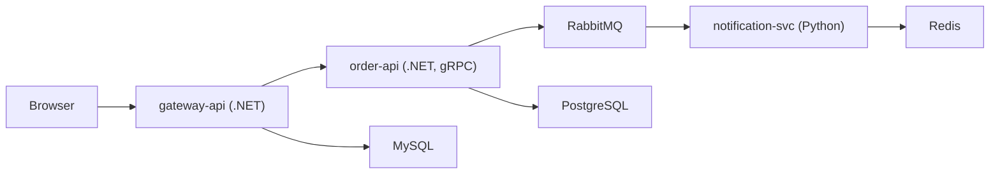

End-to-end technical and production-grade documentation for the SignalForge OpenTelemetry
microservices validation lab.

## Architecture & services

| Page | What it covers |
| ---- | -------------- |
| [Architecture Overview](architecture/overview.md) | System design, service topology, signal-flow diagrams |
| [Architecture Decisions](architecture/adrs/adr-log-tailing-not-otlp-export.md) | 10 ADRs for every non-obvious design choice — browse `architecture/adrs/` |
| [Service: gateway-api](services/gateway-api.md) | .NET 8 API gateway — endpoints, OTel, failure modes |
| [Service: order-api](services/order-api.md) | .NET 8 gRPC order service — streaming, RabbitMQ publishing |
| [Service: notification-svc](services/notification-svc.md) | Python FastAPI — async consumer, DLQ, Redis |
| [Service: frontend](services/frontend.md) | Angular 17 SPA + Grafana Faro RUM |

## Observability

| Page | What it covers |
| ---- | -------------- |
| [Pipeline](observability/pipeline.md) | Grafana Alloy River config — processors and exporters |
| [OTel Signal Contracts](observability/otel-contracts.md) | Per-service span names, metric instruments, log schemas |
| [Tail-Based Sampling](observability/sampling.md) | Sampling policies, validation, production tuning |
| [Log-to-Trace Correlation](observability/correlation.md) | Loki structured metadata, .NET vs Python field names |
| [Exemplars](observability/exemplars.md) | End-to-end exemplar pipeline from SDK to Grafana |
| [SLOs & burn-rate alerts](observability/slos.md) | Multi-window SLO math, `PrometheusRule` manifest, alert policy |

## Infrastructure

| Page | What it covers |
| ---- | -------------- |
| [Datastores](infrastructure/datastores.md) | MySQL, PostgreSQL, Redis, RabbitMQ — topology and config |
| [Datastore HA migration](infrastructure/datastore-ha.md) | Operator-backed HA (CNPG, Percona, RabbitMQ Operator) — prod path |
| [Kubernetes](infrastructure/kubernetes.md) | Namespace layout, directory tree, secrets, RBAC, health probes |
| [Container hardening](infrastructure/hardening.md) | securityContext, non-root UIDs, digest pins, Pod Security Standards |
| [Kustomize layout](infrastructure/kustomize.md) | `k8s/base` + `overlays/{dev,staging,prod}`, how deploy-local.sh consumes it |

## Deployment

| Page | What it covers |
| ---- | -------------- |
| [Local Deployment](deployment/local.md) | k3d cluster setup, local backends, step-by-step |
| [Grafana Cloud Deployment](deployment/grafana-cloud.md) | Credentials, AKV integration, endpoint formats |
| [Helm Monitoring Stack](deployment/helm.md) | grafana/k8s-monitoring chart, Alloy roles |

## Operations

| Page | What it covers |
| ---- | -------------- |
| [Runbooks](operations/runbooks.md) | Troubleshooting playbooks for every failure mode |
| [Security](operations/security.md) | Secrets lifecycle, credential rotation, threat model |
| [Networking & TLS](operations/networking.md) | NetworkPolicies, Ingress TLS via cert-manager, flannel caveat |
| [Reliability](operations/reliability.md) | PodDisruptionBudgets, pod anti-affinity, graceful shutdown |
| [Resilience Patterns](operations/resilience-patterns.md) | App-level retry/circuit-breaker/backoff/DLQ patterns, per service |
| [Supply-chain security](operations/supply-chain.md) | CI Trivy/Syft/cosign pipeline, digest pinning, SBOM verification |
| [Known Issues](operations/known-issues.md) | Open limitations and accepted trade-offs, consolidated |

## API reference

| Page | What it covers |
| ---- | -------------- |
| [REST API](api/rest.md) | Endpoints, request/response schemas |
| [gRPC API](api/grpc.md) | Proto definitions, error codes, streaming behaviour |

## Replication guides

Ordered, copy-paste guides for standing up this project's OTel instrumentation pattern in a
different repository — for handing the pattern off to another team, not for working in this repo.

| Page | What it covers |
| ---- | -------------- |
| [Guides index](guides/index.md) | Scope, assumptions, recommended order |
| [Collector & Pipeline Setup](guides/collector-pipeline-setup.md) | Alloy + `grafana/k8s-monitoring` Helm chart — do this first |
| [.NET Instrumentation](guides/dotnet-instrumentation.md) | SDK wiring, custom spans/metrics, RabbitMQ outbox propagation |
| [Python Instrumentation](guides/python-instrumentation.md) | SDK wiring, RabbitMQ consumer SpanLink propagation |
| [Frontend RUM Instrumentation](guides/frontend-rum-instrumentation.md) | Grafana Faro setup, runtime config injection |

## Reference

| Page | What it covers |
| ---- | -------------- |
| [OTel Validation Spec](spec.md) | All services, patterns to validate, the validation checklist |
| [OTel Instrumentation Patterns](otel-patterns.md) | Per-runtime instrumentation choices |
| [Testing](testing.md) | Test strategy, isolation patterns, CI matrix |
| [Project README](project-readme.md) | Deploy model, ownership boundary, dependencies, operational model |

## Quick orientation

All services export OTLP → `alloy-receiver` (Helm DaemonSet in the `monitoring` namespace). Logs are
tailed at the node by `alloy-logs`, not shipped via OTLP.

Two deployment modes (set in
[conf.yml](https://github.com/shipsolid/signal-forge/blob/main/conf.yml) `monitoring.mode`):

- **`local`** — bespoke Alloy DaemonSet exports to in-cluster Jaeger / Prometheus / Loki / Grafana
- **`cloud`** — the Helm release's Alloy agents export to Grafana Cloud Tempo / Mimir / Loki
  (credentials via Azure Key Vault)

## Starting points by role

| You are… | Start here |
| -------- | ---------- |
| New to the lab | [Architecture Overview](architecture/overview.md) |
| Setting up for the first time | [Local Deployment](deployment/local.md) |
| Debugging missing traces | [Runbooks](operations/runbooks.md) |
| Adding a new service | [Architecture Decisions](architecture/adrs/adr-log-tailing-not-otlp-export.md) + [Observability Pipeline](observability/pipeline.md) |
| Enabling Grafana Cloud export | [Grafana Cloud Deployment](deployment/grafana-cloud.md) |
| Understanding sampling behaviour | [Tail-Based Sampling](observability/sampling.md) |
| Reviewing signal contracts | [OTel Signal Contracts](observability/otel-contracts.md) |
| Reviewing security posture | [Security](operations/security.md) + [Container hardening](infrastructure/hardening.md) + [Supply-chain](operations/supply-chain.md) |
| Promoting to staging / prod | [Datastore HA migration](infrastructure/datastore-ha.md) + [Kustomize overlays](infrastructure/kustomize.md) + [Reliability](operations/reliability.md) |
| Writing SLO alerts | [SLOs & burn-rate alerts](observability/slos.md) |
| Handing this pattern to another team | [Replication guides](guides/index.md) |

## Source

Full source code lives at
[github.com/shipsolid/signal-forge](https://github.com/shipsolid/signal-forge).
