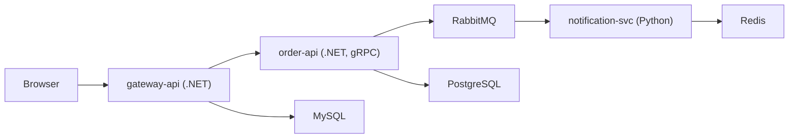

## SignalForge Documentation

End-to-end technical and production-grade documentation for the SignalForge OTel Microservices
Validation Lab.

## Contents

### Architecture & services

| Section                                          | Description                 |
| ------------------------------------------------ | --------------------------- | ------------------------------------------------------------------------- |
| [[overview                                       | Architecture]]              | System design, service topology, signal flow diagrams                     |
| [[adr-log-tailing-not-otlp-export                | Architecture Decisions]]    | 10 ADRs for every non-obvious design choice — browse `architecture/adrs/` |
| [[projects/app-signal-forge/services/gateway-api | Service: gateway-api]]      | .NET 8 API Gateway — endpoints, OTel, failure modes                       |
| [[order-api                                      | Service: order-api]]        | .NET 8 gRPC Order Service — streaming, RabbitMQ publishing                |
| [[notification-svc                               | Service: notification-svc]] | Python FastAPI — async consumer, DLQ, Redis                               |
| [[frontend                                       | Service: frontend]]         | Angular 17 SPA + Grafana Faro RUM                                         |

### Observability

| Section          | Description                |
| ---------------- | -------------------------- | -------------------------------------------------------------- |
| [[pipeline       | Pipeline]]                 | Grafana Alloy River config — processors and exporters          |
| [[otel-contracts | OTel Signal Contracts]]    | Per-service span names, metric instruments, log schemas        |
| [[sampling       | Tail-Based Sampling]]      | Sampling policies, validation, production tuning               |
| [[correlation    | Log-to-Trace Correlation]] | Loki structured metadata, .NET vs Python field names           |
| [[exemplars      | Exemplars]]                | End-to-end exemplar pipeline from SDK to Grafana               |
| [[slos           | SLOs & burn-rate alerts]]  | Multi-window SLO math, `PrometheusRule` manifest, alert policy |

### Infrastructure

| Section                                              | Description              |
| ---------------------------------------------------- | ------------------------ | --------------------------------------------------------------------------- |
| [[datastores                                         | Datastores]]             | MySQL, PostgreSQL, Redis, RabbitMQ — topology and config                    |
| [[datastore-ha                                       | Datastore HA migration]] | Operator-backed HA (CNPG, Percona, RabbitMQ Operator) — prod path           |
| [[kubernetes                                         | Kubernetes]]             | Namespace layout, directory tree, secrets, RBAC, health probes              |
| [[hardening                                          | Container hardening]]    | securityContext, non-root UIDs, digest pins, Pod Security Standards         |
| [[projects/app-signal-forge/infrastructure/kustomize | Kustomize layout]]       | `k8s/base` + `overlays/{dev,staging,prod}`, how deploy-local.sh consumes it |

### Deployment

| Section                                     | Description                |
| ------------------------------------------- | -------------------------- | ----------------------------------------------- |
| [[local                                     | Local Deployment]]         | k3d cluster setup, local backends, step-by-step |
| [[grafana-cloud                             | Grafana Cloud Deployment]] | Credentials, AKV integration, endpoint formats  |
| [[projects/app-signal-forge/deployment/helm | Helm Monitoring Stack]]    | grafana/k8s-monitoring chart, Alloy roles       |

### Operations

| Section                                                    | Description             |
| ---------------------------------------------------------- | ----------------------- | ----------------------------------------------------------------- |
| [[projects/app-signal-forge/operations/runbooks            | Runbooks]]              | Troubleshooting playbooks for every failure mode                  |
| [[projects/app-signal-forge/operations/security            | Security]]              | Secrets lifecycle, credential rotation, threat model              |
| [[networking                                               | Networking & TLS]]      | NetworkPolicies, Ingress TLS via cert-manager, flannel caveat     |
| [[reliability                                              | Reliability]]           | PodDisruptionBudgets, pod anti-affinity, graceful shutdown        |
| [[projects/app-signal-forge/operations/resilience-patterns | Resilience Patterns]]   | App-level retry/circuit-breaker/backoff/DLQ patterns, per service |
| [[supply-chain                                             | Supply-chain security]] | CI Trivy/Syft/cosign pipeline, digest pinning, SBOM verification  |
| [[known-issues                                             | Known Issues]]          | Open limitations and accepted trade-offs, consolidated            |

### API reference

| Section                              | Description |
| ------------------------------------ | ----------- | --------------------------------------------------- |
| [[projects/app-signal-forge/api/rest | REST API]]  | Endpoints, request/response schemas                 |
| [[projects/app-signal-forge/api/grpc | gRPC API]]  | Proto definitions, error codes, streaming behaviour |

### Replication guides

Ordered, copy-paste guides for standing up this project's OTel instrumentation pattern in a
different repository — for handing the pattern off to another team, not for working in this repo.

| Section                                   | Description                    |
| ----------------------------------------- | ------------------------------ | ------------------------------------------------------------- |
| [[projects/app-signal-forge/guides/readme | Guides index]]                 | Scope, assumptions, recommended order                         |
| [[collector-pipeline-setup                | Collector & Pipeline Setup]]   | Alloy + `grafana/k8s-monitoring` Helm chart — do this first   |
| [[dotnet-instrumentation                  | .NET Instrumentation]]         | SDK wiring, custom spans/metrics, RabbitMQ outbox propagation |
| [[python-instrumentation                  | Python Instrumentation]]       | SDK wiring, RabbitMQ consumer SpanLink propagation            |
| [[frontend-rum-instrumentation            | Frontend RUM Instrumentation]] | Grafana Faro setup, runtime config injection                  |

## Quick orientation

All services export OTLP → `alloy-receiver` (Helm DaemonSet in the `monitoring` namespace). Logs are
tailed at the node by `alloy-logs`, not shipped via OTLP.

Two deployment modes (set in
[conf.yml](https://github.com/shipsolid/app-signal-forge/blob/main/conf.yml) `monitoring.mode`):

- **`local`** — bespoke Alloy DaemonSet exports to in-cluster Jaeger / Prometheus / Loki / Grafana
- **`cloud`** — the Helm release's Alloy agents export to Grafana Cloud Tempo / Mimir / Loki
  (credentials via Azure Key Vault)

## Starting points by role

| You are...                           | Start here                                                          |
| ------------------------------------ | ------------------------------------------------------------------- | ------------------------------------------------------------------------------- | -------------------------------------- | -------------- |
| New to the lab                       | [[overview                                                          | Architecture Overview]]                                                         |
| Setting up for the first time        | [[local                                                             | Local Deployment]]                                                              |
| Debugging missing traces             | [[projects/app-signal-forge/operations/runbooks#No traces in Jaeger | Runbooks → No traces in Jaeger]]                                                |
| Adding a new service                 | [[adr-log-tailing-not-otlp-export                                   | Architecture Decisions]] + [[pipeline                                           | Observability Pipeline]]               |
| Enabling Grafana Cloud export        | [[grafana-cloud                                                     | Grafana Cloud Deployment]]                                                      |
| Understanding sampling behaviour     | [[sampling                                                          | Tail-Based Sampling]]                                                           |
| Reviewing signal contracts           | [[otel-contracts                                                    | OTel Signal Contracts]]                                                         |
| Reviewing security posture           | [[projects/app-signal-forge/operations/security                     | Security]] + [[hardening                                                        | Container hardening]] + [[supply-chain | Supply-chain]] |
| Promoting to staging / prod          | [[datastore-ha                                                      | Datastore HA migration]] + [[projects/app-signal-forge/infrastructure/kustomize | Kustomize overlays]] + [[reliability   | Reliability]]  |
| Writing SLO alerts                   | [[slos                                                              | SLOs & burn-rate alerts]]                                                       |
| Handing this pattern to another team | [[projects/app-signal-forge/guides/readme                           | Replication guides]]                                                            |

## Source

Full source code lives at
[github.com/shipsolid/app-signal-forge](https://github.com/shipsolid/app-signal-forge).
