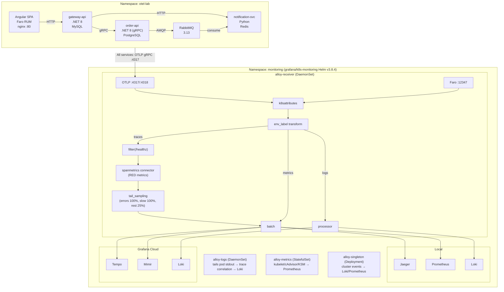
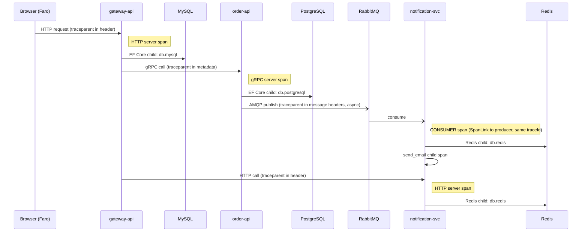
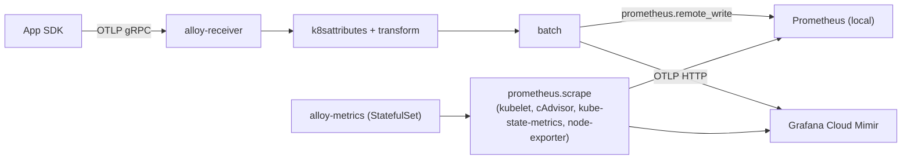
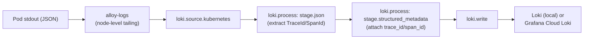
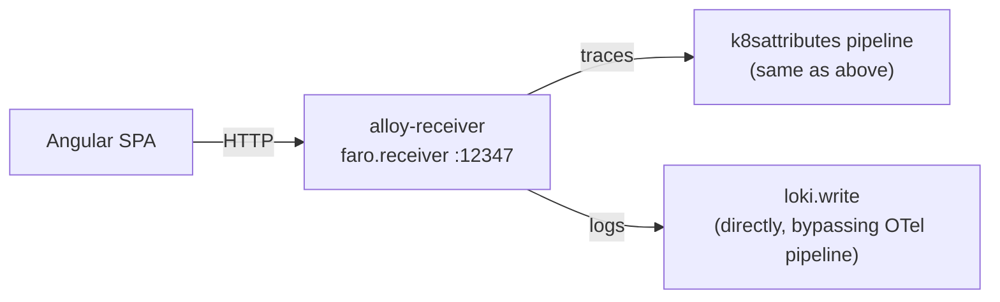

# Architecture Overview

## System topology

## Service inventory

| Service            | Runtime             | Role                                 | Owns                         |
| ------------------ | ------------------- | ------------------------------------ | ---------------------------- |
| `otel-frontend`    | Angular 17 + nginx  | Browser SPA, Faro RUM                | —                            |
| `gateway-api`      | .NET 8 Minimal API  | BFF — receives all browser calls     | MySQL 8 (projects)           |
| `order-api`        | .NET 8 gRPC         | Order CRUD + async events            | PostgreSQL 16 (orders)       |
| `notification-svc` | Python 3.12 FastAPI | RabbitMQ consumer, dedup, mock email | Redis 7 (notification state) |

## Communication patterns

| From        | To               | Protocol                        | OTel propagation                                         |
| ----------- | ---------------- | ------------------------------- | -------------------------------------------------------- |
| Browser     | gateway-api      | HTTP/JSON                       | Faro injects `traceparent` header                        |
| gateway-api | order-api        | gRPC (unary + server-streaming) | Auto-injected in gRPC metadata                           |
| gateway-api | notification-svc | HTTP/JSON                       | Auto-injected via `HttpClient` instrumentation           |
| order-api   | RabbitMQ         | AMQP 0-9-1                      | Manual `TextMapPropagator.Inject()` into message headers |
| RabbitMQ    | notification-svc | AMQP 0-9-1                      | Manual `TraceContextTextMapPropagator.extract()`         |

## Trace propagation map

A single "Create Order" click produces a trace spanning five hops and three runtimes:

The RabbitMQ hop uses a **SpanLink** (not parent-child) because message processing is asynchronous and may involve retries. Both spans share the same `traceId`. In Jaeger this renders as a dashed arrow.

## Signal flow by type

### Traces

```mermaid
flowchart LR
    appsdk["App SDK"] -- OTLP gRPC --> alloyrecv["alloy-receiver"]
    alloyrecv --> k8sattr["k8sattributes<br/>(enrich with pod/namespace/node)"]
    k8sattr --> transform["transform<br/>(stamp deployment.environment)"]
    transform --> filterhz["filter<br/>(drop /healthz spans)"]
    filterhz --> spanm["spanmetrics connector<br/>(generate RED metrics — before sampling)"]
    spanm --> tail["tail_sampling<br/>(errors=100%, slow&gt;2s=100%, rest=25%)"]
    tail --> batchp["batch"]
    batchp --> dest["Jaeger (local) and/or<br/>Grafana Cloud Tempo"]
```

### Metrics

### Logs

Note: `OTEL_LOGS_EXPORTER=none` is set on all services. Logs travel via node-level tailing, not OTLP push. This is the production pattern for high-volume log shipping.

### Browser RUM

## Deployment modes

| Mode            | Command                                                                    | Backends                                     | Use case                                  |
| --------------- | -------------------------------------------------------------------------- | -------------------------------------------- | ----------------------------------------- |
| Local (default) | `./deploy-local.sh`                                                        | Jaeger, Prometheus, Loki, Grafana in-cluster | Default — no cloud credentials needed     |
| Cloud (opt-in)  | `./scripts/fetch-grafana-cloud-conf-from-akv.sh` then `./deploy-local.sh`  | Grafana Cloud Tempo/Mimir/Loki               | End-to-end validation with remote storage |

The Alloy collector configuration is separate per mode:

- Cloud: `k8s/monitoring/grafana-helm/values-cloud.yaml.tmpl` (Helm values rendered by `deploy-local.sh`)
- Local: `k8s/monitoring/grafana/local/configmap.yaml` (hand-rolled DaemonSet — reference artifact)

See [CLAUDE.md](../../CLAUDE.md) for the full command reference and safety checks built into `deploy-local.sh`.

## Port map (after `./deploy-local.sh`)

| URL                                                                                                  | Service                                 |
| ---------------------------------------------------------------------------------------------------- | --------------------------------------- |
| `http://localhost:8080`                                                                              | Angular SPA + API (via Traefik ingress) |
| `http://localhost:16686`                                                                             | Jaeger UI                               |
| `http://localhost:3000`                                                                              | Grafana (admin/admin)                   |
| `http://localhost:9090`                                                                              | Prometheus                              |
| `http://localhost:15672`                                                                             | RabbitMQ Management (signalforge/guest) |
| `kubectl port-forward svc/grafana-k8s-alloy-receiver 12345 -n monitoring` → `http://localhost:12345` | Alloy pipeline debug UI                 |
