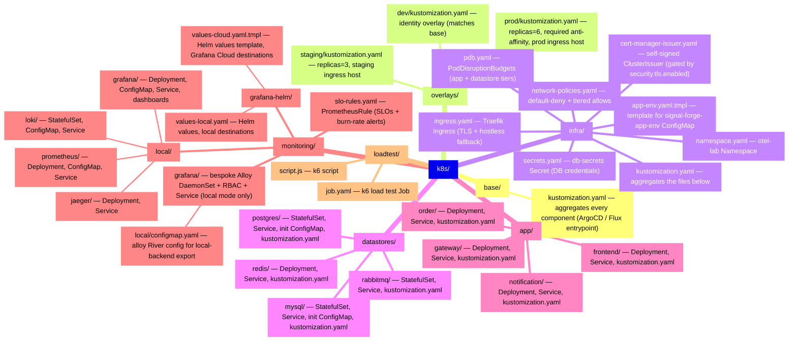

## Kubernetes Infrastructure

## Namespaces

| Namespace    | Purpose                                                          | Managed by                                                                           |
| ------------ | ---------------------------------------------------------------- | ------------------------------------------------------------------------------------ | ---------- |
| `otel-lab`   | Application services + datastores + local observability backends | `kubectl apply` (`./deploy-local.sh`)                                                |
| `monitoring` | Helm-managed Grafana Alloy stack (up to 5 roles)                 | `helm upgrade` (`./deploy-local.sh`, see [[projects/app-signal-forge/deployment/helm | helm.md]]) |

---

## Directory structure



Every subdirectory referenced by `deploy-local.sh`'s apply stages has its own `kustomization.yaml`,
so `kubectl apply -k <dir>` works for ArgoCD / Flux / Rancher Fleet. See
[[projects/app-signal-forge/infrastructure/kustomize|kustomize.md]] for the base + overlays layout
and the env patch strategy.

---

## Secrets

Two Secrets, both in the `otel-lab` namespace:

### db-secrets (DB credentials)

Applied from `k8s/infra/secrets.yaml`.

| Key                     | Contents                          | Used by                                             |
| ----------------------- | --------------------------------- | --------------------------------------------------- |
| `MYSQL_ROOT_PASSWORD`   | MySQL root password               | MySQL StatefulSet                                   |
| `MYSQL_PASSWORD`        | MySQL app user password           | MySQL StatefulSet                                   |
| `POSTGRES_PASSWORD`     | PostgreSQL app user password      | PostgreSQL StatefulSet                              |
| `RABBITMQ_PASSWORD`     | RabbitMQ default user password    | RabbitMQ StatefulSet + order-api + notification-svc |
| `GATEWAY_DB_CONNECTION` | Full MySQL connection string      | gateway-api Deployment                              |
| `ORDER_DB_CONNECTION`   | Full PostgreSQL connection string | order-api Deployment                                |

### grafana-cloud-secrets (Grafana Cloud credentials)

Materialized by `deploy-local.sh` from `conf.yml`'s `monitoring.grafana_cloud.*` block. The secret
name is configurable via `monitoring.secret_name` (default `grafana-cloud-secrets`). In cloud mode
the script also **mirrors** this secret into the Helm release's namespace (`monitoring`), because
the k8s-monitoring chart's Alloy agents live there and reference the secret by name.

| Key                            | Contents                                                             | Consumed by                                              |
| ------------------------------ | -------------------------------------------------------------------- | -------------------------------------------------------- |
| `GRAFANA_CLOUD_API_KEY`        | Access-policy token (`glc_...`, **not** the org-scoped `glsa_` form) | Alloy (cloud mode)                                       |
| `GRAFANA_CLOUD_MIMIR_ENDPOINT` | `https://<host>/api/prom/push`                                       | reference only (URL baked into values-cloud.yaml)        |
| `GRAFANA_CLOUD_MIMIR_USER`     | Mimir instance ID                                                    | Alloy `auth.usernameKey` lookup                          |
| `GRAFANA_CLOUD_LOKI_ENDPOINT`  | `https://<host>/loki/api/v1/push`                                    | reference only                                           |
| `GRAFANA_CLOUD_LOKI_USER`      | Loki instance ID                                                     | Alloy `auth.usernameKey` lookup                          |
| `GRAFANA_CLOUD_TEMPO_ENDPOINT` | `<host>:443` (OTLP gRPC, no scheme)                                  | reference only                                           |
| `GRAFANA_CLOUD_TEMPO_USER`     | Tempo instance ID                                                    | Alloy `auth.usernameKey` lookup                          |
| `FARO_COLLECTOR_URL`           | Browser RUM endpoint                                                 | frontend container (via `env:`)                          |
| `FARO_API_KEY`                 | Source-map upload token (build-time)                                 | webpack FaroSourceMapUploader (via docker `--build-arg`) |

Grafana Cloud secrets are optional at the consumer: `optional: true` on the frontend's
`FARO_COLLECTOR_URL` secretKeyRef, and `secret.create: false` on the Alloy destinations (they
fail-closed if the secret is absent, but the chart Helm install succeeds regardless).

The **secret-key contract** between `conf.yml` → Secret → `values-cloud.yaml.tmpl` is validated at
deploy time: `deploy-local.sh` asserts that every `usernameKey` / `passwordKey` referenced by the
rendered Helm values file exists in the Secret. A rename on either side fails `helm upgrade` before
it runs.

### Applying secrets

```bash
# From conf.yml (default path used by deploy-local.sh):
./deploy-local.sh --skip-build --skip-cluster     # re-applies both secrets

# Fetch Grafana Cloud values from Azure Key Vault, write them into conf.yml
# in place (see scripts/fetch-grafana-cloud-conf-from-akv.sh):
./scripts/fetch-grafana-cloud-conf-from-akv.sh    # --dry-run to preview
```

---

## Application Deployments

### gateway-api

```yaml
replicas: 2
containers:
  - name: gateway-api
    image: gateway-api:local
    ports:
      - containerPort: 5000
    env:
      - name: ConnectionStrings__DefaultConnection
        valueFrom:
          secretKeyRef:
            name: db-secrets
            key: GATEWAY_DB_CONNECTION
      - name: OTEL_SERVICE_NAME
        value: gateway-api
      - name: OTEL_EXPORTER_OTLP_ENDPOINT
        value: http://grafana-k8s-alloy-receiver.monitoring.svc.cluster.local:4317
      - name: OTEL_METRICS_EXEMPLAR_FILTER
        value: trace_based
```

### order-api

```yaml
replicas: 2
containers:
  - name: order-api
    image: order-api:local
    ports:
      - containerPort: 5001
    livenessProbe:
      httpGet:
        path: /healthz
        port: 5001
      initialDelaySeconds: 30
      periodSeconds: 15
      timeoutSeconds: 5
      failureThreshold: 3
```

### notification-svc

```yaml
replicas: 2
containers:
  - name: notification-svc
    image: notification-svc:local
    ports:
      - containerPort: 8000
    livenessProbe:
      httpGet:
        path: /healthz
        port: 8000
      initialDelaySeconds: 20
      periodSeconds: 15
      timeoutSeconds: 5
      failureThreshold: 3
```

---

## RBAC (Alloy)

Alloy needs `get/list/watch` on `pods` and `nodes` for:

- `otelcol.processor.k8sattributes` — pod IP → pod metadata lookup
- `loki.source.kubernetes` — pod log discovery

Defined in `k8s/monitoring/grafana/rbac.yaml` (hand-rolled DaemonSet reference; ServiceAccount in
`otel-lab`):

```yaml
apiVersion: rbac.authorization.k8s.io/v1
kind: ClusterRole
metadata:
  name: alloy
rules:
  - apiGroups: [""]
    resources: ["pods", "nodes", "namespaces"]
    verbs: ["get", "list", "watch"]
  - apiGroups: ["apps"]
    resources: ["replicasets"]
    verbs: ["get", "list", "watch"]
---
apiVersion: rbac.authorization.k8s.io/v1
kind: ClusterRoleBinding
metadata:
  name: alloy
roleRef:
  apiGroup: rbac.authorization.k8s.io
  kind: ClusterRole
  name: alloy
subjects:
  - kind: ServiceAccount
    name: alloy
    namespace: otel-lab   # hand-rolled DaemonSet SA (otel-lab)
```

> **Helm-managed Alloy** (the deployed stack) creates its own ServiceAccount in the `monitoring`
> namespace and its own ClusterRole automatically via the `grafana/k8s-monitoring` chart. The RBAC
> above applies only to the hand-rolled reference DaemonSet (`k8s/monitoring/grafana/`) which is not
> deployed.

Without a ClusterRole granting `get/list/watch` on pods/nodes/namespaces, the k8sattributes
processor logs errors and passes signals through without K8s attributes.

---

## Ingress

Traefik (k3d default) routes:

```yaml
rules:
  - host: ""    # matches all hostnames
    http:
      paths:
        - path: /api
          pathType: Prefix
          backend:
            service:
              name: gateway-api
              port:
                number: 5000
        - path: /
          pathType: Prefix
          backend:
            service:
              name: otel-frontend
              port:
                number: 80
```

Port 8080 on the host maps to port 80 on the k3d loadbalancer (k3d cluster creation flag:
`-p "8080:80@loadbalancer"`).

---

## Health probes

All application deployments have liveness and readiness probes at `/healthz`. Probes fire every 15
seconds with a 30-second initial delay to allow for startup time (EF Core migrations, RabbitMQ
connection).

`/healthz` spans are excluded at both the SDK level and the Alloy collector level to prevent
health-check traffic from flooding traces and span metrics.

---

## Deploy order

```
infra/ (namespace, secrets)
  → datastores/ (MySQL, PostgreSQL, Redis, RabbitMQ)
    → wait for tier=datastore pods ready
      → monitoring/grafana/ (Alloy configmap — cloud or local)
        → monitoring/local/ (local backends — only for deploy-local mode)
          → app/ (gateway, order, notification, frontend)
            → infra/ingress.yaml
```

Enforced by `./deploy-local.sh`'s `apply_stage` sequencing, regardless of `monitoring.mode`.
