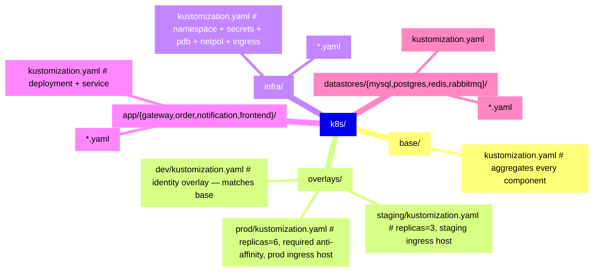

## Kustomize layout

signal-forge ships a Kustomize base + per-env overlays alongside the `deploy-local.sh` driver.
Consumers that prefer GitOps (ArgoCD, Flux, Rancher Fleet) or
`kubectl apply -k` can use the Kustomize path directly. `deploy-local.sh` is aware of this and will
`kubectl apply -k <dir>` whenever a directory contains a `kustomization.yaml`.

## Directory layout



The manifest files themselves **did not move** during the Kustomize refactor. They stayed in their
original directories (`k8s/infra/`, `k8s/app/*/`, `k8s/datastores/*/`). Each subdirectory gained a
small `kustomization.yaml` listing its local resources; `k8s/base/kustomization.yaml` then
references those subdirectories.

This matters because:

1. Git history on the manifests is intact (no renames).
2. `deploy-local.sh` can continue applying per-stage (`manifests.infra`, `manifests.datastores`,
   etc.) — the `kustomization.yaml` files sit alongside the YAML and are auto-detected.
3. Kustomize's cross-directory load-restrictor doesn't fire (each sub-kustomization only loads files
   from its own directory).

## Rendering

```bash
# Full stack, no env overrides:
kustomize build k8s/base

# Dev (identity overlay):
kubectl kustomize k8s/overlays/dev
kubectl apply -k k8s/overlays/dev

# Prod (6 replicas, required anti-affinity, prod hostname):
kubectl apply -k k8s/overlays/prod
```

ArgoCD `Application` spec targeting staging:

```yaml
spec:
  source:
    repoURL: https://github.com/...
    path: d-services/11-signal-forge/k8s/overlays/staging
    targetRevision: main
```

**Prerequisite for TLS:** the Ingress in this layout references a `ClusterIssuer`
(`cert-manager.io/cluster-issuer: signal-forge-ca`) that this Kustomize tree does **not** create —
see the `cert-manager-issuer.yaml` gotcha below. Apply
[k8s/infra/cert-manager-issuer.yaml](https://github.com/shipsolid/signal-forge/blob/main/k8s/infra/cert-manager-issuer.yaml)
with cert-manager already installed in the target cluster before or alongside your GitOps sync, or
certs never provision and the Ingress silently sits without TLS.

## What each overlay changes vs. base

### dev

The current k3d lab settings _are_ the base (2 replicas, 150m CPU, soft anti-affinity). The dev
overlay is identity plus a `signal-forge.environment: dev` label. The kustomization file has a
commented-out example showing how to add a patch without having to re-discover the syntax.

### staging

- `gateway-api`, `order-api`, `notification-svc` → `replicas: 3`
- Ingress host → `signal-forge.staging.example.com` (edit before use)
- All pods get `signal-forge.environment: staging`

### prod

- `gateway-api`, `order-api` → `replicas: 6`, `requests.cpu: 500m`, `limits.cpu: 2`
- `notification-svc` → `replicas: 4`
- Ingress host → `signal-forge.example.com` (edit before use)
- Pod anti-affinity **upgraded** from `preferredDuringScheduling...` (soft) to
  `requiredDuringScheduling...` (hard) — prod refuses to co-schedule replicas of the same app on the
  same node.

## How `deploy-local.sh` interacts with this

`apply_stage` (in
[deploy-local.sh](https://github.com/shipsolid/signal-forge/blob/main/deploy-local.sh)) checks
each configured path:

```bash
if [[ -d "$target" && -f "${target%/}/kustomization.yaml" ]]; then
  kubectl apply -k "$target"       # kustomize-native apply
else
  kubectl apply -f "$target"       # plain file / dir-of-yamls apply
fi
```

So `conf.yml`'s `manifests.datastores: [k8s/datastores/mysql/, ...]` triggers
`kubectl apply -k k8s/datastores/mysql/` automatically — which respects the sub-kustomization,
applies the labels, and obeys any overlay patches at the pathway level.

Overlays are **not** used by `deploy-local.sh` today; it targets the per-component
sub-kustomizations directly. If you want deploy-local to honor an overlay, set
`manifests.app: [k8s/overlays/dev]` and it will `apply -k` that overlay instead. You lose per-stage
ordering (`overlays/*` is a single apply call); acceptable for dev, rebuildable CI pipelines.

## Patch syntax

Kustomize supports two patch formats. This repo uses **strategic merge** patches via inline `patch:`
blocks (vs. separate patch files) because they're more readable when short:

```yaml
patches:
  - target: { kind: Deployment, name: gateway-api }
    patch: |
      - op: replace
        path: /spec/replicas
        value: 6
```

The `op: replace` form is JSON Patch RFC 6902, not strategic merge — it's explicit and surgical. For
anything more complex than a scalar replacement, switch to a separate file in
`overlays/<env>/patches/` and reference it via `path:` instead of `patch:`.

## Gotchas

- **`cert-manager-issuer.yaml` is deliberately not in `k8s/infra/kustomization.yaml`'s resource
  list**, even though the Ingress it backs _is_ part of this tree. `k8s/base/kustomization.yaml`
  sets a blanket `namespace: otel-lab`, and Kustomize's namespace transformer has no idea
  `ClusterIssuer` is a cluster-scoped CRD kind — it stamps `namespace: otel-lab` onto it anyway
  (harmless, ignored by the API server for a cluster-scoped object) but, worse, it also
  **overwrites** the CA-bootstrap `Certificate`'s explicit `namespace: cert-manager` with
  `otel-lab`, which silently breaks cert-manager's CA chain (the `ClusterIssuer`'s `ca.secretName`
  reference expects that Secret in cert-manager's own namespace). `deploy-local.sh` already applies
  this file as a separate, ungated-by-Kustomize step (`install_cert_manager`, gated by
  `security.tls.enabled`) — GitOps consumers need to do the same:
  `kubectl apply -f k8s/infra/cert-manager-issuer.yaml` once cert-manager is installed, outside the
  `kubectl apply -k` sync.
- **`commonLabels` is deprecated.** This repo uses the replacement `labels:` block with `pairs:`.
  Kustomize ≥ 5.0 nags on `commonLabels`.
- **`--load-restrictor=LoadRestrictionsNone` is not required.** The sub-kustomization layout means
  every file loaded by a kustomization.yaml is in its own directory tree. Running `kustomize build`
  without extra flags should always succeed.
- **ConfigMap generators.** Not used anywhere. The `signal-forge-app-env` ConfigMap is rendered by
  `deploy-local.sh` from a template (`k8s/infra/app-env.yaml.tmpl`) rather than via Kustomize's
  `configMapGenerator`, because its values come from `conf.yml` (Kustomize can't read arbitrary
  YAML). If you want a ConfigMap generator, wire it in the overlay.
