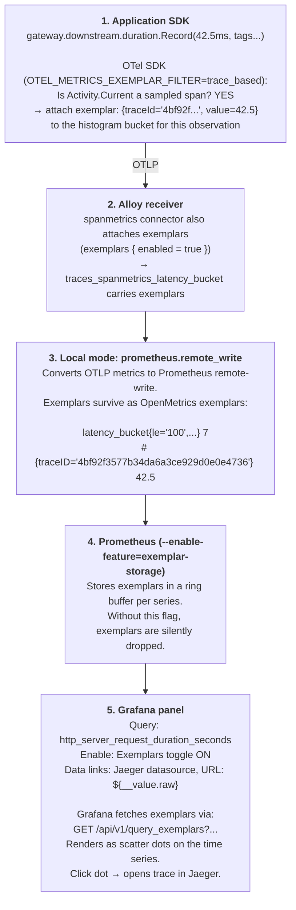

## Exemplars

Exemplars link a histogram bucket observation to a specific trace, enabling a "jump from metric
spike to trace" workflow in Grafana.

## End-to-end pipeline



## Configuration checklist

All five must be true for exemplars to appear:

- [ ] `OTEL_METRICS_EXEMPLAR_FILTER=trace_based` env var on each app Deployment
- [ ] `exemplars { enabled = true }` in Alloy `spanmetrics` connector config
- [ ] `--enable-feature=exemplar-storage` on Prometheus (in `prometheus/deployment.yaml` args)
- [ ] `--web.enable-remote-write-receiver` on Prometheus (for `prometheus.remote_write` from Alloy)
- [ ] Grafana panel has "Exemplars" toggle enabled and a "Data link" pointing to the Jaeger
      datasource

## Why `OTEL_METRICS_EXEMPLAR_FILTER` instead of `AddExemplarFilter()`

The SDK method `AddExemplarFilter(ExemplarFilterType.TraceBased)` is behind an experimental flag in
OTel .NET SDK 1.9.x. It requires:

```xml
<PropertyGroup>
  <AllowUnsafeBlocks>true</AllowUnsafeBlocks>
</PropertyGroup>
```

and importing experimental packages. The env var achieves the same result without compile-time
dependencies on unstable APIs. This approach is stable and runtime-configurable.

## Validation

### Confirm exemplars are in Prometheus

```bash
kubectl port-forward svc/prometheus 9090 -n otel-lab

# Check exemplar storage is active
curl "http://localhost:9090/api/v1/query_exemplars?query=traces_spanmetrics_latency_bucket"
# Should return exemplar objects with traceID, spanID, value
```

### Trigger exemplar-generating traffic

The `/api/slow` endpoint always runs inside a sampled span (it's always kept by tail sampling) and
always records a histogram observation. Use it to reliably generate exemplars:

```bash
curl http://localhost:8080/api/slow
```

### In Grafana

1. Open a Grafana dashboard panel showing `http_server_request_duration_seconds` or
   `traces_spanmetrics_latency_bucket`
2. Edit the panel → Query → enable **Exemplars** toggle
3. Panel → Options → Data links → add link: type = Jaeger datasource, URL = `${__value.raw}` (the
   raw traceId)
4. After traffic runs, exemplar dots appear as diamonds on the time series
5. Click a dot → Grafana opens Jaeger with the specific trace loaded

## Grafana Cloud mode

In cloud mode, exemplars flow through OTLP HTTP to Grafana Cloud Mimir. Mimir stores exemplars
natively. In Grafana Cloud's Explore view, the exemplars toggle works the same way — clicking a dot
opens the trace in the Grafana Cloud Tempo datasource.

No additional configuration is needed; exemplars are part of the OTLP protobuf payload and are
forwarded by Alloy's `otelcol.exporter.otlphttp` exporter.

## Metrics that carry exemplars

| Metric                                 | Source                            | Notes                                                       |
| -------------------------------------- | --------------------------------- | ----------------------------------------------------------- |
| `http_server_request_duration_seconds` | ASP.NET Core auto-instrumentation | Exemplars when EXEMPLAR_FILTER=trace_based                  |
| `gateway_downstream_duration_ms`       | Custom Histogram in gateway-api   | Exemplars on every observation while in a sampled span      |
| `orders_processing_duration`           | Custom Histogram in order-api     | Same                                                        |
| `traces_spanmetrics_latency_bucket`    | Alloy spanmetrics connector       | Exemplars always enabled via `exemplars { enabled = true }` |
