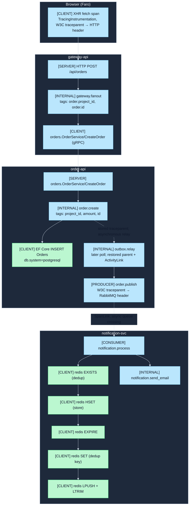

## OTel Signal Contracts

Production-grade OpenTelemetry contracts for all four services in SignalForge. These contracts
define the exact signals each service emits — span names, metric instrument names, log field
schemas, and propagation mechanisms — so that dashboards, alerts, and the Alloy pipeline can be
built and maintained against a stable interface.

**OTel semantic convention version:** 1.24 (stable attributes only unless noted) **SDK versions:**
.NET OTel SDK 1.7+, Python `opentelemetry-sdk` 1.23+, Grafana Faro Web SDK 1.x

---

## Table of Contents

1. [Conventions](#conventions)
2. [Resource Attributes](#resource-attributes)
3. [Propagation](#propagation)
4. [Collector Enrichment](#collector-enrichment)
5. [gateway-api](#gateway-api)
6. [order-api](#order-api)
7. [notification-svc](#notification-svc)
8. [frontend (Faro RUM)](#frontend-faro-rum)
9. [Cross-Service Trace Topology](#cross-service-trace-topology)
10. [Observability as release policy](#observability-as-release-policy)
11. [Validation Queries](#validation-queries)

---

## Conventions

### Attribute naming

- Custom attributes follow `domain.noun` dot-notation (e.g., `order.project_id`, `email.delay_ms`).
- OTel semantic convention attributes follow the published semconv spec and are not redefined here —
  only their presence on specific spans is called out.
- All attribute names are lowercase with underscores as word separators within each segment.

### Metric naming

- Instrument names follow `service_noun.measurement` with a `{unit}` suffix in the description.
- Prometheus exposition names are generated by the OTel → OTLP → Alloy → Prometheus pipeline: dots
  become underscores, `{unit}` suffix is dropped, `_total` is appended to Counter types.
- Exemplars are emitted on Histograms when `OTEL_METRICS_EXEMPLAR_FILTER=TRACE_BASED` is set (all
  .NET services) or when `TraceBased` exemplar filtering is enabled (Python).

### Unit conventions

| OTel unit string | Description                          |
| ---------------- | ------------------------------------ |
| `ms`             | Milliseconds (wall-clock duration)   |
| `{request}`      | Dimensionless count of HTTP requests |
| `{order}`        | Dimensionless count of orders        |
| `{notification}` | Dimensionless count of notifications |
| `USD`            | US Dollars (monetary amount)         |

---

## Resource Attributes

Resource attributes describe the entity producing telemetry. They are attached to every span, metric
data point, and log record. Alloy's `otelcol.processor.k8sattributes` enriches all signals with k8s
attributes at the collector level, so services do not need to set them.

### Common attributes (all .NET services)

Set by
`ResourceBuilder.CreateDefault().AddService(name).AddTelemetrySdk().AddEnvironmentVariableDetector()`:

| Attribute                    | Source                             | Example           |
| ---------------------------- | ---------------------------------- | ----------------- |
| `service.name`               | `AddService()`                     | `"gateway-api"`   |
| `service.version`            | Shared runtime ConfigMap via env detector | local: `"1.0.0"`; CD: full release commit SHA |
| `telemetry.sdk.name`         | `AddTelemetrySdk()`                | `"opentelemetry"` |
| `telemetry.sdk.language`     | `AddTelemetrySdk()`                | `"dotnet"`        |
| `telemetry.sdk.version`      | `AddTelemetrySdk()`                | `"1.7.0"`         |
| `OTEL_RESOURCE_ATTRIBUTES.*` | `AddEnvironmentVariableDetector()` | any k/v pairs     |

### Common attributes (notification-svc Python)

Set manually in `telemetry.py` via `Resource.create()`:

| Attribute                | Value                                                |
| ------------------------ | ---------------------------------------------------- |
| `service.name`           | `"notification-svc"`                                 |
| `service.namespace`      | `"otel-lab"`                                         |
| `service.version`        | Local default `"1.0.0"`; immutable CD release commit SHA |
| `deployment.environment` | Shared `OTEL_RESOURCE_ATTRIBUTES`; local config or CD target (`signal-forge-dev`, `-qa`, `-prod`) |

### Alloy-injected k8s attributes (all services, collector-side)

Added by `otelcol.processor.k8sattributes` in the `alloy-receiver` pipeline:

| Attribute             | Example                      |
| --------------------- | ---------------------------- |
| `k8s.pod.name`        | `"gateway-api-6f4b9d-xkpq2"` |
| `k8s.namespace.name`  | `"otel-lab"`                 |
| `k8s.deployment.name` | `"gateway-api"`              |
| `k8s.node.name`       | `"k3d-otel-lab-server-0"`    |
| `k8s.container.name`  | `"gateway-api"`              |

### Frontend (Faro RUM)

Set by `initializeFaro({ app: { ... } })`:

| Attribute         | Value                       |
| ----------------- | --------------------------- |
| `app.name`        | `"signal-forge"`            |
| `app.version`     | `"1.0.0"`                   |
| `app.environment` | `"production"` or `"local"` |

---

## Propagation

### HTTP (gateway-api ↔ order-api via gRPC, gateway-api → notification-svc REST)

**Format:** W3C TraceContext (`traceparent`, `tracestate`) + W3C Baggage **Mechanism:** .NET OTel
SDK injects/extracts headers automatically via `AddGrpcClientInstrumentation` and
`AddHttpClientInstrumentation`. No manual code required for HTTP/gRPC propagation.

### RabbitMQ (order-api PRODUCER → notification-svc CONSUMER)

**Format:** W3C TraceContext only (`traceparent` header) **Inject side** (`OrderPublisher.cs`):

```
RabbitMQ message header "traceparent" = UTF-8 bytes of W3C traceparent value
```

The outbox relay restores the persisted request context for its own span, but the publisher writes
the original stored `traceparent` directly as `byte[]`; this prevents a background retry from
silently replacing request identity with worker identity.

**Extract side** (`consumer.py`):

```python
ctx = extract(headers, getter=HeadersGetter())  # decodes bytes → str
token = attach(ctx)
# ... create CONSUMER span with links=[Link(parent_span_ctx)] ...
detach(token)  # always in finally block
```

The CONSUMER span uses a **SpanLink** (not parent-child) to the PRODUCER span context, per OTel
messaging semconv for async operations.

### Browser → Backend (Faro → gateway-api)

**Format:** W3C TraceContext (`traceparent`) injected into XHR/fetch request headers **Scope:**
Applied to all requests matching `environment.apiBaseUrl` regex and `/http:\/\/localhost/`
**Mechanism:** Faro `TracingInstrumentation` with `propagateTraceHeaderCorsUrls` configuration

---

## Collector Enrichment

All OTLP signals flow through `alloy-receiver` (Helm-managed DaemonSet, `monitoring` namespace). The
receiver pipeline applies:

| Stage                     | Effect                                                                                             |
| ------------------------- | -------------------------------------------------------------------------------------------------- |
| `k8sattributes` processor | Adds `k8s.pod.name`, `k8s.namespace.name`, `k8s.deployment.name`, `k8s.node.name` to all signals   |
| Span filter               | Drops spans where `http.target == "/healthz"`                                                      |
| Tail sampling             | errors=100%, slow (>2s)=100%, remaining=25%                                                        |
| Spanmetrics connector     | Generates RED metrics (`calls_total`, `duration_milliseconds_bucket`) per service/operation/status |
| OTLP export               | Traces → Jaeger/Tempo, Metrics → Prometheus/Mimir, Logs → Loki                                     |

---

## gateway-api

**Service name:** `gateway-api` **Stack:** .NET 8 Minimal API, MySQL 8 (EF Core + Pomelo), gRPC
client (to order-api), HTTP client (to notification-svc)

### Traces

#### Auto-instrumented spans

| Span name pattern                        | Kind   | Key attributes                                                                                               | Notes                                          |
| ---------------------------------------- | ------ | ------------------------------------------------------------------------------------------------------------ | ---------------------------------------------- |
| `HTTP {METHOD} {route}`                  | SERVER | `http.method`, `http.route`, `http.status_code`, `http.target`, `net.peer.ip`, `http.user_agent`, `plant.id` | ASP.NET Core; `/healthz` excluded by filter    |
| `orders.OrderService/CreateOrder`        | CLIENT | `rpc.system=grpc`, `rpc.service`, `rpc.method`, `rpc.grpc.status_code`                                       | gRPC client to order-api                       |
| `orders.OrderService/GetOrdersByProject` | CLIENT | same as above                                                                                                | gRPC client to order-api                       |
| `orders.OrderService/GetOrder`           | CLIENT | same as above                                                                                                | gRPC client to order-api                       |
| `HTTP GET` / `HTTP POST`                 | CLIENT | `http.url`, `http.method`, `http.status_code`                                                                | HTTP client to notification-svc                |
| `{db operation} {table}`                 | CLIENT | `db.system=mysql`, `db.name`, `db.statement` (SQL), `db.operation`                                           | EF Core + Pomelo; `SetDbStatementForText=true` |

`EnrichWithHttpRequest` adds to every SERVER span:

- `net.peer.ip` — caller's remote IP address
- `http.user_agent` — caller's User-Agent header
- `plant.id` — forwarded `X-Plant-Id` header value (if present)

`RecordException=true` attaches exception events on all unhandled exceptions with:

- `exception.type`
- `exception.message`
- `exception.stacktrace`

#### Custom spans

All custom spans use `ActivityKind.Internal` unless otherwise noted.

| Span name                         | Parent           | Attributes                        | Status                                                                                                 |
| --------------------------------- | ---------------- | --------------------------------- | ------------------------------------------------------------------------------------------------------ |
| `gateway.get_projects`            | HTTP SERVER span | _(none)_                          | OK or ERROR on exception                                                                               |
| `gateway.get_project`             | HTTP SERVER span | `project.id`                      | ERROR + description on 404                                                                             |
| `gateway.create_project`          | HTTP SERVER span | `project.id` (set after DB write) | OK or ERROR on exception                                                                               |
| `gateway.delete_project`          | HTTP SERVER span | `project.id`                      | ERROR + description on 404                                                                             |
| `gateway.fanout` (orders)         | HTTP SERVER span | `order.project_id`, `order.id`    | ERROR + RecordException on failure                                                                     |
| `gateway.fanout` (project orders) | HTTP SERVER span | `project.id`                      | OK; `gateway.downstream.duration` recorded with `downstream=order-api`, `operation=GetOrdersByProject` |
| `gateway.slow`                    | HTTP SERVER span | `delay.ms` (2000–5000ms random)   | OK                                                                                                     |
| `gateway.error`                   | HTTP SERVER span | _(none)_                          | ERROR; RecordException on thrown `InvalidOperationException`                                           |

### Metrics

#### Custom instruments

| Instrument name               | Type                  | Unit        | Dimensions                | Description                                          |
| ----------------------------- | --------------------- | ----------- | ------------------------- | ---------------------------------------------------- |
| `gateway.requests.inflight`   | UpDownCounter\<long\> | `{request}` | _(none)_                  | Active in-flight HTTP requests, excluding `/healthz` |
| `gateway.downstream.duration` | Histogram\<double\>   | `ms`        | `downstream`, `operation` | Latency of downstream service calls (gRPC or HTTP)   |

Prometheus exposition names:

- `gateway_requests_inflight`
- `gateway_downstream_duration_milliseconds_{bucket,count,sum}`

#### Standard instruments

| Source                           | Instrument prefix | Notes                                                   |
| -------------------------------- | ----------------- | ------------------------------------------------------- |
| `AddAspNetCoreInstrumentation()` | `http.server.*`   | Request count, duration, active requests                |
| `AddRuntimeInstrumentation()`    | `dotnet.*`        | GC collections, heap size, thread pool                  |
| `AddProcessInstrumentation()`    | `process.*`       | CPU time, working set, virtual memory, file descriptors |

#### Exemplars

`OTEL_METRICS_EXEMPLAR_FILTER=TRACE_BASED` is set in the K8s Deployment. Histograms emit
[[projects/app-signal-forge/observability/exemplars|exemplars]] carrying `trace_id` and `span_id`
when the recording happens inside a sampled trace. This links Prometheus metric data points to their
source trace in Jaeger/Tempo.

### Logs

**Format:** JSON via `AddJsonConsole()` on stdout **OTel export:** `AddOpenTelemetry()` on
`ILoggingBuilder` with `IncludeFormattedMessage=true`, `IncludeScopes=true`, `ParseStateValues=true`

Log records emitted in request handlers include a manually injected `TraceId` structured parameter
alongside the message template parameters. This is in addition to the OTel SDK's automatic
`TraceId`/`SpanId` injection on exported log records.

**Structured log fields (JSON keys on stdout):**

| Field             | Type            | Example                                   | Source                     |
| ----------------- | --------------- | ----------------------------------------- | -------------------------- |
| `Timestamp`       | ISO-8601 string | `"2024-11-15T10:23:45.123Z"`              | .NET logging               |
| `Level`           | string          | `"Information"`                           | .NET logging               |
| `Message`         | string          | `"Created project 42"`                    | formatted message          |
| `SourceContext`   | string          | `"GatewayApi.Endpoints.ProjectEndpoints"` | logger category            |
| `TraceId`         | string (32-hex) | `"4bf92f3577b34da6..."`                   | manual injection           |
| `SpanId`          | string (16-hex) | `"00f067aa0ba902b7"`                      | OTel SDK (via OTLP export) |
| `{ParameterName}` | varies          | `ProjectId: 42`                           | `ParseStateValues=true`    |

**[[projects/app-signal-forge/observability/correlation|Log-to-trace correlation]]:** Alloy's
`loki.process` pipeline extracts `TraceId` and `SpanId` from the JSON log line and promotes them as
Loki structured metadata (`traceID`, `spanID`). Grafana uses these to surface "Logs for this span"
in the Tempo trace view.

---

## order-api

**Service name:** `order-api` **Stack:** .NET 8 gRPC server, PostgreSQL 16 (EF Core + Npgsql 8),
RabbitMQ publisher

### Traces

#### Auto-instrumented spans

| Span name pattern                        | Kind   | Key attributes                                                                                                               | Notes                                                                   |
| ---------------------------------------- | ------ | ---------------------------------------------------------------------------------------------------------------------------- | ----------------------------------------------------------------------- |
| `orders.OrderService/CreateOrder`        | SERVER | `rpc.system=grpc`, `rpc.service=orders.OrderService`, `rpc.method=CreateOrder`, `net.peer.ip`, `http.user_agent`, `plant.id` | ASP.NET Core gRPC middleware                                            |
| `orders.OrderService/GetOrdersByProject` | SERVER | same; streaming RPC; span covers full stream duration                                                                        |                                                                         |
| `orders.OrderService/GetOrder`           | SERVER | same                                                                                                                         |                                                                         |
| `{db operation} {table}`                 | CLIENT | `db.system=postgresql`, `db.name`, `db.statement` (SQL), `db.operation`                                                      | EF Core + Npgsql; `SetDbStatementForText=true`                          |
| Npgsql driver spans                      | CLIENT | `db.system=postgresql`, connection attributes                                                                                | Source: `"Npgsql"` ActivitySource; registered via `AddSource("Npgsql")` |

`EnrichWithHttpRequest` adds `net.peer.ip`, `http.user_agent`, and `plant.id` (from `X-Plant-Id`
header) to every gRPC SERVER span.

#### Custom spans

| Span name              | Kind     | Parent              | Attributes                                                                                                                                                     | Status / Events                                   |
| ---------------------- | -------- | ------------------- | -------------------------------------------------------------------------------------------------------------------------------------------------------------- | ------------------------------------------------- |
| `order.create`         | INTERNAL | gRPC SERVER span    | `order.project_id` (set on entry), `order.amount`, `order.id` (set after `SaveChangesAsync`)                                                                   | ERROR + RecordException on unhandled exception    |
| `order.get_by_project` | INTERNAL | gRPC SERVER span    | `order.project_id`                                                                                                                                             | OK                                                |
| `order.get`            | INTERNAL | gRPC SERVER span    | `order.id`                                                                                                                                                     | ERROR with description `"Order not found"` on 404 |
| `outbox.relay`         | INTERNAL | persisted `order.create` context | `outbox.message_id`, `order.id` | Restores the stored parent context and adds an `ActivityLink`; each retry is separately observable |
| `order.publish`        | PRODUCER | `outbox.relay` span | `messaging.system=rabbitmq`, `messaging.destination=orders`, `messaging.destination_kind=exchange`, `messaging.rabbitmq.routing_key=order.created`, `order.id` | OK                                                |

**Outbox propagation detail:** `CreateOrder` stores the original W3C `traceparent` with the order
and outbox row. A later relay poll restores that context as `outbox.relay`'s parent and adds an
`ActivityLink`, then `order.publish` writes the stored `traceparent` into AMQP headers as UTF-8
`byte[]`. The Python consumer's `HeadersGetter` decodes those values before it creates its linked
consumer span. The publisher does not call `Propagators.Inject()` from a detached worker context.

### Metrics

#### Custom instruments

| Instrument name              | Type                | Unit      | Dimensions | Prometheus name                                              |
| ---------------------------- | ------------------- | --------- | ---------- | ------------------------------------------------------------ |
| `orders.created.total`       | Counter\<long\>     | `{order}` | none       | `orders_created_total`                                       |
| `orders.amount.total`        | Counter\<double\>   | `USD`     | none       | `orders_amount_total`                                        |
| `orders.processing.duration` | Histogram\<double\> | `ms`      | none       | `orders_processing_duration_milliseconds_{bucket,count,sum}` |

None of these carry a `project_id` dimension — it's unbounded (grows with every project ever
created), and this project's own engineering principles flag unbounded/high-churn labels as an
automatic stop for metrics. Per-project drill-down uses the `order.project_id` span attribute (set
on `order.create`) and this histogram's trace-based exemplar instead — both can safely carry
high-cardinality IDs.

**`orders.processing.duration`** measures wall-clock time from the start of `order.create` to the DB
write committing — not to completion of `OrderPublisher.Publish()`, which no longer happens inline
(see the outbox pattern: `OutboxRelayWorker` publishes later, out-of-band, in its own poll loop).
Because this recording happens inside a sampled trace, it carries a trace exemplar.

#### Standard instruments

| Source                           | Instrument prefix                             |
| -------------------------------- | --------------------------------------------- |
| `AddAspNetCoreInstrumentation()` | `http.server.*` (gRPC calls appear as HTTP/2) |
| `AddRuntimeInstrumentation()`    | `dotnet.*`                                    |
| `AddProcessInstrumentation()`    | `process.*`                                   |

### Logs

Same format and OTel configuration as gateway-api (JSON console, `ParseStateValues=true`).
Structured parameters per log site:

| Log site                            | Parameters                                  | Level       |
| ----------------------------------- | ------------------------------------------- | ----------- |
| `CreateOrder` completion            | `OrderId`, `ProjectId`, `Amount`, `TraceId` | Information |
| `GetOrdersByProject` completion     | `Count`, `ProjectId`, `TraceId`             | Information |
| `OrderPublisher.Publish` completion | `OrderId`, `TraceId`                        | Information |

---

## notification-svc

**Service name:** `notification-svc` **Stack:** Python 3.11, FastAPI, pika (RabbitMQ consumer),
redis-py, pythonjsonlogger

### Traces

#### Auto-instrumented spans

| Span name pattern  | Kind   | Key attributes                                                                     | Notes                                                                                                                       |
| ------------------ | ------ | ---------------------------------------------------------------------------------- | --------------------------------------------------------------------------------------------------------------------------- |
| `{METHOD} {route}` | SERVER | `http.method`, `http.route`, `http.status_code`, `http.url`                        | FastAPI via `FastAPIInstrumentor`; `/healthz` excluded                                                                      |
| `redis {command}`  | CLIENT | `db.system=redis`, `db.statement={COMMAND args}`, `net.peer.name`, `net.peer.port` | `RedisInstrumentor().instrument()` — all commands: `EXISTS`, `HSET`, `EXPIRE`, `SET`, `LPUSH`, `LTRIM`, `LRANGE`, `HGETALL` |

#### Custom spans

| Span name                 | Kind     | Relationship                      | Attributes                                                                                                                                                                 | Events / Status                                                                    |
| ------------------------- | -------- | --------------------------------- | -------------------------------------------------------------------------------------------------------------------------------------------------------------------------- | ---------------------------------------------------------------------------------- |
| `notification.process`    | CONSUMER | SpanLink to PRODUCER span context | `messaging.system=rabbitmq`, `messaging.operation=receive`, `messaging.source.name=orders`, `messaging.rabbitmq.routing_key=order.created`, `order.id`, `order.project_id` | Exception recorded on unhandled error; span ends after `basic_ack` or `basic_nack` |
| `notification.send_email` | INTERNAL | Child of `notification.process`   | `email.order_id`, `email.delay_ms`                                                                                                                                         | OK always (mock)                                                                   |

**Link relationship on `notification.process`:** The span link (`links=[Link(parent_span_ctx)]`)
preserves the async trace relationship without forcing a parent-child timing dependency. In Jaeger,
linked spans render as dashed arrows from the PRODUCER, making the queue-crossing visible without
falsely representing the CONSUMER as temporally subordinate to the PRODUCER.

**Context lifecycle:**

```
token = attach(ctx)       # install extracted context on this thread
# ... span and all children automatically inherit context ...
finally: detach(token)    # always; prevents context leak across message deliveries
```

### Metrics

#### Custom instruments

| Instrument name                     | Type      | Unit             | Dimensions                                      | Prometheus name                                                     |
| ----------------------------------- | --------- | ---------------- | ----------------------------------------------- | ------------------------------------------------------------------- |
| `notifications.processed.total`     | Counter   | `{notification}` | `status` (`success` \| `duplicate` \| `failed`) | `notifications_processed_total`                                     |
| `notifications.processing.duration` | Histogram | `ms`             | _(none)_                                        | `notifications_processing_duration_milliseconds_{bucket,count,sum}` |
| `notifications.email.send.duration` | Histogram | `ms`             | _(none)_                                        | `notifications_email_send_duration_milliseconds_{bucket,count,sum}` |

**`notifications.processing.duration`** covers the full `handle_order_created` lifecycle: dedup
Redis check + Redis write + mock email send. Recorded unconditionally (including for duplicates,
where it measures only the dedup check).

**Export configuration:** `PeriodicExportingMetricReader` with `export_interval_millis=15_000` —
aligns with Prometheus default scrape interval to avoid gaps in dashboards.

### Logs

**Format:** pythonjsonlogger `JsonFormatter` on `logging.StreamHandler(sys.stdout)` **Format
string:** `"%(asctime)s %(name)s %(levelname)s %(message)s %(otelTraceID)s %(otelSpanID)s"`

After `LoggingInstrumentor().instrument()` is applied, every log record produced while a span is
active gains:

| Field             | Type            | Example                                 | Source                |
| ----------------- | --------------- | --------------------------------------- | --------------------- |
| `asctime`         | string          | `"2024-11-15 10:23:45,123"`             | LogRecord             |
| `name`            | string          | `"app.consumer"`                        | logger name           |
| `levelname`       | string          | `"INFO"`                                | LogRecord             |
| `message`         | string          | `"Processed notification for order 42"` | formatted message     |
| `otelTraceID`     | string (32-hex) | `"4bf92f3577b34da6..."`                 | `LoggingInstrumentor` |
| `otelSpanID`      | string (16-hex) | `"00f067aa0ba902b7"`                    | `LoggingInstrumentor` |
| `otelServiceName` | string          | `"notification-svc"`                    | `LoggingInstrumentor` |

**OTLP log export:** Disabled (`OTEL_LOGS_EXPORTER=none`). Logs reach Loki exclusively through
Alloy's `loki.source.kubernetes` pod log tailing pipeline. The `loki.process` stage extracts
`otelTraceID` and `otelSpanID` from JSON lines and promotes them as Loki structured metadata for
trace correlation.

**Exception logging:** `logger.exception("Failed to process order.created event")` — used instead of
`logger.error(..., exc)` to include the full traceback without interpolating potentially sensitive
exception message text into the log message string.

---

## frontend (Faro RUM)

**App name:** `signal-forge` **Stack:** Angular 17, Grafana Faro Web SDK, Faro Web Tracing
(OTel-based), nginx

### RUM Signal Types

Faro collects four signal types and ships them to the Grafana Faro collector endpoint (`FARO_URL`):

| Signal type | Trigger                                                                 | Example                                                |
| ----------- | ----------------------------------------------------------------------- | ------------------------------------------------------ |
| `log`       | `console.log/warn/error` calls captured by Faro console instrumentation | `{level: "error", message: "..."}`                     |
| `exception` | Unhandled JS exceptions, Angular `ErrorHandler`                         | `{type: "TypeError", value: "...", stacktrace: [...]}` |
| `event`     | Page load, navigation, custom events                                    | `{name: "page_view", domain: "browser"}`               |
| `trace`     | XHR/fetch spans created by `TracingInstrumentation`                     | OTel-format spans                                      |

### Session Tracking

| Property       | Value      | Notes                                               |
| -------------- | ---------- | --------------------------------------------------- |
| `samplingRate` | `1` (100%) | Reduce to `0.1` in high-traffic production          |
| `persistent`   | `true`     | Session ID survives page reloads via sessionStorage |

### Tracing (XHR/fetch spans)

`TracingInstrumentation` creates OTel-format CLIENT spans for every `XMLHttpRequest` and `fetch`
call made by the Angular app and injects W3C `traceparent` into request headers.

**Propagation scope** — `traceparent` is injected only for URLs matching:

- `environment.apiBaseUrl` (regex-escaped, e.g., `http://localhost:8080/api`)
- `/http:\/\/localhost/` (any localhost URL)

| Span attribute     | Value                             | Notes                                        |
| ------------------ | --------------------------------- | -------------------------------------------- |
| `http.method`      | `"GET"` / `"POST"` / `"DELETE"`   | HTTP verb                                    |
| `http.url`         | full request URL                  | e.g., `"http://localhost:8080/api/projects"` |
| `http.status_code` | integer                           | set on response                              |
| `component`        | `"xml-http-request"` or `"fetch"` | Faro tracing convention                      |

### API calls and their trace linkage

| Angular method           | HTTP call                       | Linked backend span                                 |
| ------------------------ | ------------------------------- | --------------------------------------------------- |
| `getProjects()`          | `GET /api/projects`             | `gateway.get_projects`                              |
| `getProject(id)`         | `GET /api/projects/{id}`        | `gateway.get_project`                               |
| `createProject(...)`     | `POST /api/projects`            | `gateway.create_project`                            |
| `deleteProject(id)`      | `DELETE /api/projects/{id}`     | `gateway.delete_project`                            |
| `getOrdersByProject(id)` | `GET /api/projects/{id}/orders` | `gateway.fanout` → order-api                        |
| `createOrder(...)`       | `POST /api/orders`              | `gateway.fanout` → `order.create` → asynchronous `outbox.relay` → `order.publish` |
| `getNotifications()`     | `GET /api/notifications`        | notification-svc FastAPI span                       |
| `triggerError()`         | `GET /api/error`                | `gateway.error`                                     |

### beforeSend filter

Events whose JSON serialisation contains `"/healthz"` are dropped before transmission. This prevents
nginx health-check poll noise from polluting the Faro event stream.

---

## Cross-Service Trace Topology

The complete 5-hop trace for a `POST /api/orders` request:



**Trace continuity rules:**

- Hops 1–4 (Browser → gateway-api → `order.create`) share the same `traceId` via HTTP/gRPC W3C
  header propagation — they form a connected parent-child tree.
- The later outbox relay restores the stored request context as its parent and adds an
  `ActivityLink`. This retains one trace query across the asynchronous DB boundary while making a
  retry attempt separately visible; it is not an inline RabbitMQ publish.
- The RabbitMQ → notification-svc hop shares the same `traceId` but is attached via a `SpanLink`
  rather than a parent reference, reflecting the asynchronous delivery model.
- `notification.process` has `parentSpanId = nil` (it is a root span) but carries
  `links[0] = order.publish.spanContext`.

---

## Observability as release policy

This repository implements a **static, blocking observability-as-policy gate** in CI. The policy
script validates the contract this page describes before a release image can be published:

- backend `OTEL_SERVICE_NAME` values must match service identity;
- `service.namespace`, `service.version`, and `deployment.environment` must be present in the
  shared runtime resource attributes;
- local Alloy and cloud Helm inputs must render as YAML/River, Prometheus rules must pass
  `promtool`, and the rendered Alloy file must pass the real Alloy validator;
- committed local dashboards must be valid JSON with a title and panel array, and SLO/runbook assets
  must exist;
- explicitly configured span-metric dimensions cannot include known unbounded request/user/session
  identifiers such as `trace_id`, `request_id`, `user_id`, raw URL, or email.

This is intentionally a focused release contract, not a fabricated runtime health check. It does
not query Grafana, prove dashboard query semantics, measure telemetry arrival, validate alert
delivery, calculate a full cardinality/cost budget, or determine whether an SLO is currently met.

For an enabled DEV/QA/PROD deployment, CD calls a separately configured observability gate with the
exact environment, commit, CI run, required services, signals, and resource attributes. `block`
fails every environment; `warn` is visible in DEV/QA but fails PROD. The repository does not define
that external API, its query credentials, or its approved thresholds, so a static CI pass must not
be represented as evidence of live telemetry. See [Immutable CI/CD Promotion](../deployment/ci-cd.md).

## Validation Queries

### Traces — Jaeger

Verify the 5-hop async trace exists:

1. In Jaeger UI, search service=`gateway-api`, operation=`HTTP POST /api/orders`
2. Open a trace — confirm it contains spans from all four services
3. Confirm `order.publish` has a dashed link arrow to `notification.process`
4. Confirm `order.publish` and `notification.process` share the same `traceId`

### Metrics — Prometheus / PromQL

```promql
# Orders per second by project
rate(orders_created_total[5m])

# p99 order processing latency
histogram_quantile(0.99, rate(orders_processing_duration_milliseconds_bucket[5m]))

# Gateway downstream latency p95 per downstream service
histogram_quantile(0.95,
  rate(gateway_downstream_duration_milliseconds_bucket[5m]))
by (downstream, operation, le)

# Notification failure rate
rate(notifications_processed_total{status="failed"}[5m])
  /
rate(notifications_processed_total[5m])

# Inflight requests (gauge)
gateway_requests_inflight
```

### Logs — Loki / LogQL

```logql
# Correlate logs for a specific trace ID
{app="gateway-api"} | json | TraceId="<traceId>"

# notification-svc errors with trace context
{app="notification-svc"} | json | levelname="ERROR"
  | line_format "{{.message}} trace={{.otelTraceID}}"

# All services — log volume by level
sum by (app, levelname) (
  count_over_time({namespace="otel-lab"} | json [5m])
)
```

### Exemplar verification — Grafana

1. Open Grafana → Explore → Prometheus datasource
2. Query `orders_processing_duration_milliseconds_bucket`
3. Enable "Exemplars" toggle
4. Click an exemplar point — it should navigate to the corresponding Tempo trace
