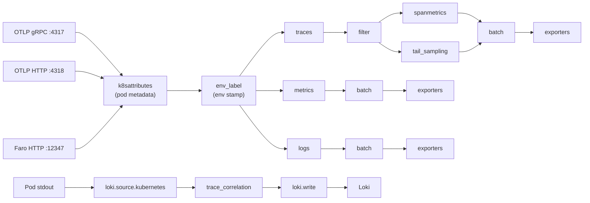
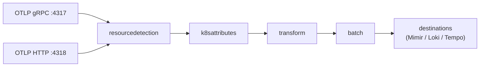

## Observability Pipeline

Grafana Alloy is the collector for all signals, always installed by `./deploy-local.sh` via the
`grafana/k8s-monitoring` Helm chart (`alloy-receiver` DaemonSet in the `monitoring` namespace, plus
`alloy-logs`/`alloy-metrics`/`alloy-singleton`). **Local and cloud mode are two structurally
different implementations, not two configmaps for the same pipeline:**

- **Local mode** (`monitoring.mode: local`) — a hand-authored River pipeline in
  `k8s/monitoring/grafana/local/configmap.yaml`, applied directly by `deploy-local.sh` alongside the
  Helm chart. Every stage below (receivers, k8sattributes, env-label, healthz filter, spanmetrics,
  tail sampling, batch, exporters) is custom code in that file.
- **Cloud mode** (`monitoring.mode: cloud`, default) — entirely the Helm chart's own
  `applicationObservability` feature, configured declaratively via
  `k8s/monitoring/grafana-helm/values-cloud.yaml.tmpl`. There is no equivalent hand-authored
  configmap — the chart generates its own fixed internal pipeline from those values. See
  [Cloud mode pipeline](#cloud-mode-pipeline) below; it does **not** have the same stages as local
  mode, and that's a real, documented capability gap (see
  [Known gaps in cloud mode](#known-gaps-in-cloud-mode)), not a doc-only difference.

---

## Local mode pipeline

### Stage 1: Receivers

**OTLP receiver** — accepts push from all services:

```river
otelcol.receiver.otlp "default" {
  grpc { endpoint = "0.0.0.0:4317" }
  http { endpoint = "0.0.0.0:4318" }
  output {
    traces  = [otelcol.processor.k8sattributes.default.input]
    metrics = [otelcol.processor.k8sattributes.default.input]
    logs    = [otelcol.processor.k8sattributes.default.input]
  }
}
```

**Faro receiver** — accepts browser RUM from Angular SPA:

```river
faro.receiver "frontend" {
  server {
    listen_address       = "0.0.0.0"
    listen_port          = 12347
    cors_allowed_origins = ["*"]
  }
  output {
    traces = [otelcol.processor.k8sattributes.default.input]
    logs   = [loki.write.local.receiver]   // logs bypass OTel pipeline → direct to Loki
  }
}
```

Note: Faro logs go directly to `loki.write` (bypassing the OTel batch processor) because they are
already structured for Loki and do not need OTLP processing.

---

### Stage 2: K8s attribute enrichment

```river
otelcol.processor.k8sattributes "default" {
  extract {
    metadata = [
      "k8s.namespace.name",
      "k8s.deployment.name",
      "k8s.pod.name",
      "k8s.node.name",
      "k8s.container.name",
    ]
    label {
      from      = "pod"
      key_regex = "app\\.kubernetes\\.io/.*"
    }
  }
  pod_association {
    source { from = "connection" }   // resolves pod from OTLP connection source IP
  }
}
```

Attributes added to every span and metric point (regardless of which service sent it):

- `k8s.namespace.name`, `k8s.pod.name`, `k8s.deployment.name`, `k8s.node.name`, `k8s.container.name`
- Any pod label matching `app.kubernetes.io/*` (e.g. `app.kubernetes.io/name=gateway-api`)

---

### Stage 3: Environment label

```river
otelcol.processor.transform "env_label" {
  error_mode = "ignore"
  trace_statements {
    context    = "resource"
    statements = [
      "set(attributes[\"deployment.environment\"], \"signal-forge-dev\") where attributes[\"deployment.environment\"] == nil",
      "set(attributes[\"deployment_environment\"], \"signal-forge-dev\") where attributes[\"deployment_environment\"] == nil"
    ]
  }
  // metric_statements and log_statements only set the dot key — Prometheus's
  // exporter auto-sanitizes dots to underscores, and loki.write's
  // external_labels stamps the underscore key separately, so both already
  // land as deployment_environment without a second statement. Traces have
  // no such sanitization step, so trace_statements sets both keys explicitly.
}
```

Stamps `deployment_environment` as a resource attribute on any signal that doesn't already have it —
identically across metrics, logs, and traces. This enables environment-based filtering in Grafana
without requiring every service to set the attribute explicitly.

---

### Stage 4: Health-check filter (traces only)

```river
otelcol.processor.filter "healthz" {
  error_mode = "ignore"
  traces {
    span = [
      "attributes[\"http.route\"] == \"/healthz\"",
      "attributes[\"url.path\"] == \"/healthz\"",
    ]
  }
  output {
    traces = [
      otelcol.connector.spanmetrics.default.input,
      otelcol.processor.tail_sampling.default.input,
    ]
  }
}
```

Drops `/healthz` spans before they reach spanmetrics or the sampler. K8s liveness probes fire every
15 seconds across all pods — without this filter they would dominate trace count and span metrics.

Belt-and-suspenders design: the SDK-level filter
(`opts.Filter = ctx => ctx.Request.Path != "/healthz"`) prevents spans from being created at all for
.NET services. The collector filter catches anything that slips through from Python or future
services.

---

### Stage 5: Span metrics connector

```river
otelcol.connector.spanmetrics "default" {
  dimension { name = "http.method" }
  dimension { name = "http.route" }
  dimension { name = "http.status_code" }
  dimension { name = "rpc.method" }
  dimension { name = "rpc.service" }
  dimension { name = "messaging.operation" }
  histogram {
    explicit {
      buckets = ["5ms", "10ms", "25ms", "50ms", "100ms", "250ms", "500ms", "1s", "2.5s", "5s", "10s"]
    }
  }
  exemplars { enabled = true }
  output {
    metrics = [otelcol.processor.batch.default.input]
  }
}
```

Generates RED (Rate / Error / Duration) metrics — with
[[projects/app-signal-forge/observability/exemplars|exemplars]] attached — from **all** spans,
before tail sampling. Produces:

- `traces_spanmetrics_calls_total` — rate counter
- `traces_spanmetrics_latency_bucket` — latency histogram

See [[sampling|Tail-Based Sampling]] for why this runs before sampling.

---

### Stage 6: Tail sampling

```river
otelcol.processor.tail_sampling "default" {
  decision_wait               = "10s"
  num_traces                  = 1000
  expected_new_traces_per_sec = 100

  policy { name = "errors-always";  type = "status_code";    status_code   { status_codes = ["ERROR"] } }
  policy { name = "slow-requests";  type = "latency";        latency       { threshold_ms = 2000 } }
  policy { name = "probabilistic-rest"; type = "probabilistic"; probabilistic { sampling_percentage = 25 } }
  output { traces = [otelcol.processor.batch.default.input] }
}
```

See [[sampling|Tail-Based Sampling]] for policy rationale and validation approach. **This processor
has no equivalent in cloud mode** — see [Known gaps in cloud mode](#known-gaps-in-cloud-mode).

---

### Stage 7: Batch processor

```river
otelcol.processor.batch "default" {
  timeout         = "5s"
  send_batch_size = 1024
}
```

Buffers up to 1024 signals or 5 seconds, whichever comes first, before flushing to exporters.
Reduces exporter connections and amortises network round trips.

---

### Stage 8: Exporters

```river
// Traces → Jaeger (OTLP gRPC, insecure)
otelcol.exporter.otlp "jaeger_local" {
  client {
    endpoint = "jaeger.otel-lab.svc.cluster.local:4317"
    tls { insecure = true }
  }
}

// Metrics → Prometheus (remote-write)
otelcol.exporter.prometheus "local" {
  forward_to = [prometheus.remote_write.local.receiver]
}
prometheus.remote_write "local" {
  endpoint {
    url = "http://prometheus.otel-lab.svc.cluster.local:9090/api/v1/write"
  }
}
```

---

### Log tailing pipeline

This pipeline runs independently from the OTLP pipeline. It tails pod stdout from the `otel-lab`
namespace.

```river
discovery.kubernetes "pods" {
  role = "pod"
  namespaces { names = ["otel-lab"] }
}

discovery.relabel "pod_logs" {
  targets = discovery.kubernetes.pods.targets
  rule { source_labels = ["__meta_kubernetes_namespace"]; target_label = "namespace" }
  rule { source_labels = ["__meta_kubernetes_pod_name"];  target_label = "pod" }
  rule { source_labels = ["__meta_kubernetes_pod_container_name"]; target_label = "container" }
  rule { source_labels = ["__meta_kubernetes_pod_label_app"];      target_label = "app" }
}

loki.source.kubernetes "pod_logs" {
  targets    = discovery.relabel.pod_logs.output
  forward_to = [loki.process.trace_correlation.receiver]
}
```

The `trace_correlation` processor extracts trace IDs from JSON log lines of both .NET and Python
services. Its trace_id/span_id extraction + structured-metadata stages are single-sourced at
[`k8s/monitoring/grafana/shared/trace-correlation-stages.alloy`](https://github.com/shipsolid/app-signal-forge/blob/main/k8s/monitoring/grafana/shared/trace-correlation-stages.alloy)
and spliced into `configmap.yaml.tmpl` at deploy time (`deploy-local.sh`'s
`render_local_alloy_configmap()`) — the same fragment cloud mode uses, see
[Log↔trace correlation (cloud mode)](#logtrace-correlation-cloud-mode) below. Only the `level`
extraction/label stages below are local-only:

```river
loki.process "trace_correlation" {
  stage.json {
    expressions = {
      dotnet_trace = "TraceId",      // .NET field name
      dotnet_span  = "SpanId",
      dotnet_level = "Level",
      python_trace = "otelTraceID",  // Python field name
      python_span  = "otelSpanID",
      python_level = "levelname",
    }
  }
  stage.template { source = "trace_id"; template = "{{ if .dotnet_trace }}{{ .dotnet_trace }}{{ else }}{{ .python_trace }}{{ end }}" }
  stage.template { source = "span_id";  template = "{{ if .dotnet_span }}{{ .dotnet_span }}{{ else }}{{ .python_span }}{{ end }}" }
  stage.template { source = "level";    template = "{{ if .dotnet_level }}{{ .dotnet_level }}{{ else }}{{ .python_level }}{{ end }}" }
  stage.labels           { values = { level = "" } }
  stage.structured_metadata { values = { trace_id = "trace_id", span_id = "span_id" } }
  forward_to = [loki.write.local.receiver]
}
```

`trace_id` and `span_id` are stored as Loki **structured metadata** (not stream labels) because
trace IDs are high-cardinality — using them as stream labels would cause label explosion in Loki.

Grafana's Jaeger datasource `tracesToLogsV2` config queries Loki for `{trace_id="<id>"}` to provide
"Logs for this span" in the trace view.

---

### Full local-mode data flow



---

## Cloud mode pipeline

Cloud mode has no hand-authored River config at all. `deploy-local.sh` renders
[`values-cloud.yaml.tmpl`](https://github.com/shipsolid/app-signal-forge/blob/main/k8s/monitoring/grafana-helm/values-cloud.yaml.tmpl)
(substituting `${...}` placeholders from `conf.yml`) and passes it to `helm upgrade` for the
`grafana/k8s-monitoring` chart. The chart's `applicationObservability` feature generates its own
**fixed, templated pipeline** from those values — not something this repo controls stage-by-stage
the way local mode's configmap does:



There is no spanmetrics connector, healthz filter, or tail-sampling stage enabled in this repo's
cloud config — `values-cloud.yaml.tmpl` only sets `destinations`, `applicationObservability.enabled`
and `receivers.otlp`, `clusterMetrics`, `clusterEvents`, and `nodeLogs`/`podLogs` processing stages.

### Log↔trace correlation (cloud mode)

`podLogs.extraLogProcessingStages` in `values-cloud.yaml.tmpl` carries the same JSON-extraction +
structured-metadata logic as local mode's `trace_correlation` stage above — both are rendered from
the single shared fragment,
[`k8s/monitoring/grafana/shared/trace-correlation-stages.alloy`](https://github.com/shipsolid/app-signal-forge/blob/main/k8s/monitoring/grafana/shared/trace-correlation-stages.alloy),
spliced in by `deploy-local.sh`'s `render_helm_values()`, through the chart's raw-River-snippet hook
(the same mechanism already used there for ANSI-stripping and kube-system log-level dropping). The
Helm chart runs `tpl` on this value, so `render_helm_values()` escapes the fragment's Go-template
delimiters (`{{"{{"}}` / `{{"}}"}}`) before substitution, to survive Helm's render pass intact.

---

## Known gaps in cloud mode

**No sampling of any kind.** The `grafana/k8s-monitoring` chart's `applicationObservability` feature
has no tail-sampling or probabilistic-sampling processor anywhere in its values schema (verified by
reading every processor/connector option in the chart's `feature-application-observability`
subchart, v3.8.4) — head-based or tail-based. Adding one would require forking the chart's
templates, which this repo deliberately doesn't do (no vendored chart copy). Cloud mode sends **100%
of trace volume** to Tempo today. This is a real cost/[[tech/cardinality|cardinality]] tradeoff
worth naming explicitly rather than leaving silent: acceptable at this lab's traffic volume, but
would need revisiting (either accepting the cost, or forking the chart) before treating cloud mode
as production-representative at higher volume. See [[sampling|sampling.md]] for the local-mode
reference implementation this doesn't have an equivalent for.
