## Security

This page is the **threat model and secrets lifecycle** reference. Controls that are heavy enough to
have their own page are linked out:

- [[hardening|Container hardening]] — securityContext, non-root UIDs, readOnlyRootFilesystem,
  digest-pinned base images, Pod Security Standards
- [[networking|Networking & TLS]] — NetworkPolicy default-deny, Ingress TLS via cert-manager,
  and the lab's kube-router enforcement model
- [[supply-chain|Supply-chain security]] — CI Trivy scan, Syft SBOM, cosign keyless signing
- [[reliability|Reliability]] — PodDisruptionBudgets, graceful shutdown (defence against
  availability loss during drains)

## Threat model summary

| Threat | Control | Reference |
| --- | --- | --- |
| Credentials in source code | Kubernetes Secrets sourced from Azure Key Vault via `scripts/fetch-grafana-cloud-conf-from-akv.sh`. | This page, [Secrets management](#secrets-management) |
| Credentials in git history | `.env` + `conf.yml` are tracked learning-lab scaffolding; rotate anything real before committing. `secrets.yaml` uses placeholder base64 values. | This page |
| Container compromise → host escape | `securityContext.runAsNonRoot`, `allowPrivilegeEscalation: false`, `capabilities.drop: [ALL]`, and seccomp RuntimeDefault on every workload. | [Container hardening](../infrastructure/hardening.md) |
| Vulnerable base image | Digest-pinned `FROM` plus a CI Trivy scan that blocks HIGH/CRITICAL findings with a fix. | [Supply-chain security](supply-chain.md) |
| Unauthenticated API access | `AllowedHosts` restriction and CORS limited to known origins. | This page |
| Injection via user input | Input validation at the gateway API and order API gRPC boundaries. | This page |
| Credential leakage in logs | `logger.exception()` is used without string interpolation of sensitive fields. | This page |
| Privilege escalation in-cluster | The Alloy ServiceAccount has minimum RBAC; every app pod drops all Linux capabilities. | This page; [Container hardening](../infrastructure/hardening.md) |
| Poison message amplification | A dead-letter queue isolates unprocessable messages. | This page |
| Unauthorised cross-tier traffic | `NetworkPolicy` default-deny and tiered allows cover apps, datastores, and Alloy. | [Networking & TLS](networking.md) |
| MITM on Ingress | cert-manager creates a self-signed CA and leaf certificate for lab Ingress. | [Networking & TLS](networking.md) |
| Tampered release image | CI signs and attests each immutable digest. An enabled CD run verifies both against the trusted workflow identity before materialising kubeconfig or applying manifests. Cluster admission enforcement remains unwired. | [Supply-chain security](supply-chain.md) |
| CI/CD credential exposure | Least-privilege workflow permissions and GitHub Environment protection scope credentials. Kubeconfig is materialised only in an ephemeral runner temporary directory. | [Immutable CI/CD promotion](../deployment/ci-cd.md) |

---

## Secrets management

### Where secrets live

Two independent paths — neither populates the other's Secret:

```mermaid
flowchart TD
    subgraph pathA["Path A — Grafana Cloud secrets"]
        A1["Azure Key Vault (example-org-prd-kv)<br/>grafana-example-org-* (7 secrets)"] -->|"make secrets-fetch-akv<br/>(or scripts/fetch-grafana-cloud-conf-from-akv.sh,<br/>the primary flow — see CLAUDE.md)"| A2["Kubernetes Secret: grafana-cloud-secrets"]
        A2 -->|secretKeyRef in Deployment specs| A3["Container environment variables<br/>(runtime only, not in manifests)"]
    end

    subgraph pathB["Path B — Database secrets"]
        B1["k8s/infra/secrets.yaml<br/>(static, hand-rotated base64 values)"] -->|"kubectl apply -f k8s/infra/secrets.yaml"| B2["Kubernetes Secret: db-secrets<br/>(otel-lab namespace)"]
        B2 -->|secretKeyRef in Deployment/StatefulSet specs| B3["Container environment variables<br/>(runtime only, not in manifests)"]
    end
```



`db-secrets` is never AKV-sourced — see §Credential rotation procedure below for how it's actually
rotated by hand.

No plaintext credentials appear in:

- Git-tracked files (`k8s/`, `src/`)
- Docker images
- Pod spec env values (only `secretKeyRef` references)

### Secret keys and consumers

| Secret key              | Consumer               | Required?             |
| ----------------------- | ---------------------- | --------------------- |
| `MYSQL_ROOT_PASSWORD`   | MySQL StatefulSet      | Yes                   |
| `GATEWAY_DB_CONNECTION` | gateway-api Deployment | Yes (fail-fast)       |
| `ORDER_DB_CONNECTION`   | order-api Deployment   | Yes (fail-fast)       |
| `GRAFANA_CLOUD_API_KEY` | Alloy DaemonSet        | No (`optional: true`) |
| `GRAFANA_CLOUD_TEMPO_*` | Alloy DaemonSet        | No                    |
| `GRAFANA_CLOUD_MIMIR_*` | Alloy DaemonSet        | No                    |
| `GRAFANA_CLOUD_LOKI_*`  | Alloy DaemonSet        | No                    |

### Fail-fast on missing required secrets

.NET services throw `InvalidOperationException` at startup if `ConnectionStrings:DefaultConnection`
is empty. This ensures:

- A misconfigured pod fails loudly (CrashLoopBackOff) rather than serving errors silently
- The failure is visible in `kubectl describe pod` with the exact missing variable

```csharp
var connStr = builder.Configuration.GetConnectionString("DefaultConnection");
if (string.IsNullOrWhiteSpace(connStr))
    throw new InvalidOperationException(
        "ConnectionStrings:DefaultConnection is required.");
```

### Grafana Cloud secrets — `optional: true`

Cloud credentials use `optional: true` in `secretKeyRef` because cloud export is an opt-in feature.
The service starts without them and degrades gracefully (cloud exporters log errors but local
pipeline continues).

```yaml
env:
  - name: GRAFANA_CLOUD_API_KEY
    valueFrom:
      secretKeyRef:
        name: grafana-cloud-secrets
        key: GRAFANA_CLOUD_API_KEY
        optional: true   # Alloy starts without cloud credentials
```

---

## Input validation

### gateway-api (`OrderEndpoints.cs`)

All inputs are validated at the API boundary before reaching downstream services:

```csharp
if (dto.ProjectId <= 0)
    return Results.ValidationProblem(new Dictionary<string, string[]> {
        { "projectId", ["ProjectId must be a positive integer."] }
    });
if (dto.Amount <= 0 || dto.Amount > 999_999.99)
    return Results.ValidationProblem(...);
if (string.IsNullOrWhiteSpace(dto.Description) || dto.Description.Length > 500)
    return Results.ValidationProblem(...);
```

Returns `HTTP 422 Unprocessable Entity` with a structured error body. No database calls are made for
invalid input.

### order-api (`OrderGrpcService.cs`)

Duplicate validation at the gRPC service boundary:

```csharp
if (request.ProjectId <= 0)
    throw new RpcException(new Status(StatusCode.InvalidArgument, "ProjectId must be positive."));
```

This defence-in-depth means invalid data cannot reach PostgreSQL even if gateway-api validation is
bypassed.

---

## CORS

CORS is restricted to known origins. Wildcard `*` is not used:

```csharp
var corsOrigins = builder.Configuration["Cors:AllowedOrigins"]
    ?? "http://localhost:4200";
builder.Services.AddCors(opts => opts.AddDefaultPolicy(policy =>
    policy.WithOrigins(corsOrigins.Split(","))
          .AllowAnyMethod()
          .AllowAnyHeader()));
```

In Kubernetes, `Cors:AllowedOrigins` is set via Deployment env var to the actual frontend hostname.
Faro CORS is `["*"]` — this is intentional because Faro receives RUM data from browsers, not API
calls with sensitive payloads.

---

## AllowedHosts

`AllowedHosts` in `appsettings.json` restricts which `Host` headers are accepted. Wildcard `*` (the
ASP.NET Core default) is replaced with explicit names. **The delimiter is `;`, not `,`** —
`HostFilteringOptionsSetup` (internal to `Microsoft.AspNetCore.Hosting`) splits on `;` only; a
comma-separated list parses as one unmatched entry and every request 400s. See
[[projects/app-signal-forge/services/gateway-api|docs/services/gateway-api.md]] for the full
incident writeup.

**gateway-api**:
`gateway-api;gateway-api.otel-lab.svc.cluster.local;signal-forge.local;localhost;127.0.0.1`
**order-api**: `order-api;order-api.otel-lab.svc.cluster.local`

Both services also append their own pod IP (bare and `:port` forms) at startup via the `MY_POD_IP`
Downward API env var, so kubelet's liveness/readiness probes — which connect using the pod's own
ephemeral IP as the `Host` header — pass without widening the list to `*`.

This prevents Host header injection attacks in environments where the service is exposed externally.

---

## Credential leakage prevention in logs

Python's `logger.exception()` is used instead of `logger.error("%s", exc)`:

```python
# CORRECT — includes full traceback without interpolating potentially sensitive data
logger.exception("Failed to process order.created event")

# AVOID — if exc contains credential data (e.g., connection string in exception message),
# it could leak to logs
logger.error("Failed to process: %s", exc)
```

.NET's `RecordException(ex)` on spans follows the same principle — exception messages are attached
to span events, not to log messages where they might be processed by log aggregation pipelines.

---

## RBAC (Alloy)

The Alloy ServiceAccount has minimum required permissions:

```yaml
rules:
  - apiGroups: [""]
    resources: ["pods", "nodes", "namespaces", "endpoints", "services"]
    verbs: ["get", "list", "watch"]
  - apiGroups: ["apps"]
    resources: ["replicasets", "deployments", "statefulsets", "daemonsets"]
    verbs: ["get", "list", "watch"]
```

No write permissions. No access to Secrets, ConfigMaps, or service accounts. The ClusterRole is
scoped to read-only operations needed for k8sattributes enrichment and log discovery.

---

## Azure Service Principal

The SP used for `make secrets-fetch-akv` should have:

- **Key Vault Secrets User** role on `example-org-prd-kv` — read-only access to secrets
- No other roles in the subscription

The SP credentials (`ARM_CLIENT_SECRET`) are stored only in `.env` (git-ignored) on the developer's
machine. They are never committed to git or stored in Kubernetes.

---

## Credential rotation procedure

### Grafana Cloud API key

1. Generate a new Access Policy token in Grafana Cloud with scopes:
   `metrics:write logs:write traces:write`
2. Update in AKV:
   `az keyvault secret set --vault-name ... --name grafana-example-org-cloud-api-key --value "glsa_new..."`
3. Re-fetch: `make secrets-fetch-akv`
4. Restart Alloy: `kubectl -n monitoring rollout restart daemonset/grafana-k8s-alloy-receiver`
5. Revoke the old token in Grafana Cloud Access Policies

### Database passwords

1. Update in `k8s/infra/secrets.yaml` (base64 re-encoded)
2. Update the database user password directly (MySQL: `ALTER USER ...; FLUSH PRIVILEGES;`)
3. `kubectl apply -f k8s/infra/secrets.yaml`
4. Restart the consuming service: `kubectl -n otel-lab rollout restart deployment/gateway-api`

> **Note**: Changing the MySQL password requires updating both the Secret and the database before
> restarting the service. Do not restart the service before updating the database — it will fail
> authentication.

---

## Security validation checklist

- [ ] `kubectl -n otel-lab get secret db-secrets -o json | jq '.data'` — all values are base64 (not
      plaintext)
- [ ] `grep -r "password\|Password\|apikey\|api_key" k8s/app/` — no plaintext passwords in manifests
- [ ] `grep -r "AllowedHosts" src/` — no `"*"` values in appsettings.json files
- [ ] `grep -r "WithOrigins" src/` — no `AllowAnyOrigin()` calls in .NET CORS config
- [ ] `.env` is in `.gitignore` — `git status` should never show `.env` as tracked
- [ ] `kubectl auth can-i create secrets --as=system:serviceaccount:otel-lab:alloy` — should return
      `no`
