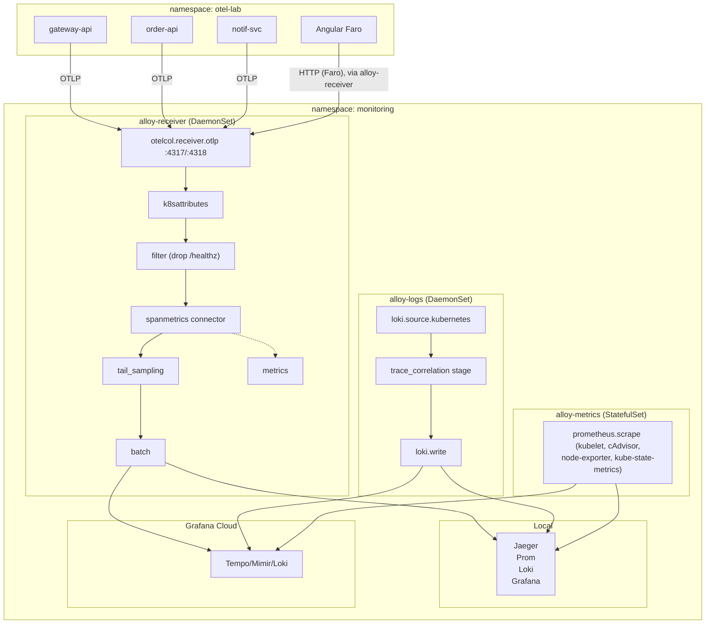
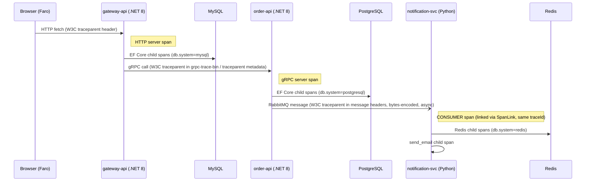
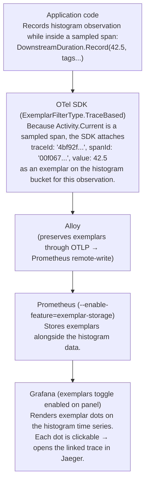
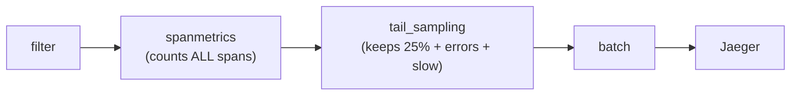

## OTEL-PATTERNS.md — SignalForge Instrumentation Reference

This document explains every instrumentation decision in the lab: _what_ is configured, _why_ it was
chosen over alternatives, and _what you should see_ when the pattern works correctly. It expands on
the instrumentation-level detail behind [[projects/app-signal-forge/spec|the architecture spec]].

---

## Table of Contents

1. [Architecture & Signal Flow](#1-architecture--signal-flow)
2. [Trace Propagation Chain](#2-trace-propagation-chain)
3. [Async Propagation: RabbitMQ (the critical pattern)](#3-async-propagation-rabbitmq)
4. [Span Kinds & Relationships](#4-span-kinds--relationships)
5. [Custom Span Attributes](#5-custom-span-attributes)
6. [Metrics & Exemplars](#6-metrics--exemplars)
7. [Span Metrics Connector](#7-span-metrics-connector)
8. [Tail-Based Sampling](#8-tail-based-sampling)
9. [Log Tailing & Trace Correlation](#9-log-tailing--trace-correlation)
10. [K8s Attribute Enrichment](#10-k8s-attribute-enrichment)
11. [Frontend RUM with Faro](#11-frontend-rum-with-faro)
12. [Grafana Cloud export (cloud mode)](#12-grafana-cloud-export-cloud-mode)
13. [Exemplar Pipeline End-to-End](#13-exemplar-pipeline-end-to-end)
14. [Health-Check Exclusion](#14-health-check-exclusion)
15. [Helm-Based Monitoring (Required)](#15-helm-based-monitoring-required)
16. [Troubleshooting Guide](#16-troubleshooting-guide)

---

## 1. Architecture & Signal Flow



All OTel signal types (traces, metrics) flow through `alloy-receiver`. Logs are tailed at the node
level by `alloy-logs` (not OTLP export from apps). Infra metrics are collected by `alloy-metrics`.

The `monitoring` namespace uses the `grafana/k8s-monitoring` Helm chart at the version pinned in
`conf.yml` when cloud mode is active. Local mode uses the hand-authored collector path under
`k8s/monitoring/grafana/local/`; it is a separate local topology, not a second exporter path.

---

## 2. Trace Propagation Chain

A single "Create Order" click in the Angular SPA produces a trace spanning five hops across three
runtimes and two communication paradigms:



### Propagation mechanism per transport

| Transport                        | Carrier                 | Mechanism                                              |
| -------------------------------- | ----------------------- | ------------------------------------------------------ |
| HTTP (browser → gateway)         | HTTP headers            | Faro `TracingInstrumentation` injects `traceparent`    |
| HTTP (gateway → notif-svc)       | HTTP headers            | `AddHttpClientInstrumentation()` injects automatically |
| gRPC (gateway → order-api)       | gRPC metadata           | `AddGrpcClientInstrumentation()` injects automatically |
| RabbitMQ (order-api → notif-svc) | Message headers (bytes) | Manual `Propagators.DefaultTextMapPropagator.Inject()` |

The RabbitMQ hop is manual because the `opentelemetry-instrumentation-pika` library does not
reliably extract incoming context in all pika versions. Manual extraction is explicit and
version-independent.

---

## 3. Async Propagation: RabbitMQ

This is the most technically interesting instrumentation in the lab.

### Why SpanLink, not parent-child?

OTel semantic conventions for messaging define two relationship types:

- **Parent-child**: used when the consumer processes the message _synchronously as part of the same
  logical operation_ as the producer. The consumer span's `parentSpanId` = producer span's `spanId`.
- **SpanLink**: used when the consumer processes the message _asynchronously_ — potentially much
  later, possibly in a different service instance or after a retry. The consumer span has its own
  `traceId` context but _links_ to the producer span's context.

We use **SpanLink** here because:

1. The notification-svc consumer runs in a separate process on a different pod.
2. There is a temporal gap between publish and consume.
3. Messages may be redelivered (NACK + dead-letter), producing multiple consumer spans for one
   producer span.

In Jaeger, a linked span appears as a dashed arrow on the trace timeline, visually distinct from the
solid parent-child lines.

### .NET producer side (`OrderPublisher.cs`)

```csharp
// 1. Start PRODUCER span
using var activity = DiagnosticsConfig.ActivitySource.StartActivity(
    "order.publish",
    ActivityKind.Producer);      // ← Kind=Producer is the OTel convention

// 2. Inject W3C context into RabbitMQ message headers
var propagator = Propagators.DefaultTextMapPropagator;
propagator.Inject(
    new PropagationContext(Activity.Current?.Context ?? default, Baggage.Current),
    props.Headers,
    (headers, key, value) => headers[key] = Encoding.UTF8.GetBytes(value));
//                                           ↑ bytes because pika delivers bytes
```

### Python consumer side (`consumer.py`)

```python
# 1. Extract W3C context from message headers
ctx = extract(headers, getter=_getter)      # getter decodes bytes → str
token = attach(ctx)                         # set as current context on thread

# 2. Build a SpanLink to the producer's span context
parent_span_ctx = trace.get_current_span(ctx).get_span_context()
links = [Link(parent_span_ctx)] if parent_span_ctx.is_valid else []

# 3. Start CONSUMER span with the link
with tracer.start_as_current_span(
    "notification.process",
    kind=SpanKind.CONSUMER,
    links=links,               # ← Link (not parent) for async relationship
) as span:
    ...

# 4. CRITICAL: restore context after processing
detach(token)
```

### What you see in Jaeger

Search for a `CreateOrder` trace. The timeline shows:

- Solid lines: Browser → gateway → order-api (synchronous chain)
- Dashed arrow: order-api `order.publish` → notification-svc `notification.process`

The dashed arrow represents the SpanLink across the RabbitMQ boundary. Both spans share the same
`traceId` (the 32-char hex ID is identical).

---

## 4. Span Kinds & Relationships

| Kind       | Used on                                | Meaning                                        |
| ---------- | -------------------------------------- | ---------------------------------------------- |
| `SERVER`   | HTTP/gRPC receivers                    | Span starts when the server receives a request |
| `CLIENT`   | HTTP/gRPC senders                      | Span wraps an outbound call to another service |
| `PRODUCER` | `order.publish`                        | Span wraps a message publish to a broker       |
| `CONSUMER` | `notification.process`                 | Span wraps async message processing            |
| `INTERNAL` | `order.create`, `gateway.fanout`, etc. | Business-logic spans with no network I/O       |

The `gateway.fanout` span is `INTERNAL` — it exists purely to group the parallel downstream calls
(gRPC + HTTP) under a single parent so the trace waterfall shows the fan-out structure clearly.

---

## 5. Custom Span Attributes

Attributes beyond the OTel semantic conventions, specific to this domain:

| Attribute          | Set on span                                             | Purpose                                 |
| ------------------ | ------------------------------------------------------- | --------------------------------------- |
| `project.id`       | `gateway.get_project`, `gateway.delete_project`         | Filter traces by project in Jaeger      |
| `order.id`         | `order.create`, `order.publish`, `notification.process` | Filter traces by order                  |
| `order.project_id` | `order.create`, `notification.process`                  | Cross-service project context           |
| `order.amount`     | `order.create`                                          | Financial context for anomaly detection |
| `delay.ms`         | `gateway.slow`                                          | Artificial latency value for validation |
| `email.order_id`   | `notification.send_email`                               | Links mock email to its order           |
| `email.delay_ms`   | `notification.send_email`                               | Simulated email API latency             |

### Best practices followed

1. **Set attributes before the risky operation** (DB call, network call). If the operation throws,
   the attribute is still on the span before it's ended as an error span.

2. **Use `SetStatus(ActivityStatusCode.Error, ...)` explicitly** for business errors (404 not found,
   duplicate, etc.) that don't throw exceptions. Auto-instrumentation only marks spans as errors
   when an exception propagates.

3. **Use `RecordException(ex)`** to attach `exception.type`, `exception.message`, and
   `exception.stacktrace` as span events. This is done in `Program.cs` via
   `opts.RecordException = true` for ASP.NET Core spans, and manually in catch blocks for custom
   spans.

---

## 6. Metrics & Exemplars

### Instrument types in use

| Service          | Instrument                          | Type             | Prometheus name                     |
| ---------------- | ----------------------------------- | ---------------- | ----------------------------------- |
| gateway-api      | `gateway.requests.inflight`         | UpDownCounter    | `gateway_requests_inflight`         |
| gateway-api      | `gateway.downstream.duration`       | Histogram        | `gateway_downstream_duration`       |
| order-api        | `orders.created.total`              | Counter          | `orders_created_total`              |
| order-api        | `orders.amount.total`               | Counter (double) | `orders_amount_total`               |
| order-api        | `orders.processing.duration`        | Histogram        | `orders_processing_duration`        |
| notification-svc | `notifications.processed.total`     | Counter          | `notifications_processed_total`     |
| notification-svc | `notifications.processing.duration` | Histogram        | `notifications_processing_duration` |
| notification-svc | `notifications.email.send.duration` | Histogram        | `notifications_email_send_duration` |

OTel metric names (dots) become underscores in Prometheus by convention.

### Exemplar mechanism

Exemplars link a histogram bucket observation to a specific trace:



**Configuration checklist for exemplars to work:**

- [ ] `OTEL_METRICS_EXEMPLAR_FILTER=trace_based` env var on each app Deployment (replaces the
      removed SDK `AddExemplarFilter` experimental API)
- [ ] `--enable-feature=exemplar-storage` on Prometheus (set in `prometheus/deployment.yaml`)
- [ ] `--web.enable-remote-write-receiver` on Prometheus (set in `prometheus/deployment.yaml`)
- [ ] `exemplars { enabled = true }` in Alloy spanmetrics connector
- [ ] Grafana panel: enable "Exemplars" toggle + set "Data links" to Jaeger datasource

> **Why env var instead of SDK call?** `AddExemplarFilter(ExemplarFilterType.TraceBased)` is behind
> an experimental flag in OTel .NET SDK 1.9.x and cannot be resolved without opting into unstable
> APIs. The `OTEL_METRICS_EXEMPLAR_FILTER=trace_based` env var achieves the same result without
> compile-time dependencies on experimental code.

---

## 7. Span Metrics Connector

The Alloy `otelcol.connector.spanmetrics` component auto-generates RED (Rate / Error / Duration)
metrics from traces **before tail sampling**.

### Why before sampling?

If span metrics were generated _after_ sampling, only 25% of traces would contribute to counters —
your request rate metric would read 25% of reality. By placing `spanmetrics` in the pipeline
_before_ `tail_sampling`, every span is counted regardless of whether the trace is kept:



### Metric dimensions

Dimensions are span attribute names that become Prometheus label keys. Configured dimensions:

| Dimension             | Populated by                                    |
| --------------------- | ----------------------------------------------- |
| `http.method`         | ASP.NET Core, FastAPI auto-instrumentation      |
| `http.route`          | ASP.NET Core (`/api/projects/{id}`), FastAPI    |
| `http.status_code`    | ASP.NET Core, FastAPI                           |
| `rpc.method`          | gRPC client/server instrumentation              |
| `rpc.service`         | gRPC client/server instrumentation              |
| `messaging.operation` | RabbitMQ PRODUCER/CONSUMER spans (manually set) |

Spans that don't have a dimension's attribute simply don't include that label on the resulting
metric point — no `http.method=""` pollution.

### PromQL examples

```promql
# Request rate per service per route
sum by (service_name, http_route) (
  rate(traces_spanmetrics_calls_total[1m])
)

# P95 latency per gRPC method
histogram_quantile(0.95,
  sum by (le, rpc_method) (
    rate(traces_spanmetrics_latency_bucket{rpc_service="orders.OrderService"}[5m])
  )
)

# Error rate (errors-only traffic)
sum by (service_name) (
  rate(traces_spanmetrics_calls_total{status_code="STATUS_CODE_ERROR"}[1m])
)
```

---

## 8. Tail-Based Sampling

### Policies

| Policy               | Type                  | Keeps                   |
| -------------------- | --------------------- | ----------------------- |
| `errors-always`      | `status_code = ERROR` | 100% of error traces    |
| `slow-requests`      | `latency > 2000ms`    | 100% of slow traces     |
| `probabilistic-rest` | `25%`                 | 25% of remaining traces |

Policies are evaluated in order; first match wins.

### Validation

With the k6 load test running (`make test`):

1. **Error traces**: call `GET /api/error` — every call should appear in Jaeger
2. **Slow traces**: call `GET /api/slow` — every call (2-5s delay) should appear
3. **Normal traces**: create projects/orders — check Jaeger and expect ~25% of k6 requests to appear
   as traces

The span metrics connector provides the pre-sampling baseline:

```promql
# Total request rate (pre-sampling)
sum(rate(traces_spanmetrics_calls_total[1m]))
```

Compare this to the rate of traces arriving in Jaeger to validate the ~25% rate.

### Trade-off: 10s decision window

`decision_wait = "10s"` means Alloy buffers all spans for a trace for up to 10 seconds before making
a sampling decision. This introduces up to a 10s delay between a request completing and its trace
appearing in Jaeger.

For the lab this is fine. For production you'd tune based on p99 trace duration (set `decision_wait`
to at least your p99 trace duration to avoid partial traces).

---

## 9. Log Tailing & Trace Correlation

### Why not OTLP log export?

`OTEL_LOGS_EXPORTER=none` is set on all services. Reasons:

1. **Production fidelity**: At scale, shipping logs via a node-level agent (Alloy/Fluentd/Promtail)
   is more reliable than per-process OTLP export. Log volume spikes don't consume SDK/process
   resources.

2. **Simpler application code**: Services just write to stdout. No log pipeline configuration in the
   application.

3. **Validates a distinct OTel pattern**: The lab validates log-to-trace correlation via metadata
   extraction, not just OTLP log shipping.

### How trace IDs reach Loki

```text
.NET service writes JSON log line:
  {"Timestamp":"...","Level":"Information","TraceId":"4bf92f...","SpanId":"00f067...","Message":"..."}
                                             ↑ injected by OTel LoggingInstrumentation

Python service writes JSON log line:
  {"asctime":"...","levelname":"INFO","otelTraceID":"4bf92f...","otelSpanID":"00f067...","message":"..."}
                                        ↑ injected by LoggingInstrumentation().instrument()

Alloy loki.process stage:
  stage.json { expressions = { trace_id = "TraceId", ... } }
  stage.structured_metadata { values = { trace_id = "trace_id", ... } }
  → Loki stores trace_id as indexed structured metadata, not a stream label
    (stream labels are low-cardinality; trace IDs are high-cardinality)

Grafana Jaeger datasource:
  tracesToLogsV2 { datasourceUid = "loki", filterByTraceID = true }
  → When viewing a trace, Grafana auto-queries Loki for logs matching
    the trace_id structured metadata field
```

### .NET vs Python field name mismatch

The Alloy River config's `stage.json` extracts `.TraceId` (the .NET field name). The Python
`LoggingInstrumentation` injects `otelTraceID`. To handle both:

```river
stage.json {
  expressions = {
    trace_id    = "TraceId",       // .NET (ASP.NET Core + OTel SDK)
    trace_id_py = "otelTraceID",   // Python (opentelemetry-instrumentation-logging)
    span_id     = "SpanId",
    span_id_py  = "otelSpanID",
    level       = "Level",
  }
}
// Then coalesce: use trace_id if set, else trace_id_py
// (Alloy does not have a coalesce function; simplest fix is to normalise
//  field names in the apps to both use "TraceId"/"SpanId".)
```

For this lab, the Python logger format string can be updated to match the .NET field names by
setting the key in the JsonFormatter:

```python
# In main.py, change to output "TraceId" and "SpanId" keys:
handler.setFormatter(jsonlogger.JsonFormatter(
    "%(asctime)s %(levelname)s %(message)s",
    rename_fields={"otelTraceID": "TraceId", "otelSpanID": "SpanId"}
))
```

---

## 10. K8s Attribute Enrichment

The `otelcol.processor.k8sattributes` component adds Kubernetes context to every signal without any
application-side code changes.

### How it resolves the pod

Alloy uses the source IP address of the incoming OTLP connection to look up the pod in the
Kubernetes API:

```river
pod_association {
  source { from = "connection" }
}
```

The OTLP gRPC connection source IP matches the pod's IP (not the node IP) because pods in k3d have
their own network namespace.

### Attributes added

All of these appear on every span exported from the lab, regardless of which service sent it:

| Attribute                     | Example value              | Purpose                 |
| ----------------------------- | -------------------------- | ----------------------- |
| `k8s.namespace.name`          | `otel-lab`                 | Multi-cluster isolation |
| `k8s.pod.name`                | `gateway-api-7d9f5b-xkqpv` | Per-pod debugging       |
| `k8s.deployment.name`         | `gateway-api`              | Service grouping        |
| `k8s.node.name`               | `k3d-otel-lab-server-0`    | Node-level correlation  |
| `k8s.container.name`          | `gateway-api`              | Multi-container pods    |
| `app.kubernetes.io/name`      | `gateway-api`              | From pod label          |
| `app.kubernetes.io/component` | `api-gateway`              | From pod label          |
| `app.kubernetes.io/version`   | `1.0.0`                    | From pod label          |

### RBAC requirement

Alloy needs ClusterRole with `get/list/watch` on `pods` and `nodes`. See `k8s/alloy/rbac.yaml`.
Without this, the processor logs errors and passes signals through without K8s attributes.

---

## 11. Frontend RUM with Faro

### Faro initialisation (`src/frontend/src/app/telemetry/faro.ts`)

```typescript
initializeFaro({
  url: environment.faroUrl,  // Alloy's faro.receiver :12347
  app: { name: 'otel-frontend', version: '1.0.0', environment: 'local' },
  instrumentations: [
    ...getWebInstrumentations(),      // Web Vitals, JS errors, console
    new TracingInstrumentation({      // fetch/XHR spans + traceparent injection
      instrumentationOptions: {
        propagateTraceHeaderCorsUrls: [/http:\/\/localhost/],
      },
    }),
  ],
});
```

### What Faro captures

| Signal                  | How captured               | Where it appears                         |
| ----------------------- | -------------------------- | ---------------------------------------- |
| Page load timing        | `getWebInstrumentations()` | Grafana Cloud Frontend → LCP, FID, CLS   |
| Route changes           | `getWebInstrumentations()` | Faro traces — navigation spans           |
| Fetch/XHR spans         | `TracingInstrumentation`   | Faro traces, linked to backend traces    |
| `traceparent` injection | `TracingInstrumentation`   | Backend `gateway-api` span becomes child |
| JavaScript errors       | `getWebInstrumentations()` | Faro errors with stack traces            |
| Console output          | `captureConsole: true`     | Faro logs                                |

### Browser → Backend trace linkage

When the Angular SPA calls `GET /api/projects`, Faro injects a `traceparent` header matching the
current browser span's context. ASP.NET Core's `AddAspNetCoreInstrumentation()` reads this header
and makes the HTTP server span a **child** of the browser span.

Result in Jaeger: the same `traceId` appears in both the browser-side Faro span and the server-side
gateway-api span — a single trace starting in the browser and ending in the MySQL database.

---

## 12. Grafana Cloud export (cloud mode)

`monitoring.mode` in [conf.yml](https://github.com/shipsolid/signal-forge/blob/main/conf.yml) is
`local` or `cloud` — **mutually exclusive, never both.** There is no dual-export: `cloud` mode ships
traces/metrics/logs to Grafana Cloud via the `grafana/k8s-monitoring` Helm chart's Alloy agents;
`local` mode ships to the in-cluster Jaeger/Prometheus/Loki stack instead. Only one set of exporters
is ever active. (An earlier version of this doc described a hand-authored `k8s/alloy/configmap.yaml`
dual-exporting both — that file and that architecture no longer exist; see
[[pipeline|docs/observability/pipeline.md]] for the current chart-based pipeline.)

Grafana Cloud issues a **separate numeric instance ID per signal type** (Tempo, Mimir, Loki each
have their own), with one shared API key as the password for all three, plus a raw-URL →
adjusted-URL transform per signal (gRPC host:port for Tempo, Prometheus remote_write `/push` for
Mimir — not OTLP HTTP, see
[[grafana-cloud#Endpoint format requirements|docs/deployment/grafana-cloud.md]] for why — and
`/loki/api/v1/push` for Loki).

The full credential model — Azure Key Vault layout, the fetch script, `conf.yml` wiring, and the K8s
Secret it produces — is documented once, in [[grafana-cloud|docs/deployment/grafana-cloud.md]]; this
section intentionally doesn't duplicate it. Setup is
`./scripts/fetch-grafana-cloud-conf-from-akv.sh` (populates `conf.yml`) then
`./deploy-local.sh --skip-cluster --skip-build` — the canonical path. `make secrets-fetch-akv` is a
legacy alternative (see `CLAUDE.md`) that writes the Secret directly and drives its own
`helm upgrade`, bypassing `deploy-local.sh`; prefer the script-based flow above.

### Verifying cloud export is working

```bash
# Mode-aware triage: conf.yml values, pod state, Alloy exporter counters, reachability probe.
./scripts/debug.sh

# Or check Alloy logs directly for export errors:
kubectl -n monitoring logs daemonset/grafana-k8s-alloy-receiver | grep -i "grafana_cloud\|error"

# Send a test trace, then check Grafana Cloud → Explore → Tempo:
curl -s http://localhost:8080/api/projects
```

### Graceful degradation

Grafana Cloud credential env vars are sourced via `secretKeyRef` with `optional: true`, so Alloy
pods start even when the secret is absent or incomplete — missing values surface as export errors in
the log grep above (`endpoint is empty`, `401`), not as a pod crash.

---

## 13. Exemplar Pipeline End-to-End

The full journey of an exemplar from application code to Grafana:

```text
1. Application (gateway-api)
   DownstreamDuration.Record(42.5, tags...)
   SDK checks: is Activity.Current a sampled span?
   YES → attaches {traceId, spanId, value=42.5} as exemplar to the bucket

2. OTLP export (gateway-api → Alloy :4317)
   Exemplars are part of the OTLP MetricsData protobuf:
   ExponentialHistogramDataPoint.exemplars[] or
   HistogramDataPoint.exemplars[]

3. Alloy spanmetrics connector
   Also attaches exemplars to generated span metric histograms
   (exemplars { enabled = true })

4. Alloy prometheus.remote_write
   Converts OTLP metrics to Prometheus format.
   Exemplars survive the conversion as OpenMetrics exemplars:
   traces_spanmetrics_latency_bucket{...} 7 # {traceID="4bf92f..."} 42.5

5. Prometheus (--enable-feature=exemplar-storage)
   Stores exemplars in a ring buffer (max_exemplars=100000 in configmap).
   Without --enable-feature=exemplar-storage, exemplars are silently dropped.

6. Grafana panel query
   Adds exemplarTraceIdDestinations config pointing to Jaeger datasource.
   Grafana fetches exemplars alongside metric data via Prometheus API:
   GET /api/v1/query_exemplars?...
   Renders them as scatter dots on the time series panel.

7. Click exemplar dot → Grafana opens Jaeger trace for that traceId
```

---

## 14. Health-Check Exclusion

Health checks are excluded at two levels:

### Level 1 — SDK (ASP.NET Core)

```csharp
.AddAspNetCoreInstrumentation(opts => {
    opts.Filter = ctx => ctx.Request.Path != "/healthz";
})
```

Prevents the span from being created at all. Zero overhead.

### Level 2 — Alloy collector

```river
otelcol.processor.filter "healthz" {
  error_mode = "ignore"
  traces {
    span = [
      "attributes[\"http.route\"] == \"/healthz\"",
      "attributes[\"url.path\"] == \"/healthz\"",
    ]
  }
}
```

Catches any health-check span that slipped through (e.g. from the Python FastAPI service where the
SDK filter is configured differently).

Both levels are needed because:

- The Python service configures `excluded_urls="/healthz"` in
  `FastAPIInstrumentation().instrument_app()`, which prevents span creation. But belt-and-suspenders
  at the collector is cheap.
- The collector filter also handles future services added to the lab that might not implement
  SDK-level filtering.

---

## 15. Helm-Based Monitoring (Required)

The `grafana/k8s-monitoring` Helm chart at the version pinned in `conf.yml` is the canonical
collector stack for cloud mode. The hand-authored local Alloy DaemonSet is selected only in local
mode; do not run both collector paths against the same application traffic because duplicate spans,
metrics, and incompatible configuration are the likely result.

App services send OTLP to `grafana-k8s-alloy-receiver.monitoring.svc.cluster.local:4317`.
`./deploy-local.sh` installs the Helm chart unconditionally in `mode: cloud`; in `mode: local`, pass
`--with-helm` or the chart is skipped and this endpoint has nothing listening.

### Role comparison

| Role              | Kind        | Collects                                                      | Sends to           |
| ----------------- | ----------- | ------------------------------------------------------------- | ------------------ |
| `alloy-metrics`   | StatefulSet | Cluster infra metrics (kubelet, cAdvisor, node-exporter, KSM) | Prometheus (local) |
| `alloy-singleton` | Deployment  | Cluster events, kube-state-metrics                            | Loki + Prometheus  |
| `alloy-logs`      | DaemonSet   | Pod stdout/stderr, node journal logs                          | Loki               |
| `alloy-receiver`  | DaemonSet   | OTLP push from apps (ports 4317/4318)                         | Jaeger (local)     |
| `alloy-profiles`  | DaemonSet   | Continuous profiling (Pyroscope)                              | Disabled locally   |

### What the Helm stack covers

```text
Helm grafana/k8s-monitoring  (installed by ./deploy-local.sh)
  ✓ App traces + span metrics + tail sampling  (alloy-receiver)
  ✓ App metrics (OTLP push)                    (alloy-receiver)
  ✓ Faro RUM receiver                          (alloy-receiver, :12347)
  ✓ Pod + node log tailing + trace correlation (alloy-logs)
  ✓ Infra metrics (kubelet, cAdvisor, KSM)     (alloy-metrics)
  ✓ Cluster events                             (alloy-singleton)
```

### Why the hand-rolled DaemonSet was removed

Running two Alloy instances receiving the same OTLP traffic caused:

- Duplicate spans in Jaeger and duplicate metric samples in Prometheus
- Version mismatch between the pinned `v1.14.0` image and Helm chart expectations
- CrashLoopBackOff due to River config incompatibilities with the Helm receiver pipeline

The Helm-managed `alloy-receiver` fully covers the application OTel pipeline.

### Helm values file

[`k8s/monitoring/grafana-helm/values-local.yaml`](https://github.com/shipsolid/signal-forge/blob/main/k8s/monitoring/grafana-helm/values-local.yaml)
configures the chart for local k3d. Key differences from the production `09-grafana-k8s` config:

- Destinations point to in-cluster services (`otel-lab` namespace) not Grafana Cloud
- OpenCost disabled (no cloud billing APIs)
- Kepler disabled (eBPF energy metrics unreliable on WSL/VM)
- Pyroscope disabled (no local Pyroscope instance)
- `prometheusOperatorObjects` disabled (no CRDs installed)
- `remoteConfig.enabled: false` on all agents (prevents Fleet Management override)

### Deploy

```bash
./deploy-local.sh --skip-cluster --skip-build   # installs/upgrades the Helm release
kubectl get pods -n monitoring                  # watch active roles come up
```

### Annotation autodiscovery

Add these annotations to any app pod template to have `alloy-metrics` scrape its `/metrics` endpoint
automatically — no ServiceMonitor needed:

```yaml
annotations:
  k8s.grafana.com/scrape: "true"
  k8s.grafana.com/metrics.portNumber: "8080"   # adjust to actual port
```

---

## 16. Troubleshooting Guide

### No traces in Jaeger

1. Check Alloy is running: `kubectl -n otel-lab get pod -l app=alloy`
2. Check Alloy logs: `kubectl -n otel-lab logs daemonset/alloy`
3. Verify OTLP endpoint: `kubectl -n otel-lab exec deploy/gateway-api -- env | grep OTEL`
4. Check the `OTEL_EXPORTER_OTLP_ENDPOINT` matches the Alloy service ClusterIP name

### Metrics missing from Prometheus

1. Check Prometheus has remote-write receiver enabled:
   `kubectl -n otel-lab exec deploy/prometheus -- /bin/prometheus --help | grep remote-write`
2. Check Alloy `prometheus.remote_write` target: Open Alloy UI at
   `kubectl port-forward svc/alloy 12345 -n otel-lab` → `http://localhost:12345`
3. Verify `--enable-feature=exemplar-storage` is set for exemplars

### Async propagation not working (CONSUMER span has different traceId)

1. Check the RabbitMQ message headers contain `traceparent`: Enable RabbitMQ Management UI → queue
   `notifications` → Get Message → inspect headers
2. Check the Python `HeadersGetter.get()` correctly decodes bytes: Add
   `logger.debug("headers: %s", headers)` in `handle_order_created`
3. Verify `opentelemetry-instrumentation-pika` is NOT also running and overwriting the context

### Logs not appearing in Loki with trace correlation

1. Check the app writes JSON to stdout (not plain text)
2. Verify Alloy has host path mounts for `/var/log` and `/var/lib/docker/containers`
3. Check `loki.source.kubernetes` targets: `kubectl -n otel-lab logs daemonset/alloy | grep loki`
4. Query Loki directly to see if logs arrive at all:
   `kubectl port-forward svc/loki 3100 -n otel-lab`
   `curl "http://localhost:3100/loki/api/v1/query?query={namespace=\"otel-lab\"}&limit=10"`
5. Check the JSON field names match what `stage.json` expects (TraceId vs otelTraceID)

### Exemplar dots not showing in Grafana

1. Panel → Edit → Query → enable "Exemplars" toggle
2. Add a "Data links" entry pointing to the Jaeger datasource with `${__value.raw}` as URL
3. Verify `--enable-feature=exemplar-storage` is on Prometheus
4. Verify `ExemplarFilterType.TraceBased` is set in the .NET service
5. Check that the histogram observation happens INSIDE a sampled span (use `/api/slow` which always
   has a span active during the recording)

### K8s attributes missing from spans

1. Verify the Alloy ServiceAccount has the ClusterRole:
   `kubectl get clusterrolebinding alloy -o yaml`
2. Check Alloy can reach the K8s API: `kubectl -n otel-lab logs daemonset/alloy | grep k8sattr`
3. Verify `pod_association { source { from = "connection" } }` is set — other association modes
   (resource attribute) require the app to set pod name attributes

### Grafana Cloud export not working

See
[[projects/app-signal-forge/operations/runbooks#Grafana Cloud export not working|docs/operations/runbooks.md]]
— the canonical version of this runbook, kept in one place rather than duplicated here to avoid
exactly the kind of drift this copy had (wrong Alloy resource name/namespace, and an inverted Mimir
endpoint format that told the reader to use the broken `/api/v1/otlp` form instead of the correct
`/api/prom/push`).

### AKV authentication failing (`secrets-fetch-akv` errors)

1. Verify `.env` has all ARM fields set: `grep ARM_ .env`

2. Test SP login manually:

   ```bash
   source .env
   az login --service-principal \
     --username "$ARM_CLIENT_ID" \
     --password "$ARM_CLIENT_SECRET" \
     --tenant  "$ARM_TENANT_ID"
   ```

3. Verify SP has Key Vault Secrets User role on `example-org-prd-kv`:
   `az keyvault show --name example-org-prd-kv --query "properties.accessPolicies"`

4. Confirm secrets exist with the expected names:
   `az keyvault secret list --vault-name example-org-prd-kv --query "[?starts_with(name,'grafana-example-org')].name" -o tsv`
