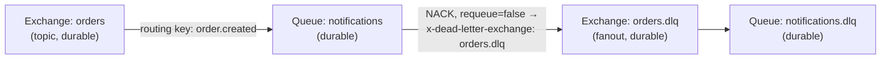

## Service: notification-svc

**Role**: RabbitMQ consumer. Processes `order.created` events, stores notifications in Redis with
idempotency dedup, exposes a REST API for reading notifications.

**Runtime**: Python 3.12, FastAPI + Uvicorn **Port**: 8000 (cluster-internal) **Replicas**: 2

---

## Endpoints

| Method | Route                 | Description                          |
| ------ | --------------------- | ------------------------------------ |
| `GET`  | `/notifications`      | List recent notifications from Redis |
| `GET`  | `/notifications/{id}` | Get single notification by ID        |
| `GET`  | `/healthz`            | Liveness/readiness probe             |

---

## Consumer architecture

The service runs two concurrent components:

1. **FastAPI** — HTTP server (Uvicorn, blocking main thread pool)
2. **RabbitMQ consumer** — background thread started by `lifespan` context manager

```python
@asynccontextmanager
async def lifespan(app):
    thread = threading.Thread(target=_consumer_loop, daemon=True)
    thread.start()
    yield
```

### Redis dedup TTL

The Redis dedup key TTL is matched to the notification record's own TTL (both 24h):

```python
dedup_key = f"dedup:{event.order_id}"
if not r.set(dedup_key, "1", nx=True, ex=86400):  # 24h dedup window
    ...
```

These two TTLs used to differ (dedup key at 1h, notification record at 24h), leaving a window where
a redelivery between 1h and 24h would bypass dedup entirely and double-push the notification ID onto
the list. Fixed by aligning both TTLs to 86400s; `LREM` before `LPUSH` on `notification_ids` is kept
as defense-in-depth so the same ID still can't appear twice in the list even if the two TTLs ever
drift apart again.

### Exponential backoff on consumer crash

If `start_consumer()` raises (e.g., RabbitMQ is unavailable), the loop retries with exponential
backoff:

```python
base_delay, max_delay, attempt = 5, 300, 0
while True:
    try:
        start_consumer()
        attempt = 0          # reset on clean return
    except Exception:
        attempt += 1
        delay = min(base_delay * (2 ** (attempt - 1)), max_delay)
        logger.error("Consumer crashed (attempt %d), restarting in %ds",
                     attempt, delay, exc_info=True)
        time.sleep(delay)
```

Backoff sequence: 5s → 10s → 20s → 40s → ... → 300s (cap). This prevents thundering-herd reconnect
storms when RabbitMQ restarts.

---

## Queue and exchange topology



Dead-letter routing is declared via queue arguments:

```python
channel.queue_declare(
    queue="notifications",
    durable=True,
    arguments={"x-dead-letter-exchange": DLQ_EXCHANGE}
)
```

When a message is NACKed with `requeue=False`, RabbitMQ routes it to `orders.dlq` →
`notifications.dlq`. No application-level retry counter is needed. See
[[adr-dead-letter-queue-for-poison-messages|ADR-008]].

---

## W3C trace context extraction

The consumer extracts `traceparent` from RabbitMQ message headers and builds a `SpanLink` to the
producer's span:

```python
from opentelemetry.propagate import extract
from opentelemetry.trace import Link

# 1. Decode bytes headers (pika delivers values as bytes)
class _BytesGetter:
    def get(self, carrier, key):
        val = carrier.get(key)
        return [val.decode()] if isinstance(val, bytes) else ([val] if val else [])

ctx = extract(properties.headers or {}, getter=_BytesGetter())
token = attach(ctx)

parent_ctx = trace.get_current_span(ctx).get_span_context()
links = [Link(parent_ctx)] if parent_ctx.is_valid else []

with tracer.start_as_current_span(
    "notification.process",
    kind=SpanKind.CONSUMER,
    links=links,            # SpanLink, not parent-child (see ADR-002)
) as span:
    ...

detach(token)
```

This produces a dashed arrow in [[tech/jaeger|Jaeger]] connecting the `order.publish` span
(order-api) to the `notification.process` span (notification-svc), both sharing the same `traceId`.

---

## Processing logic

```python
def handle_order_created(ch, method, properties, body: bytes):
    event = OrderCreatedEvent(**json.loads(body))

    # 1. Idempotency check — atomic SET ... NX on a *separate* dedup key,
    #    not HSETNX on the notification record itself. A prior version used
    #    exists() + a later set() — a TOCTOU window where two near-simultaneous
    #    deliveries could both pass the check before either set the key.
    #    SET NX closes that window in one round trip.
    dedup_key = f"dedup:{event.order_id}"
    if not r.set(dedup_key, "1", nx=True, ex=3600):  # 1h dedup window
        span.set_attribute("notification.duplicate", True)
        ch.basic_ack(delivery_tag=method.delivery_tag)
        return  # Already processed

    # 2. Store notification (separate 24h TTL from the 1h dedup key above —
    #    a redelivery between 1h and 24h bypasses dedup; see docs/reviews/
    #    2026-07-08-principal-staff-review.md §2.2 for the open gap this leaves)
    notification_id = f"notif-{event.order_id}"
    r.hset(f"notifications:{notification_id}", mapping={
        "id": notification_id,
        "order_id": event.order_id,
        "project_id": event.project_id,
        "message": f"Order #{event.order_id} created for project {event.project_id}: "
                    f"{event.description} — ${event.amount:.2f}",
        "status": "sent",
        "created_at": datetime.now(timezone.utc).isoformat(),
        "trace_id": current_trace_id,
    })
    r.expire(f"notifications:{notification_id}", 86400)  # TTL: 24h
    r.lpush("notification_ids", notification_id)
    r.ltrim("notification_ids", 0, 999)  # capped list, most-recent 1000

    # 3. Mock email send (child span)
    with tracer.start_as_current_span("notification.send_email") as email_span:
        delay_ms = random.randint(100, 500)
        email_span.set_attribute("email.order_id", event.order_id)
        email_span.set_attribute("email.delay_ms", delay_ms)
        time.sleep(delay_ms / 1000)

    ch.basic_ack(delivery_tag=method.delivery_tag)
```

---

## Redis client (`redis_client.py`)

Connection is created once and cached. Health check pings before returning the client; on
`ConnectionError` the stale client is discarded and the exception re-raised (not silently retried
in-place) so the caller's own error handling decides what happens next:

```python
def get_redis() -> redis.Redis:
    global _client
    if _client is None:
        _client = redis.Redis(
            host=REDIS_HOST, port=REDIS_PORT,
            socket_connect_timeout=5, socket_timeout=5,
            socket_keepalive=True,
            health_check_interval=30,
        )
    try:
        _client.ping()
    except redis.ConnectionError:
        logger.warning("Redis connection lost; client cleared, will reconnect on next call")
        _client = None
        raise
    return _client
```

---

## OTel instrumentation

### Auto-instrumented

| Component      | Package                                 | Spans created                                   |
| -------------- | --------------------------------------- | ----------------------------------------------- |
| FastAPI routes | `opentelemetry-instrumentation-fastapi` | HTTP server spans                               |
| Redis commands | `opentelemetry-instrumentation-redis`   | `SET`, `GET`, `HSET` etc with `db.system=redis` |

Health-check exclusion: `excluded_urls="/healthz"` in `FastAPIInstrumentation().instrument_app()`.

### Custom instruments

| Instrument                          | Type       | Labels                               | Description                        |
| ----------------------------------- | ---------- | ------------------------------------ | ---------------------------------- |
| `notification.process` span         | `CONSUMER` | `notification.duplicate`, `order.id` | Full processing span with SpanLink |
| `notification.send_email` span      | `INTERNAL` | `email.order_id`, `email.delay_ms`   | Mock email delivery                |
| `notifications.processed.total`     | Counter    | `status` (success/duplicate/failed)  | Processing outcomes                |
| `notifications.processing.duration` | Histogram  | —                                    | End-to-end consumer latency        |
| `notifications.email.send.duration` | Histogram  | —                                    | Mock email latency                 |

---

## Log format

Structured JSON via `python-json-logger`. Fields used by Alloy's `loki.process` trace correlation
stage:

```json
{
  "asctime": "2026-04-14T10:30:01.234Z",
  "levelname": "INFO",
  "message": "Processed order.created event",
  "otelTraceID": "4bf92f3577b34da6a3ce929d0e0e4736",
  "otelSpanID": "00f067aa0ba902b7"
}
```

The Alloy `stage.json` in both collector configs extracts `python_trace = "otelTraceID"` and
`python_span = "otelSpanID"` and promotes them to Loki structured metadata.

---

## Failure modes

| Scenario                                | Behaviour                            | Evidence                                                                        |
| --------------------------------------- | ------------------------------------ | ------------------------------------------------------------------------------- |
| RabbitMQ unavailable at start           | Backoff retry (5s → 300s)            | `logger.error("Consumer crashed")` in pod logs                                  |
| Redis unavailable                       | `redis.RedisError` raised in handler | NACK with `requeue=True` (message re-queued), `status=failed_transient` counter |
| Duplicate message                       | Silent idempotency skip              | `notification.duplicate=True` span attribute, `status=duplicate` counter        |
| Malformed message                       | `KeyError` or `ValueError`           | NACK with `requeue=False` → DLQ, `logger.exception(...)`                        |
| order-api publishes without traceparent | Consumer creates span with no link   | Span still created, no correlation                                              |

---

## Health probes

```yaml
livenessProbe:
  httpGet:
    path: /healthz
    port: 8000
  initialDelaySeconds: 20
  periodSeconds: 15
  timeoutSeconds: 5
  failureThreshold: 3
```
