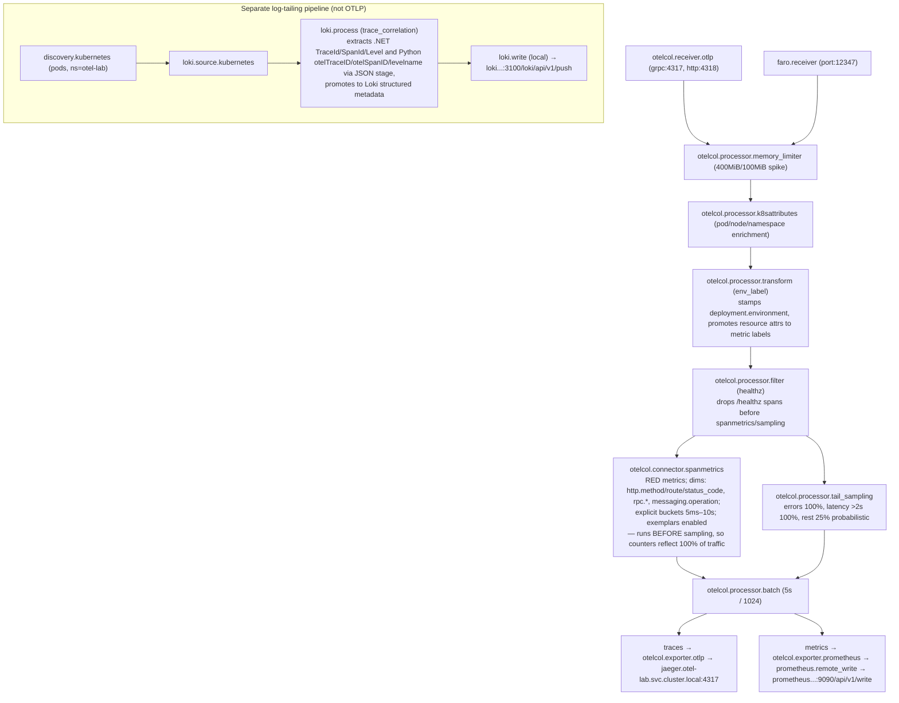
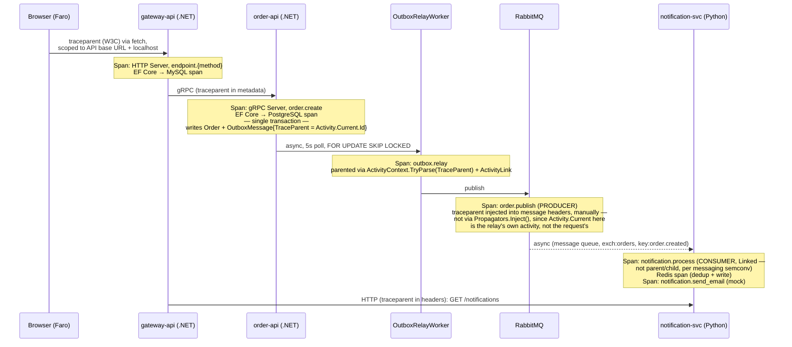

## spec.md — SignalForge: OTel Microservices Validation Lab

> This is the architecture spec. For deploy mechanics see
> [CLAUDE.md](https://github.com/shipsolid/signal-forge/blob/main/CLAUDE.md); for the
> documentation index (per-service deep dives, ADRs, runbooks, security posture) see
> [[projects/app-signal-forge/readme|docs/README.md]]; for the instrumentation-level deep dive on
> every OTel decision see [[projects/app-signal-forge/otel-patterns|otel-patterns.md]].

## 1. Purpose

A multi-service application (.NET, Python, Angular) deployed on local k3d, instrumented end-to-end
with OpenTelemetry and collected via **Grafana Alloy**. The goal is to validate every
instrumentation pattern — traces, metrics, logs, exemplars, span metrics, cross-language
propagation, sync + async communication (including the transactional outbox pattern), and frontend
RUM — before rolling them into production workloads.

**Mode is a single switch, not dual-export.** `monitoring.mode` in
[conf.yml](https://github.com/shipsolid/signal-forge/blob/main/conf.yml) is either `cloud`
(default) or `local` — mutually exclusive. In `cloud` mode the Helm-managed Alloy agents ship
directly to Grafana Cloud Tempo/Mimir/Loki and no in-cluster Jaeger/Prometheus/Loki/ Grafana are
deployed. In `local` mode a bespoke Alloy DaemonSet exports to those in-cluster backends instead.
There is no configuration that sends the same signal to both destinations at once.

---

## 2. Architecture Overview

```mermaid
flowchart TD
    subgraph CLUSTER["k3d cluster: otel-lab (namespace: otel-lab)"]
        FE["Angular SPA (Faro RUM)<br/>nginx:8080, UID 101"]
        GW["gateway-api (.NET 8)<br/>:5000, UID 1654<br/>owns: MySQL 8.0"]
        ORD["order-api (.NET 8)<br/>:5002 grpc, :5001 health<br/>UID 1654, owns: PostgreSQL 16"]
        NOTIF["notification-svc (Python/FastAPI)<br/>:8000, UID 1000<br/>owns: Redis"]
        MQ["RabbitMQ (broker)<br/>exch:orders (topic)"]

        FE -->|"HTTP /api"| GW
        GW -->|"gRPC :5002"| ORD
        GW -->|"HTTP :8000"| NOTIF
        ORD -->|"publish / outbox relay (5s)"| MQ
        MQ -->|"consume, prefetch=1"| NOTIF
        NOTIF -.->|"nack → DLQ"| MQ

        TLSNOTE["TLS ingress (Traefik + cert-manager): signal-forge.local:8443 → frontend / gateway"]
        NPNOTE["NetworkPolicies: default-deny + tiered allow-list (not enforced on k3d/flannel)"]
    end

    subgraph LOCALMODE["monitoring.mode = local"]
        L_INFO["k8s/monitoring/grafana/ (bespoke Alloy DaemonSet, v1.14.0)<br/>OTLP :4317/:4318, Faro :12347"]
        L1[memory_limiter] --> L2[k8sattributes] --> L3["transform (env label)"] --> L4["filter (healthz)"]
        L4 --> L5[spanmetrics connector]
        L4 --> L6["tail_sampling (errors 100%, &gt;2s 100%, rest 25%)"]
        L5 --> L7[batch]
        L6 --> L7
        L7 --> L8["traces → Jaeger"]
        L7 --> L9["metrics → Prometheus remote_write"]
        L10["logs → Loki<br/>(separate loki.source.kubernetes tailing pipeline, trace_correlation stage)"]
        L_BACKENDS["Local backends (k8s/monitoring/local/):<br/>Jaeger:16686, Prometheus:9090, Loki:3100, Grafana:3000<br/>(pre-provisioned datasources + 2 dashboards)"]
        L_HELM["Helm chart install is OPTIONAL here (--with-helm)"]
    end

    subgraph CLOUDMODE["monitoring.mode = cloud (default)"]
        CL_INFO["grafana/k8s-monitoring Helm chart v3.8.4<br/>namespace: monitoring, MANDATORY"]
        CL_RECEIVER["alloy-receiver DaemonSet<br/>OTLP :4317/:4318 — is the sole ingress"]
        CL_DEST_M["grafana-cloud-metrics → Mimir Prometheus remote_write<br/>(NOT /api/v1/otlp)"]
        CL_DEST_L["grafana-cloud-logs → Loki push"]
        CL_DEST_T["grafana-cloud-traces → Tempo OTLP/gRPC"]
        CL_RECEIVER --> CL_DEST_M
        CL_RECEIVER --> CL_DEST_L
        CL_RECEIVER --> CL_DEST_T
        CL_ENABLES["Also enables: clusterMetrics, annotationAutodiscovery, clusterEvents,<br/>node/pod log pipelines with trace correlation, applicationObservability."]
        CL_DISABLED["Disabled: Beyla auto-instrumentation, Pyroscope profiling, Fleet Management."]
        CL_NONE["No in-cluster Jaeger/Prometheus/Loki/Grafana deployed in this mode."]
    end
```



---

## 3. Services

### 3.1 Angular SPA — `otel-frontend` (routes as `signal-forge`)

| Attribute | Value                                                                                          |
| --------- | ---------------------------------------------------------------------------------------------- |
| Framework | Angular **17.3.0**, standalone components, lazy-loaded routes                                  |
| Builder   | `@angular-builders/custom-webpack` (custom `webpack.config.ts` for the Faro source-map plugin) |
| RUM SDK   | `@grafana/faro-web-sdk` ^1.10.1, `@grafana/faro-web-tracing` ^1.10.1                           |
| Hosting   | `nginxinc/nginx-unprivileged:alpine`, port **8080**, UID **101**                               |
| Purpose   | Frontend RUM, browser-to-backend trace propagation, runtime-configurable API/Faro endpoints    |

#### Pages & User Flows (`src/app/app.routes.ts`)

| Path            | Component                | Backend calls (via `ApiService`)                                              | OTel validation target                      |
| --------------- | ------------------------ | ----------------------------------------------------------------------------- | ------------------------------------------- |
| `''`            | `DashboardComponent`     | `GET /api/projects`, `POST /api/projects`                                     | Faro → Gateway span linkage                 |
| `projects/:id`  | `ProjectDetailComponent` | `GET /api/projects/:id`, `GET /api/projects/:id/orders` (parallel `forkJoin`) | Multi-fetch waterfall in traces             |
| `orders/new`    | `CreateOrderComponent`   | `POST /api/orders` (`projectId` prefilled from query param)                   | Full click-to-database trace                |
| `notifications` | `NotificationsComponent` | `GET /api/notifications`                                                      | Cross-language trace (Gateway → Python)     |
| `error-test`    | `ErrorTestComponent`     | `GET /api/error` (+ 2 pure-frontend error triggers, no backend call)          | Frontend error capture + backend error span |

`ApiService` also exposes `deleteProject()` → `DELETE /api/projects/:id`, defined but not wired to
any route today.

All requests pass through `resilienceInterceptor` (`services/resilience.interceptor.ts`): 10s
timeout, GET-only retry (max 2 attempts, 500ms base backoff), sanitized `ApiError` normalization.

The **error-test page** has three deliberate triggers, all built for OTel/Faro validation:

1. "Trigger Backend Error (500)" → `GET /api/error` — validates backend exception-span capture.
2. "Trigger JS Exception" → throws synchronously → `FaroErrorHandler` (registered Angular
   `ErrorHandler`) → `faro.api.pushError()`.
3. "Trigger Unhandled Promise Rejection" → captured by Faro's default `window.unhandledrejection`
   listener.

#### Faro Configuration — runtime-injected, not build-time (`src/app/telemetry/faro.ts`)

Initialized via an Angular `APP_INITIALIZER` (in `app.config.ts`), so RUM is active before the
router or any component runs.

```typescript
const faroUrl = window.__ENV?.FARO_URL || environment.faroUrl;
if (!faroUrl) {
  console.info('[Faro] FARO_URL not configured — RUM disabled');
} else {
  initializeFaro({
    url: faroUrl,
    app: {
      name: 'signal-forge',
      version: '1.0.0',
      environment: environment.production ? 'production' : 'local',
    },
    sessionTracking: { samplingRate: 1, persistent: true },
    beforeSend: scrubTelemetryItem,   // drops /healthz log noise, redacts emails
    instrumentations: [
      ...getWebInstrumentations(),
      new TracingInstrumentation({
        instrumentationOptions: {
          propagateTraceHeaderCorsUrls: [
            new RegExp(environment.apiBaseUrl.replace(/[.*+?^${}()|[\]\\]/g, '\\$&')),
            /http:\/\/localhost/,
          ],
        },
      }),
    ],
  });
}
```

**How the URL actually gets in**: `window.__ENV` is a runtime `assets/env.js`, not a build-time env
var. The Dockerfile bakes a placeholder (`{ FARO_URL: "", API_BASE_URL: "/api" }`); the K8s
Deployment mounts a `frontend-env-js` ConfigMap over `assets/env.js` via `subPath`, rendered by
`deploy-local.sh` from the `FARO_COLLECTOR_URL` credential (sourced via `conf.yml`'s
`monitoring.grafana_cloud.use_env`) — compatible with `readOnlyRootFilesystem: true` since no
entrypoint script rewrites files at container start. `nginx.conf` disables caching on
`/assets/env.js` specifically so a ConfigMap change takes effect on pod restart without a browser
cache flush.

- **Local dev (`ng serve`)** falls back to `environment.ts`'s `http://localhost:12347/collect` — the
  local Alloy DaemonSet's `faro.receiver` port.
- **In-cluster, cloud mode** — `FARO_URL` resolves to the Grafana Cloud Faro collector endpoint if
  configured, else RUM is disabled (no crash).

Key signals from Faro: page load timing, route change spans, fetch/XHR spans (propagating
`traceparent` only to the API base URL and `http://localhost` origins), JavaScript errors, Web
Vitals. Source maps upload via `@grafana/faro-webpack-plugin` only when `FARO_API_KEY` is passed as
a Docker build arg.

`nginx.conf` also sets a real CSP
(`default-src 'self'; connect-src 'self' https://*.grafana.net; frame-ancestors 'none'`),
`X-Frame-Options: DENY`, `X-Content-Type-Options: nosniff`, and does **not** proxy `/api` itself —
that routing happens at the Ingress, not in this container.

---

### 3.2 API Gateway / BFF — `gateway-api` (.NET 8)

| Attribute      | Value                                                                                                        |
| -------------- | ------------------------------------------------------------------------------------------------------------ |
| Framework      | .NET 8 Minimal API                                                                                           |
| Database       | MySQL 8.0 (owns `Projects` aggregate), `EnsureCreated()` — no formal migrations                              |
| ORM            | EF Core 8.0.2 + Pomelo.EntityFrameworkCore.MySql 8.0.2                                                       |
| Comms outbound | gRPC → order-api (`:5002`), HTTP → notification-svc (`:8000`), both behind `.AddStandardResilienceHandler()` |
| Role           | Receives all frontend calls, fans out to downstream services                                                 |

#### Endpoints (`Endpoints/ProjectEndpoints.cs`, `Endpoints/OrderEndpoints.cs`)

| Method | Route                       | Downstream call                                                    | OTel target                                          |
| ------ | --------------------------- | ------------------------------------------------------------------ | ---------------------------------------------------- |
| GET    | `/api/projects`             | — (local DB)                                                       | EF Core + MySQL spans                                |
| GET    | `/api/projects/{id}`        | — (local DB)                                                       | Span attribute `project.id`                          |
| POST   | `/api/projects`             | — (local DB)                                                       | Write span, `gateway.create_project`                 |
| DELETE | `/api/projects/{id}`        | — (local DB)                                                       | Cascade delete, error scenario                       |
| POST   | `/api/orders`               | gRPC → `OrderService.CreateOrder` (with generated idempotency key) | gRPC client span propagation                         |
| GET    | `/api/orders/{id}`          | gRPC → `OrderService.GetOrder`                                     | gRPC client span                                     |
| GET    | `/api/projects/{id}/orders` | gRPC → `OrderService.GetOrdersByProject`                           | gRPC server-streaming span (capped at 10,000 orders) |
| GET    | `/api/notifications`        | HTTP → notification-svc `GET /notifications` (1 MB response cap)   | HTTP client span, cross-language propagation         |
| GET    | `/api/slow`                 | — (random 2000–5000 ms delay)                                      | Latency histogram, exemplar validation               |
| GET    | `/api/error`                | — (throws `InvalidOperationException`)                             | Error span, exception event recording                |
| GET    | `/healthz`                  | —                                                                  | Health-check exclusion in tracing + inflight counter |

Every route except `/healthz` runs through `TracingEndpointFilter`, which adds a child span named
`endpoint.{method}` (e.g. `endpoint.get`, `endpoint.post`). `X-Plant-Id` inbound headers are
forwarded into gRPC metadata via `GrpcCallContext.PlantIdMetadata()`; gRPC errors are mapped to HTTP
status codes by `GrpcErrorMapping.cs` (400/401/403/404/409/429/501/503/504, default 502).

#### Domain Model

```csharp
public class Project
{
    public int Id { get; set; }
    public string Name { get; set; } = string.Empty;     // max 200, required
    public string Owner { get; set; } = string.Empty;    // max 100, required
    public DateTime CreatedAt { get; set; } = DateTime.UtcNow;   // datetime(6)
}
```

Shared validation constants (`src/proto/OrderValidation.cs`, namespace `OrderContracts`, compiled
into both gateway-api and order-api): `OrderLimits.MaxAmount = 999_999.99`,
`OrderLimits.MaxDescriptionLength = 500`.

#### OTel Packages (`gateway-api.csproj`)

```xml
<PackageReference Include="OpenTelemetry" Version="1.9.0" />
<PackageReference Include="OpenTelemetry.Extensions.Hosting" Version="1.9.0" />
<PackageReference Include="OpenTelemetry.Instrumentation.AspNetCore" Version="1.9.0" />
<PackageReference Include="OpenTelemetry.Instrumentation.Http" Version="1.9.0" />
<PackageReference Include="OpenTelemetry.Instrumentation.GrpcNetClient" Version="1.9.0-beta.1" />
<PackageReference Include="OpenTelemetry.Instrumentation.EntityFrameworkCore" Version="1.0.0-beta.12" />
<PackageReference Include="OpenTelemetry.Instrumentation.Runtime" Version="1.9.0" />
<PackageReference Include="OpenTelemetry.Instrumentation.Process" Version="0.5.0-beta.6" />
<PackageReference Include="OpenTelemetry.Exporter.OpenTelemetryProtocol" Version="1.9.0" />
```

Resource: `AddService("gateway-api").AddTelemetrySdk().AddEnvironmentVariableDetector()`.
`EnrichWithHttpRequest` adds `http.user_agent`, `net.peer.ip`, `http.route.action`, `plant.id`.
Logging: `AddOpenTelemetry(...)` (scopes/formatted-message/state included) **plus**
`AddJsonConsole()` — `OTEL_LOGS_EXPORTER=none` means only the JSON-console path is actually shipped
(Alloy tails stdout, does not receive logs via OTLP). Exemplars are enabled via the
`OTEL_METRICS_EXEMPLAR_FILTER=trace_based` env var, not code — see §5.3.

#### Custom Instrumentation

| Signal | Name                                                                                                                                    | Type                        | Description                                                                                                             |
| ------ | --------------------------------------------------------------------------------------------------------------------------------------- | --------------------------- | ----------------------------------------------------------------------------------------------------------------------- |
| Trace  | `gateway.fanout`                                                                                                                        | Span (Client/Internal)      | Wraps each downstream call; tags `order.project_id`, `order.id`, `project.id`                                           |
| Trace  | `gateway.get_projects` / `gateway.get_project` / `gateway.create_project` / `gateway.delete_project` / `gateway.slow` / `gateway.error` | Span                        | One per handler, project/delay-tagged                                                                                   |
| Trace  | `endpoint.{method}`                                                                                                                     | Span                        | From `TracingEndpointFilter`, tags `http.route.template`, `http.method`, `http.target`                                  |
| Metric | `gateway.requests.inflight`                                                                                                             | UpDownCounter (`{request}`) | Concurrent request gauge (excludes `/healthz`)                                                                          |
| Metric | `gateway.downstream.duration`                                                                                                           | Histogram (`ms`)            | Labels `downstream` (`order-api`/`notification-svc`), `operation` — per-downstream-service call latency, with exemplars |
| Log    | structured `ILogger` → JSON console                                                                                                     | Log record                  | Message templates always include `TraceId`                                                                              |

#### Dockerfile

`mcr.microsoft.com/dotnet/sdk:8.0` (build, digest-pinned) → `mcr.microsoft.com/dotnet/aspnet:8.0`
(runtime, digest-pinned). `USER 1654:1654` (built-in `app` user).
`ASPNETCORE_URLS=http://0.0.0.0:5000`, `EXPOSE 5000`.

---

### 3.3 Order Service — `order-api` (.NET 8)

| Attribute      | Value                                                                                          |
| -------------- | ---------------------------------------------------------------------------------------------- |
| Framework      | .NET 8 — gRPC server on a dedicated HTTP/2-only port + minimal API for health on HTTP/1.1      |
| Database       | PostgreSQL 16.4                                                                                |
| ORM            | EF Core 8.0.4 + Npgsql.EntityFrameworkCore.PostgreSQL 8.0.4                                    |
| Message broker | RabbitMQ, via a transactional **outbox** (not a direct publish)                                |
| Role           | Order CRUD, atomically records an outbox entry per order, relays it to RabbitMQ asynchronously |

**Dual-port split is deliberate**: Kestrel's default `Http1AndHttp2` protocol selection requires
ALPN, which cleartext (non-TLS) connections can't negotiate — so gRPC needs its own HTTP/2-only,
prior-knowledge port, separate from the HTTP/1.1 port kubelet probes use.

| Port | Protocol                                 | Purpose                                                                  |
| ---- | ---------------------------------------- | ------------------------------------------------------------------------ |
| 5001 | HTTP/1.1                                 | `/healthz` — kubelet liveness/readiness probes                           |
| 5002 | HTTP/2 (h2c, cleartext, prior-knowledge) | gRPC `OrderService` — gateway-api's `OrderApi:Address` targets this port |

#### gRPC Service Definition (`src/proto/orders.proto`)

```protobuf
syntax = "proto3";
package orders;
option csharp_namespace = "OrderApi.Protos";

service OrderService {
  rpc CreateOrder (CreateOrderRequest) returns (CreateOrderResponse);
  rpc GetOrdersByProject (GetOrdersByProjectRequest) returns (stream OrderResponse);
  rpc GetOrder (GetOrderRequest) returns (OrderResponse);
}

message CreateOrderRequest {
  int32 project_id = 1;
  string description = 2;
  double amount = 3;
  string idempotency_key = 4;   // empty = no dedup
}

message CreateOrderResponse {
  int32 order_id = 1;
  string status = 2;
}

message GetOrdersByProjectRequest { int32 project_id = 1; }
message GetOrderRequest           { int32 order_id = 1; }

message OrderResponse {
  int32 id = 1;
  int32 project_id = 2;
  string description = 3;
  double amount = 4;
  string status = 5;
  string created_at = 6;   // ISO-8601 UTC
}
```

Business rules: `project_id > 0`; `description` 1–500 chars; `amount` in `(0, 999,999.99]` (wire
type is `double` — no proto decimal — while the DB column is `numeric(18,2)`); `idempotency_key`
empty means no dedup, otherwise a repeat key replays the original order instead of creating a
duplicate.

#### Domain Model

```csharp
public class Order
{
    public int Id { get; set; }
    public int ProjectId { get; set; }
    public string Description { get; set; } = string.Empty;   // max 500, required
    public decimal Amount { get; set; }                         // numeric(18,2)
    public string Status { get; set; } = "Created";            // string, not an enum — only
                                                                  // "Created" is ever written;
                                                                  // Processing/Completed/Failed
                                                                  // are documented placeholders
    public DateTime CreatedAt { get; set; } = DateTime.UtcNow;
    public string? IdempotencyKey { get; set; }                 // max 64, unique index (NULL-safe)
}

public class OutboxMessage
{
    public int Id { get; set; }
    public Order Order { get; set; } = null!;      // FK, cascade delete
    public string? TraceParent { get; set; }        // max 55 — W3C traceparent is always 55 chars
    public DateTime CreatedAt { get; set; }
    public DateTime? ProcessedAt { get; set; }       // null until relayed to RabbitMQ; indexed
}
```

#### Transactional Outbox → RabbitMQ Relay

`OrderGrpcService.CreateOrder` writes `Order` and its `OutboxMessage` in a **single
`SaveChangesAsync`** — the message and the row it describes either both commit or both roll back, so
a pod crash between "order written" and "event published" can't lose the event. The
`OutboxMessage.TraceParent` field captures `Activity.Current?.Id` at write time — this is what lets
the eventual RabbitMQ publish (which happens later, in a different execution context) still carry
the _original request's_ trace.

`OutboxRelayWorker` (a `BackgroundService`) polls every **5 seconds**, selects up to 100 unprocessed
rows (`ProcessedAt IS NULL`, oldest first), and claims each with `FOR UPDATE SKIP LOCKED` — safe
across multiple order-api replicas racing the same table:

```csharp
var msg = await db.OutboxMessages
    .FromSqlInterpolated($@"
    SELECT * FROM ""OutboxMessages""
    WHERE ""Id"" = {outboxMessageId} AND ""ProcessedAt"" IS NULL
    FOR UPDATE SKIP LOCKED")
    .Include(m => m.Order)
    .SingleOrDefaultAsync(ct);
```

It reconstructs the original trace context with
`ActivityContext.TryParse(msg.TraceParent, ..., isRemote: true, out var parsedContext)`, starts an
`outbox.relay` span parented to that context (plus an explicit `ActivityLink`), calls
`IOrderPublisher.PublishAsync`, and marks `ProcessedAt` on success. On failure it rolls back —
`ProcessedAt` stays null, so the message is retried on the next poll.

#### RabbitMQ Publishing (`Messaging/OrderPublisher.cs`)

Exchange **`orders`** (topic, durable), routing key **`order.created`**, message persistent, 1-hour
TTL (`Expiration = "3600000"`):

```json
{ "order_id": 42, "project_id": 7, "description": "Server rack provisioning", "amount": 4500.00, "created_at": "2026-04-14T10:30:00Z" }
```

**Trace propagation is manual, deliberately not `Propagators.Inject()`**:

```csharp
props.Headers = new Dictionary<string, object>();
if (!string.IsNullOrEmpty(traceParent))
    props.Headers["traceparent"] = Encoding.UTF8.GetBytes(traceParent);
```

The code comment explains why: `OutboxRelayWorker` runs in a background context, not the original
request's — `Activity.Current` there would be the relay's _own_ activity, not the request's. The
already-persisted `OutboxMessage.TraceParent` is the correct value to inject, so it's written
directly rather than re-derived from ambient context. A `order.publish` span
(`ActivityKind.Producer`) is started around the publish call, tagged with
`messaging.system=rabbitmq`, `messaging.destination=orders`, `messaging.destination_kind=exchange`,
`messaging.rabbitmq.routing_key=order.created`.

> A prior version of this pipeline had `outbox.relay`/`order.publish` landing in their own
> disconnected trace — fixed, and now covered by a real integration test (§9 below,
> `CrossLanguageTraceIntegrationTests`) that fails if it regresses.

#### OTel Packages (`order-api.csproj`)

```xml
<PackageReference Include="OpenTelemetry.Extensions.Hosting" Version="1.9.0" />
<PackageReference Include="OpenTelemetry.Instrumentation.AspNetCore" Version="1.9.0" />
<PackageReference Include="OpenTelemetry.Instrumentation.GrpcNetClient" Version="1.9.0-beta.1" />
<PackageReference Include="OpenTelemetry.Instrumentation.EntityFrameworkCore" Version="1.0.0-beta.12" />
<PackageReference Include="OpenTelemetry.Instrumentation.Runtime" Version="1.9.0" />
<PackageReference Include="OpenTelemetry.Instrumentation.Process" Version="0.5.0-beta.6" />
<PackageReference Include="OpenTelemetry.Exporter.OpenTelemetryProtocol" Version="1.9.0" />
```

No `Npgsql.OpenTelemetry` package — Npgsql 8's `AddNpgsql()` API was removed; tracing wires up
Npgsql's own built-in `ActivitySource` directly: `.AddSource("Npgsql")`. `EnrichWithHttpRequest`
adds `net.peer.ip`, `http.user_agent`, `plant.id` (truncated to 256 chars).

#### Custom Instrumentation

| Signal | Name                         | Type                    | Description                                                                                                                                             |
| ------ | ---------------------------- | ----------------------- | ------------------------------------------------------------------------------------------------------------------------------------------------------- |
| Trace  | `order.create`               | Span                    | Wraps validate + DB write + outbox insert; tags `order.project_id`, `order.amount`, `order.id`                                                          |
| Trace  | `order.get_by_project`       | Span                    | Tag `order.project_id`                                                                                                                                  |
| Trace  | `order.get`                  | Span                    | Tag `order.id`                                                                                                                                          |
| Trace  | `order.publish`              | Span (Producer)         | RabbitMQ publish, messaging.\* attributes                                                                                                               |
| Trace  | `outbox.relay`               | Span (Internal)         | Relay-worker span, linked+parented to the original request's trace via the stored `traceparent`                                                         |
| Metric | `orders.created.total`       | Counter (`{order}`)     | Total orders created — deliberately **no** `project_id` label (unbounded cardinality); use the `order.project_id` span attribute for drill-down instead |
| Metric | `orders.amount.total`        | Counter (double, `USD`) | Running total order value                                                                                                                               |
| Metric | `orders.processing.duration` | Histogram (`ms`)        | Time from order create to RabbitMQ publish, with exemplars                                                                                              |

#### Dockerfile

Same base images/digests as gateway-api. `USER 1654:1654`. `EXPOSE 5001 5002`. No `ASPNETCORE_URLS`
set — Kestrel binds both ports explicitly in `Program.cs`; setting the env var too would double-bind
port 5001.

---

### 3.4 Notification Service — `notification-svc` (Python / FastAPI)

| Attribute      | Value                                                                                         |
| -------------- | --------------------------------------------------------------------------------------------- |
| Framework      | Python 3.12, FastAPI 0.111.0 + Uvicorn 0.30.1                                                 |
| Database       | Redis 7.4 (notification state + dedup)                                                        |
| Message broker | RabbitMQ (consumer, `pika` 1.3.2), with a dead-letter exchange                                |
| Role           | Consumes `order.created` events, dedups, stores notification records, exposes list/detail API |

#### Endpoints (`app/main.py`)

| Method | Route                 | Purpose                                                             | OTel target                     |
| ------ | --------------------- | ------------------------------------------------------------------- | ------------------------------- |
| GET    | `/notifications`      | Last 100 notifications from Redis                                   | Redis span instrumentation      |
| GET    | `/notifications/{id}` | Single notification, 404 if missing/expired                         | Span attributes                 |
| GET    | `/healthz`            | Liveness — no span, excluded from tracing                           | Health-check exclusion          |
| GET    | `/readyz`             | Readiness — checks consumer connection + Redis ping, 503 on failure | Consumer/Redis health surfacing |

#### RabbitMQ Consumer + Dead-Letter Queue (`app/consumer.py`)

| Attribute    | Value                                                                                   |
| ------------ | --------------------------------------------------------------------------------------- |
| Exchange     | `orders` (topic, durable)                                                               |
| Queue        | `notifications` (durable), `prefetch_count=1`, arg `x-dead-letter-exchange: orders.dlq` |
| Routing key  | `order.created`                                                                         |
| DLQ exchange | `orders.dlq` (fanout, durable)                                                          |
| DLQ queue    | `notifications.dlq`                                                                     |

**Trace propagation is manual by design, not `opentelemetry-instrumentation-pika`** (the package
isn't even in `requirements.txt`). The module docstring gives the reason: pika's
auto-instrumentation doesn't reliably link the incoming message's context in all versions, and
manual extraction gives full control over span kind (`CONSUMER`) and the link relationship. RabbitMQ
delivers header values as raw bytes (since the .NET publisher writes them as bytes), so a custom
`HeadersGetter` decodes before handing off to the standard W3C extractor:

```python
class HeadersGetter:
    def get(self, carrier: dict, key: str) -> list[str]:
        val = carrier.get(key)
        if val is None:
            return []
        return [val.decode("utf-8")] if isinstance(val, bytes) else [str(val)]
    def keys(self, carrier: dict) -> list[str]:
        return list(carrier.keys()) if carrier else []

ctx = extract(properties.headers or {}, getter=HeadersGetter())
token = attach(ctx)
parent_span_ctx = trace.get_current_span(ctx).get_span_context()
links = [Link(parent_span_ctx)] if parent_span_ctx.is_valid else []

with tracer.start_as_current_span("notification.process", kind=SpanKind.CONSUMER, links=links) as span:
    ...
```

Per OTel messaging semantic conventions, the CONSUMER span uses a **Link** to the producer's span
(not a parent/child relationship) — this validates **cross-language async propagation** (.NET outbox
relay → Python consumer).

#### Processing Logic (`handle_order_created`)

1. Extract W3C context from headers, `attach()` to the thread (so Redis/email child spans inherit it
   automatically); `detach()` in a `finally`.
2. Start `notification.process` (CONSUMER, linked), set `messaging.*` attributes.
3. Parse body → `OrderCreatedEvent` (Pydantic).
4. **Dedup**: atomic `SET dedup:{order_id} 1 NX EX 86400` — if it already existed, tag
   `notification.duplicate=True`, count `{"status": "duplicate"}`, ACK, return early. (Deliberately
   atomic `SET NX`, not `EXISTS`-then-`SET`, to close a prior TOCTOU race; the dedup TTL was aligned
   to 24h to match the notification-record TTL, which used to be a mismatched 1h.)
5. Build the message, `HSET notifications:notif-{order_id}` (fields incl. `trace_id`),
   `EXPIRE 86400`.
6. `LREM` (remove any existing entry) → `LPUSH` → `LTRIM 0 999` on `notification_ids` (capped at
   1000, idempotent re-push).
7. `_mock_email_send()` — separate `notification.send_email` span, random 100–500ms sleep.
8. Record `notifications.processing.duration`, increment `{"status": "success"}`, ACK.

**Error → NACK mapping**: | Failure | NACK | Counter label | Effect | | ------- | ---- |
-------------- | ------ | | `redis.RedisError` | `requeue=True` | `failed_transient` | Retried —
treated as transient infra failure | | Bad JSON / Pydantic validation / any other exception |
`requeue=False` | `failed` | Routed to `orders.dlq` — poison message |

#### Redis Key Patterns

| Key                              | Type                 | TTL    | Purpose                                                           |
| -------------------------------- | -------------------- | ------ | ----------------------------------------------------------------- |
| `dedup:{order_id}`               | string               | 86400s | Idempotency guard, atomic `SET NX`                                |
| `notifications:notif-{order_id}` | hash                 | 86400s | `id, order_id, project_id, message, status, created_at, trace_id` |
| `notification_ids`               | list, capped at 1000 | none   | Recent-IDs index for `GET /notifications`                         |

#### OTel Packages (`requirements.txt`)

```
opentelemetry-api==1.25.0
opentelemetry-sdk==1.25.0
opentelemetry-exporter-otlp-proto-grpc==1.25.0
opentelemetry-instrumentation-fastapi==0.46b0
opentelemetry-instrumentation-redis==0.46b0
opentelemetry-instrumentation-logging==0.46b0
python-json-logger==2.0.7
```

No pika instrumentation (manual extraction, see above); gRPC-only OTLP exporter (no HTTP variant
installed). `LoggingInstrumentor` injects `otelTraceID`/`otelSpanID`/`otelServiceName` into log
records — logs themselves ship via stdout + Alloy tailing (`OTEL_LOGS_EXPORTER=none`), not OTLP.

#### Custom Instrumentation

| Signal | Name                                | Type                       | Description                                                                                   |
| ------ | ----------------------------------- | -------------------------- | --------------------------------------------------------------------------------------------- |
| Trace  | `notification.process`              | Span (CONSUMER, linked)    | Full event processing, `messaging.*` + `order.id`/`order.project_id`/`notification.duplicate` |
| Trace  | `notification.send_email`           | Span                       | Mock email send, `email.order_id`/`email.delay_ms`                                            |
| Metric | `notifications.processed.total`     | Counter (`{notification}`) | Label `status`: `success` / `duplicate` / `failed` / `failed_transient`                       |
| Metric | `notifications.processing.duration` | Histogram (`ms`)           | End-to-end from RabbitMQ delivery to ACK                                                      |
| Metric | `notifications.email.send.duration` | Histogram (`ms`)           | Mock email latency                                                                            |

#### Dockerfile

`python:3.12-slim` (digest-pinned). Non-root `app` user created explicitly (debian base has none),
UID/GID **1000**. `EXPOSE 8000`. `OTEL_LOGS_EXPORTER=none` set in the image.

---

## 4. Infrastructure Components

### 4.1 Databases

| Database   | Version (pinned)   | Owner            | K8s kind                               | Storage |
| ---------- | ------------------ | ---------------- | -------------------------------------- | ------- |
| MySQL      | `mysql:8.0`        | gateway-api      | StatefulSet + PVC                      | 1Gi     |
| PostgreSQL | `postgres:16.4`    | order-api        | StatefulSet + PVC                      | 1Gi     |
| Redis      | `redis:7.4-alpine` | notification-svc | Deployment (ephemeral is fine for lab) | —       |

Version pins matter beyond documentation: `order-api.Tests`' Testcontainers-based tests and the
`CrossLanguageTraceIntegrationTests` project both pin the identical image tags, with comments
calling out that they must match `k8s/datastores/*/statefulset.yaml`.

### 4.2 RabbitMQ

| Attribute | Value                                                                                             |
| --------- | ------------------------------------------------------------------------------------------------- |
| Image     | `rabbitmq:3.13.7-management`                                                                      |
| K8s kind  | StatefulSet + PVC, `fsGroupChangePolicy: OnRootMismatch` (avoids widening `.erlang.cookie` perms) |
| Ports     | 5672 (AMQP), 15672 (Management UI, NodePort)                                                      |
| Exchange  | `orders` (topic) + `orders.dlq` (fanout)                                                          |
| Queue     | `notifications` (bound to `order.created`, dead-letters to `orders.dlq`) + `notifications.dlq`    |

Management UI exposed (NodePort 15672, creds `signalforge`/`guest` per `conf.yml`) for visual
validation of message flow.

### 4.3 Local-Mode Observability Backends (`monitoring.mode: local` only)

| Component           | Image                           | K8s kind                | Exposed port   |
| ------------------- | ------------------------------- | ----------------------- | -------------- |
| Jaeger (all-in-one) | `jaegertracing/all-in-one:1.55` | Deployment              | NodePort 16686 |
| Prometheus          | `prom/prometheus:v2.51.0`       | Deployment + ConfigMap  | NodePort 9090  |
| Loki                | `grafana/loki:3.0.0`            | StatefulSet + ConfigMap | ClusterIP 3100 |
| Grafana             | `grafana/grafana:11.0.0`        | Deployment              | NodePort 3000  |

Grafana is pre-provisioned with datasources (Prometheus, Jaeger, Loki — with exemplar/
tracesToLogsV2 wiring) and two dashboards (§14). **None of these four manifests set a
securityContext** — unlike every app/datastore workload, they run without an enforced non-root UID;
acceptable for a lab-only backend, worth hardening before treating this stack as anything more.

### 4.4 TLS, NetworkPolicies, PodDisruptionBudgets

- **TLS** (`security.tls` in conf.yml): cert-manager (`jetstack/cert-manager` v1.18.2) bootstraps a
  self-signed CA chain (`ClusterIssuer/selfsigned-bootstrap` → `Certificate/signal-forge-ca` →
  `ClusterIssuer/signal-forge-ca`, 10-year/ECDSA-256, explicitly lab-only). The Ingress
  (`otel-lab-ingress`, Traefik) terminates TLS for host `signal-forge.local` on `:8443`, routing
  `/api` → gateway-api, `/` → otel-frontend. A separate, hostless catch-all HTTP rule exists for dev
  convenience only (flagged in-file: delete rather than "fix" before promoting to staging/prod).
- **NetworkPolicies** (`k8s/infra/network-policies.yaml`): default-deny-all + a tiered allow-list
  (DNS egress, ingress-controller → app tier, app-to-app, app-to-datastore + reverse,
  app-to-alloy-receiver, frontend HTTPS egress for Grafana Cloud Faro). **Not enforced on k3d's
  default flannel CNI** — this is the production-intent baseline, evaluated only with
  Calico/Cilium/Weave.
- **PodDisruptionBudgets** (`k8s/infra/pdb.yaml`): `minAvailable: 1` (absolute) in base, patched to
  `50%` in the `prod` overlay so it scales with the replica-count patch there.

---

## 5. Grafana Alloy Configuration

Two independent pipelines exist, selected by `monitoring.mode` — **never both at once**.

### 5.1 Local mode — hand-rolled River config (`k8s/monitoring/grafana/local/configmap.yaml`)

Deployed by a bespoke DaemonSet (`k8s/monitoring/grafana/daemonset.yaml`, image
`grafana/alloy:v1.14.0`), not the Helm chart (Helm install is optional here, via `--with-helm`).



No Grafana Cloud exporters exist in this file at all — confirmed explicitly by a comment in
`daemonset.yaml`: cloud mode doesn't deploy this DaemonSet.

### 5.2 Cloud mode — Helm chart (`grafana/k8s-monitoring` v3.8.4)

Mandatory in cloud mode (opt-in via `--with-helm` in local mode). Values come from
`k8s/monitoring/grafana-helm/values-cloud.yaml.tmpl`, a template rendered by `deploy-local.sh` from
`conf.yml`'s `monitoring.grafana_cloud` block, pointed at the `grafana-cloud-secrets` Secret
(`secret.create: false`). Three destinations:

| Destination             | Protocol                | Note                                                                           |
| ----------------------- | ----------------------- | ------------------------------------------------------------------------------ |
| `grafana-cloud-metrics` | Prometheus remote_write | **Not** `/api/v1/otlp` — that path 404s against Grafana Cloud's Mimir endpoint |
| `grafana-cloud-logs`    | Loki push               |                                                                                |
| `grafana-cloud-traces`  | Tempo OTLP/gRPC         | traces-only                                                                    |

Also enables `clusterMetrics`, `annotationAutodiscovery`, `clusterEvents` (excludes `Normal`), and
node/pod log pipelines with ANSI-strip + trace/log correlation. Explicitly disabled: Beyla
auto-instrumentation, Pyroscope profiling, `prometheusOperatorObjects`, Fleet Management
(`remoteConfig`). A second, alternate rendering path (`gen-cloud-overlay.py`) also exists,
generating an overlay values file with an additional split `grafana-cloud-infra-metrics` destination
— invoked by the Makefile's `secrets-fetch-akv`/`secrets-apply` targets, distinct from
`deploy-local.sh`'s template-substitution flow. Both exist in the repo; `deploy-local.sh` is the
primary path per [CLAUDE.md](https://github.com/shipsolid/signal-forge/blob/main/CLAUDE.md).

`deploy-local.sh`'s `validate_secret_keys()` cross-checks every `usernameKey`/`passwordKey`/
`tokenKey` the rendered values file references against the keys actually present in
`grafana-cloud-secrets` before running `helm upgrade` — a rename on either side fails the deploy
with a clear diff instead of surfacing as 401s at runtime.

### 5.3 Exemplar Configuration

Unchanged from the original design intent — exemplars require configuration at both ends:

**Application side** (both .NET services and notification-svc) — env var, not code:

```yaml
env:
  - name: OTEL_METRICS_EXEMPLAR_FILTER
    value: trace_based
```

> `AddExemplarFilter(ExemplarFilterType.TraceBased)` requires opting into OTel .NET experimental
> APIs and isn't resolvable at compile time without unstable package references — the env var is
> equivalent and avoids that dependency.

**Alloy side** — exemplars flow through the spanmetrics connector (`exemplars.enabled = true`) and
survive OTLP export; the Prometheus remote-write exporter forwards them natively (local mode).

**Grafana side** — dashboard panels enable the "Exemplars" toggle with a Tempo/Jaeger datasource as
the trace-link target (pre-wired in the local-mode Grafana provisioning, §14).

---

## 6. Communication Patterns & Trace Propagation Map



**Propagation protocol**: W3C TraceContext (`traceparent`) everywhere — HTTP headers, gRPC metadata,
RabbitMQ message headers (manual injection/extraction on both the .NET and Python ends, by design —
see §3.3 and §3.4 for why neither side uses its language's auto-propagator library for the broker
hop).

A single "Create Order" click produces a trace spanning **Browser → Gateway (.NET) → Order Service
(.NET, gRPC) → [outbox write, async relay] → RabbitMQ → Notification Service (Python)** — 3 runtimes,
sync + async in one trace. This exact property is what `CrossLanguageTraceIntegrationTests.CreateOrder_FlowsThroughRabbitMqToNotificationSvc_AndTraceLinksAllHops`
(§9) verifies against real containers: it asserts `order.create`, `outbox.relay`, `order.publish`, and
`notification.process` all land in the _same_ Jaeger trace. That test exists specifically because an
earlier version of the outbox relay let `outbox.relay`/`order.publish` land in a disconnected trace —
this is a regression guard, not just a design aspiration.

---

## 7. Environment Variables & OTel Resource Attributes

Each service sets these via its Deployment spec (rendered from `k8s/infra/app-env.yaml.tmpl` /
per-service Deployment manifests):

```yaml
env:
  - name: OTEL_SERVICE_NAME
    value: "<service-name>"
  - name: OTEL_RESOURCE_ATTRIBUTES
    value: "service.namespace=otel-lab,service.version=1.0.0,deployment.environment=<monitoring.deployment_environment>"
  - name: OTEL_EXPORTER_OTLP_ENDPOINT
    value: "<alloy endpoint — local DaemonSet Service or Helm chart's alloy-receiver, mode-dependent>"
  - name: OTEL_EXPORTER_OTLP_PROTOCOL
    value: "grpc"
  - name: OTEL_LOGS_EXPORTER
    value: "none"
  - name: OTEL_METRICS_EXEMPLAR_FILTER
    value: "trace_based"
```

`monitoring.deployment_environment` in `conf.yml` currently resolves to `signal-forge-dev`.
`OTEL_LOGS_EXPORTER=none` is intentional in every service — validates the **log tailing pattern**
(app writes structured JSON to stdout → Alloy tails → injects trace correlation → ships to Loki)
rather than direct OTLP log export, mirroring production behavior at scale.

---

## 8. Kubernetes Manifests

`k8s/` combines two layers that coexist rather than one replacing the other: `deploy-local.sh`
applies per-directory `kubectl apply -k`/`-f` stages driven by `conf.yml` (the actual local dev-loop
path), while `k8s/base/` + `k8s/overlays/{dev,staging,prod}/` is a standard Kustomize tree (the
GitOps/ArgoCD/Flux entrypoint) that references the _same_ source directories without moving any
files.

### 8.1 Component Matrix

| Directory                                       | Kind(s)                                                                                                        | Notes                                                                                                                                                                                               |
| ----------------------------------------------- | -------------------------------------------------------------------------------------------------------------- | --------------------------------------------------------------------------------------------------------------------------------------------------------------------------------------------------- |
| `k8s/infra/`                                    | Namespace, Secret, PDB, NetworkPolicy×6, Ingress, cert-manager Issuer/Certificate chain, ConfigMap template    | `namespace.yaml`, `secrets.yaml`, `pdb.yaml`, `network-policies.yaml`, `ingress.yaml`, `cert-manager-issuer.yaml` (deliberately excluded from `kustomization.yaml` — see §8.2), `app-env.yaml.tmpl` |
| `k8s/datastores/mysql/`                         | StatefulSet, PVC, Service, ConfigMap (init SQL)                                                                | ClusterIP 3306                                                                                                                                                                                      |
| `k8s/datastores/postgres/`                      | StatefulSet, PVC, Service, ConfigMap (init SQL)                                                                | ClusterIP 5432                                                                                                                                                                                      |
| `k8s/datastores/redis/`                         | Deployment, Service                                                                                            | ClusterIP 6379                                                                                                                                                                                      |
| `k8s/datastores/rabbitmq/`                      | StatefulSet, PVC, Service (AMQP + mgmt)                                                                        | NodePort 15672 for mgmt UI                                                                                                                                                                          |
| `k8s/app/gateway/`                              | Deployment, Service, kustomization.yaml                                                                        | ClusterIP 5000                                                                                                                                                                                      |
| `k8s/app/order/`                                | Deployment, Service, kustomization.yaml                                                                        | ClusterIP 5001 (health) + 5002 (gRPC)                                                                                                                                                               |
| `k8s/app/notification/`                         | Deployment, Service, kustomization.yaml                                                                        | ClusterIP 8000                                                                                                                                                                                      |
| `k8s/app/frontend/`                             | Deployment, Service, kustomization.yaml                                                                        | ClusterIP 8080; mounts `frontend-env-js` ConfigMap over `assets/env.js`                                                                                                                             |
| `k8s/monitoring/grafana/`                       | DaemonSet, RBAC, Service, ConfigMap (`local/configmap.yaml`)                                                   | Bespoke local-mode Alloy — deployed only when `monitoring.mode: local`                                                                                                                              |
| `k8s/monitoring/grafana-helm/`                  | Helm values (`values-local.yaml`, `values-cloud.yaml.tmpl`), `gen-cloud-overlay.py`, `generated/` snapshot dir | Consumed by `deploy-local.sh install_helm()` / Makefile `secrets-*` targets                                                                                                                         |
| `k8s/monitoring/local/`                         | Deployment/StatefulSet × 4 (Jaeger, Prometheus, Loki, Grafana) + ConfigMaps                                    | `monitoring.mode: local` only — no securityContext on any of the four (§4.3)                                                                                                                        |
| `k8s/monitoring/slo-rules.yaml`                 | Plain Prometheus/Mimir rule groups (not a CRD)                                                                 | Loaded by local Prometheus via `rule_files:`, or pushed to Mimir's Ruler via `scripts/push-slo-rules-to-mimir.sh` in cloud mode                                                                     |
| `k8s/base/`, `k8s/overlays/{dev,staging,prod}/` | Kustomize base + overlays                                                                                      | See §8.2                                                                                                                                                                                            |
| `k8s/loadtest/`                                 | Job (k6) + inline script ConfigMap                                                                             | Generates representative traffic                                                                                                                                                                    |

### 8.2 Kustomize Layout

`k8s/base/kustomization.yaml` aggregates `../infra`, each `../datastores/*`, and each `../app/*` via
their own tiny per-directory `kustomization.yaml` files — the manifests were never physically moved
into `base/`; this sub-kustomization pattern exists specifically to avoid that churn while still
giving GitOps tooling one root to point at. It labels everything
`app.kubernetes.io/part-of: signal-forge`.

`k8s/infra/kustomization.yaml` deliberately **excludes** `cert-manager-issuer.yaml` — Kustomize's
namespace transformer would otherwise reassign the CA `Certificate`'s explicit
`namespace: cert-manager` to `otel-lab`, breaking the CA bootstrap. GitOps consumers apply it as a
separate step.

| Overlay   | Label                               | Patches                                                                                                                                                                                                                                                                                                                                                                                                                                                                                                                                 |
| --------- | ----------------------------------- | --------------------------------------------------------------------------------------------------------------------------------------------------------------------------------------------------------------------------------------------------------------------------------------------------------------------------------------------------------------------------------------------------------------------------------------------------------------------------------------------------------------------------------------- |
| `dev`     | `signal-forge.environment: dev`     | None — dev already matches base                                                                                                                                                                                                                                                                                                                                                                                                                                                                                                         |
| `staging` | `signal-forge.environment: staging` | Replicas → 3 (gateway/order/notification); Ingress host → `signal-forge.staging.example.com`                                                                                                                                                                                                                                                                                                                                                                                                                                            |
| `prod`    | `signal-forge.environment: prod`    | `secretGenerator` (behavior: replace) rebuilds `db-secrets` from a gitignored `prod.secrets.env` — build fails closed without it, so prod can't silently inherit dev placeholder creds; replicas → gateway 6 / order 6 / notification 4 with real CPU/mem requests+limits; pod anti-affinity flips `preferred`→`required`; PDB `minAvailable` → `50%`; adds an illustrative CPU-based `hpa.yaml` (min 6/max 12 @ 70%, explicitly not wired to the SLO burn-rate rules, requires metrics-server which `deploy-local.sh` doesn't install) |

---

## 9. Testing

**140 automated tests** across all four services (see [[testing|docs/testing.md]] for the full
breakdown and exact run commands) — most run with no cluster, database, or broker; the exceptions
require Docker:

| Suite                         | Location                        | What needs Docker                                                                                                                                             |
| ----------------------------- | ------------------------------- | ------------------------------------------------------------------------------------------------------------------------------------------------------------- |
| `gateway-api.Tests`           | `src/gateway-api.Tests/`        | Nothing — mocked gRPC client + `IHttpClientFactory`, EF Core InMemory                                                                                         |
| `order-api.Tests`             | `src/order-api.Tests/`          | `OutboxRelayWorkerTests` (real Postgres via Testcontainers, needed for `FOR UPDATE SKIP LOCKED`) and `OrderPublisherTests` (real RabbitMQ via Testcontainers) |
| `notification-svc` (`pytest`) | `src/notification-svc/tests/`   | Nothing — `fakeredis`, fully mocked pika args                                                                                                                 |
| `frontend` (Jest)             | `src/frontend/src/**/*.spec.ts` | Nothing                                                                                                                                                       |
| **`integration-tests`**       | `src/integration-tests/`        | Full 5-container stack: builds order-api + notification-svc from their real Dockerfiles, runs Postgres + RabbitMQ + Redis + Jaeger via Testcontainers         |

`integration-tests` (`CrossLanguageTraceIntegrationTests` + `CrossLanguageTraceFixture`) is the
project that actually exercises the trace-propagation claim in §6 end-to-end: it fires a real gRPC
`CreateOrder` at a real order-api container, polls notification-svc until the message has flowed
through a real RabbitMQ broker, then queries a real Jaeger for the resulting trace and asserts
`order.create`, `outbox.relay`, `order.publish`, and `notification.process` all appear in it. It is
**not** part of the default `dotnet test`/CI-fast run — it needs Docker to build two images and run
five containers, and is invoked separately (see docs/testing.md).

---

## 10. Local Setup Flow

`./deploy-local.sh` is the sole deploy path — see
[CLAUDE.md](https://github.com/shipsolid/signal-forge/blob/main/CLAUDE.md) for the full flag
reference and safety-check list (context guard, NodePort-drift check, secret-key contract check).

```bash
# Full run: cluster + builds + manifests + Helm (5-15 min cold)
./deploy-local.sh

# Manifests-only iteration (<1 min) — the common inner loop
./deploy-local.sh --skip-cluster --skip-build

# Local mode + local Helm chart install too (otherwise Helm is skipped in local mode)
./deploy-local.sh --skip-cluster --skip-build --with-helm

# Teardown
./deploy-local.sh --teardown
```

Every knob — port mappings, image build args, which manifests apply in which mode, TLS/cert-manager
gating, Grafana Cloud credentials, SLO rule loading — comes from
[conf.yml](https://github.com/shipsolid/signal-forge/blob/main/conf.yml), not from flags or
hardcoded shell values. Switching `monitoring.mode: cloud` → `local` and re-running with
`--skip-cluster --skip-build` is sufficient to flip the whole observability destination; no manifest
edits required.

```bash
# Validate the deploy
curl http://localhost:8080/api/projects
open http://localhost:8080                 # Angular frontend
open http://localhost:15672                # RabbitMQ management (signalforge/guest)

# Local mode only:
open http://localhost:16686                 # Jaeger
open http://localhost:3000                   # Grafana (admin/admin)
open http://localhost:9090                    # Prometheus

# TLS (requires security.tls.enabled + an /etc/hosts entry for signal-forge.local)
curl -k https://signal-forge.local:8443

# Load test
kubectl apply -k k8s/loadtest/
```

### 9.1 Grafana Cloud Mode

Cloud and local mode are **mutually exclusive, not dual-export** — set by `monitoring.mode: cloud`
in [conf.yml](https://github.com/shipsolid/signal-forge/blob/main/conf.yml) (the current
default), not by populating a Secret directly. Credentials are pulled from Azure Key Vault via
`./scripts/fetch-grafana-cloud-conf-from-akv.sh` (which writes them into the env file named by
`monitoring.grafana_cloud.use_env`), then `./deploy-local.sh` sources that same file and
materializes the credentials into the `grafana-cloud-secrets` Secret and the Helm chart's values
file, verifying every secret key the rendered values reference actually exists before installing.
See [[grafana-cloud|docs/deployment/grafana-cloud.md]] for the full credential model.

---

## 11. Load Test Script (k6)

`k8s/loadtest/job.yaml` runs `grafana/k6:latest` against `k8s/loadtest/script.js` (also mounted
inline via a ConfigMap in the same file):

```javascript
import http from 'k6/http';
import { check, sleep } from 'k6';

export const options = {
  stages: [
    { duration: '30s', target: 5 },
    { duration: '2m',  target: 20 },
    { duration: '30s', target: 0 },
  ],
};

const BASE = 'http://gateway-api.otel-lab.svc.cluster.local:5000';

export default function () {
  // Happy path: create project → create order → check notifications
  const project = http.post(`${BASE}/api/projects`, JSON.stringify({
    name: `Project-${Date.now()}`,
    owner: 'k6-user',
  }), { headers: { 'Content-Type': 'application/json' } });
  check(project, { 'project created': (r) => r.status === 201 });

  const projectId = JSON.parse(project.body).id;

  const order = http.post(`${BASE}/api/orders`, JSON.stringify({
    projectId: projectId,
    description: 'Load test order',
    amount: Math.random() * 10000,
  }), { headers: { 'Content-Type': 'application/json' } });
  check(order, { 'order created': (r) => r.status === 201 });

  sleep(1); // Let async processing happen

  const notifications = http.get(`${BASE}/api/notifications`);
  check(notifications, { 'notifications ok': (r) => r.status === 200 });

  // Read paths
  http.get(`${BASE}/api/projects`);
  http.get(`${BASE}/api/projects/${projectId}`);
  http.get(`${BASE}/api/projects/${projectId}/orders`);

  // Edge cases (10% of iterations)
  if (Math.random() < 0.1) {
    http.get(`${BASE}/api/slow`);
  }
  if (Math.random() < 0.05) {
    http.get(`${BASE}/api/error`);
  }

  sleep(0.5);
}
```

---

## 12. Validation Checklist

### 12.1 Trace Propagation (Jaeger / Tempo)

- [ ] **Frontend → Backend**: Faro-generated browser span links to `gateway-api` HTTP server span
      (same `traceId`)
- [ ] **HTTP propagation**: `gateway-api` → `notification-svc` HTTP call has parent-child span
      relationship
- [ ] **gRPC propagation**: `gateway-api` → `order-api` gRPC call has parent-child span
      relationship, with `rpc.method`/`rpc.service` attributes
- [ ] **Outbox → async propagation (critical)**: `order-api`'s `outbox.relay`/`order.publish` spans
      land in the **same** trace as the original `order.create` request, not a disconnected one —
      covered by `CrossLanguageTraceIntegrationTests` (§9); this is a regression guard, run it after
      touching `OutboxRelayWorker` or `OrderPublisher`
- [ ] **Cross-language propagation**: RabbitMQ → `notification-svc` `notification.process` CONSUMER
      span carries a `Link` to the producer span (not parent-child, per messaging semconv)
- [ ] **Full trace**: single "Create Order" click shows spans across Browser → Gateway → Order →
      (outbox relay, async) → RabbitMQ → Notification
- [ ] **Error spans**: `/api/error` produces `otel.status_code = ERROR` with exception events
- [ ] **Health-check exclusion**: no `/healthz` spans appear in Jaeger/Tempo
- [ ] **Idempotency replay**: creating an order with a repeated `idempotency_key` does not create a
      second `Order` row or a second outbox entry

### 12.2 Span Metrics (Alloy → Prometheus/Mimir)

- [ ] `traces_spanmetrics_calls_total` / `..._latency_bucket` present with `service.name`,
      `span.name`, `http.method`, `http.route` labels
- [ ] gRPC spans produce span metrics with `rpc.method`/`rpc.service` dimensions
- [ ] RabbitMQ spans produce span metrics with `messaging.operation` dimension
- [ ] Span metrics reflect 100% of traffic even though trace _sampling_ is 25% (spanmetrics runs
      before the tail-sampling stage)

### 12.3 Application Metrics

- [ ] `gateway_requests_inflight`, `gateway_downstream_duration` present
- [ ] `orders_created_total`, `orders_amount_total`, `orders_processing_duration` present, with
      **no** `project_id` label
- [ ] `notifications_processed_total` present with all four `status` label values reachable
      (success, duplicate, failed, failed_transient)

### 12.4 Exemplars

- [ ] Clicking a histogram spike in Grafana surfaces exemplar dots → opens the linked trace
- [ ] Span-metrics histograms also carry exemplars

### 12.5 K8s Attributes Enrichment

- [ ] Every span/metric has `k8s.pod.name`, `k8s.namespace.name`, `k8s.deployment.name`,
      `k8s.node.name`

### 12.6 Logs & Trace Correlation

- [ ] Loki entries contain `trace_id`/`span_id` as structured metadata for both .NET (`TraceId`/
      `SpanId`) and Python (`otelTraceID`/`otelSpanID`) log shapes
- [ ] "Logs for this span" in Grafana shows correlated lines for both runtimes

### 12.7 Tail Sampling (local mode)

- [ ] All error traces retained (100% of `/api/error` calls)
- [ ] All slow traces (>2s) retained (`/api/slow` calls)
- [ ] Normal traces appear at roughly 25% rate under sustained k6 load

### 12.8 Frontend RUM (Faro)

- [ ] `signal-forge` appears as a service in Grafana Cloud Frontend or local Faro data
- [ ] JS errors (both thrown and unhandled-rejection triggers on `/error-test`) are captured
- [ ] Route change navigation spans are recorded
- [ ] `/healthz` log noise and email addresses are scrubbed before leaving the browser
      (`scrubTelemetryItem`)

### 12.9 Grafana Cloud (if `monitoring.mode: cloud`)

- [ ] Traces appear in Tempo, metrics (including span metrics) in Mimir, logs in Loki with trace
      correlation
- [ ] `validate_secret_keys()` passed at deploy time (no missing secret keys)

### 12.10 Resilience / Negative Scenarios

- [ ] Kill MySQL pod → gateway-api 500s → error spans + logs recorded correctly
- [ ] Kill RabbitMQ pod → `OutboxRelayWorker` publish fails, message stays unprocessed
      (`ProcessedAt` null), retried on next 5s poll after recovery — no message loss
- [ ] Bad/unparseable message on `notifications` queue → NACKed to `orders.dlq`, doesn't block the
      queue
- [ ] Restart the Alloy DaemonSet/Deployment → data gap limited to the batch window (~5s), no OOM
- [ ] Scale notification-svc to 0 → messages queue up in RabbitMQ → resume processing on scale-up
- [ ] Scale order-api to 3 replicas → `FOR UPDATE SKIP LOCKED` ensures each outbox message is
      relayed exactly once, not once per replica

---

## 13. Repo Structure

```
signal-forge/
├── CLAUDE.md                        # Claude Code guidance — deploy mechanics, safety checks
├── README.md                        # Project overview
├── CONTRIBUTING.md, SECURITY.md, LICENSE
├── Makefile                         # Build/test/secrets shortcuts (no longer deploys — see §14)
├── deploy-local.sh                  # Sole deploy path — reads conf.yml
├── conf.yml                         # Single source of truth for deploy-local.sh
├── zcert.crt                        # Corporate/Zscaler CA (empty placeholder off-corp-net)
├── .env / .env.example              # Tracked; treated as public scaffolding — rotate before real use
│
├── src/
│   ├── frontend/                    # Angular 17 SPA
│   │   ├── src/app/
│   │   │   ├── pages/               # dashboard, project-detail, create-order, notifications, error-test
│   │   │   ├── services/            # api.service.ts, resilience.interceptor.ts
│   │   │   └── telemetry/           # faro.ts, faro-error-handler.ts
│   │   ├── nginx.conf                # SPA routing, CSP headers, no-cache on assets/env.js
│   │   ├── Dockerfile
│   │   └── package.json
│   │
│   ├── gateway-api/                 # .NET 8 — API Gateway / BFF
│   │   ├── Program.cs
│   │   ├── Endpoints/               # ProjectEndpoints.cs, OrderEndpoints.cs, GrpcCallContext.cs, GrpcErrorMapping.cs
│   │   ├── Models/Project.cs
│   │   ├── Data/AppDbContext.cs
│   │   ├── Telemetry/                # DiagnosticsConfig.cs, TracingEndpointFilter.cs
│   │   ├── Dockerfile
│   │   └── gateway-api.csproj
│   ├── gateway-api.Tests/
│   │
│   ├── order-api/                   # .NET 8 — gRPC Order Service + outbox relay
│   │   ├── Program.cs
│   │   ├── Models/                   # Order.cs, OutboxMessage.cs
│   │   ├── Data/AppDbContext.cs
│   │   ├── Services/OrderGrpcService.cs
│   │   ├── Messaging/                # IOrderPublisher.cs, OrderPublisher.cs, OutboxRelayWorker.cs
│   │   ├── Telemetry/DiagnosticsConfig.cs
│   │   ├── Dockerfile
│   │   └── order-api.csproj
│   ├── order-api.Tests/               # incl. Testcontainers-backed OutboxRelayWorkerTests, OrderPublisherTests
│   │
│   ├── notification-svc/            # Python FastAPI
│   │   ├── app/
│   │   │   ├── main.py               # routes + lifespan
│   │   │   ├── consumer.py           # RabbitMQ consumer, manual trace extraction, DLQ handling
│   │   │   ├── redis_client.py
│   │   │   ├── models.py
│   │   │   └── telemetry.py          # OTel bootstrap + custom instruments
│   │   ├── tests/
│   │   ├── requirements.txt, requirements-test.txt
│   │   └── Dockerfile
│   │
│   ├── integration-tests/           # Cross-language, real-broker 5-hop trace test (Testcontainers, §9)
│   │   ├── CrossLanguageTraceFixture.cs
│   │   └── CrossLanguageTraceIntegrationTests.cs
│   │
│   └── proto/                       # Shared contracts, staged into build contexts at build time
│       ├── orders.proto
│       └── OrderValidation.cs
│
├── k8s/
│   ├── base/kustomization.yaml               # GitOps entrypoint — aggregates the dirs below
│   ├── overlays/{dev,staging,prod}/          # Replica/anti-affinity/ingress-host/PDB patches
│   ├── infra/                                 # namespace, secrets, pdb, network-policies, ingress,
│   │                                            cert-manager-issuer, app-env.yaml.tmpl
│   ├── datastores/{mysql,postgres,redis,rabbitmq}/
│   ├── app/{gateway,order,notification,frontend}/
│   ├── monitoring/
│   │   ├── grafana/                           # bespoke local-mode Alloy DaemonSet + rbac + service
│   │   │   └── local/configmap.yaml           # the River pipeline (§5.1)
│   │   ├── grafana-helm/                      # Helm values (values-local.yaml, values-cloud.yaml.tmpl),
│   │   │   │                                    gen-cloud-overlay.py
│   │   │   └── generated/                     # committed snapshot dir (empty until first render)
│   │   ├── local/{jaeger,prometheus,loki,grafana}/   # in-cluster backends, local mode only
│   │   └── slo-rules.yaml                     # recording rules + burn-rate alerts (§8, §14)
│   └── loadtest/{job.yaml, script.js}
│
├── scripts/
│   ├── debug.sh                               # mode-aware triage
│   ├── fetch-grafana-cloud-conf-from-akv.sh
│   ├── push-slo-rules-to-mimir.sh
│   └── smoke-test-conf-updater.sh
│
└── docs/
    ├── README.md                               # index — start here
    ├── spec.md                                  # ← this file
    ├── testing.md, OTEL-PATTERNS.md
    ├── architecture/{overview,decisions}.md
    ├── services/{gateway-api,order-api,notification-svc,frontend}.md
    ├── observability/{pipeline,otel-contracts,sampling,correlation,exemplars,slos}.md
    ├── infrastructure/{datastores,datastore-ha,kubernetes,hardening,kustomize}.md
    ├── deployment/{local,grafana-cloud,helm}.md
    ├── operations/{runbooks,security,networking,reliability,resilience-patterns,supply-chain,known-issues}.md
    ├── api/{rest,grpc}.md
    └── reviews/2026-07-08-principal-staff-review.md
```

---

## 14. Makefile & Deploy Tooling

`./deploy-local.sh` is the sole deploy path (cluster + builds + manifests + Helm, driven by
`conf.yml`) — see [CLAUDE.md](https://github.com/shipsolid/signal-forge/blob/main/CLAUDE.md).
The [`Makefile`](https://github.com/shipsolid/signal-forge/blob/main/Makefile) no longer deploys
anything; it builds images, runs tests, and fetches/applies Grafana Cloud credentials. Its
`deploy`/`deploy-cloud`/`deploy-local`/`full` targets are explicit stubs that print a redirect to
`./deploy-local.sh` and `exit 1` — they exist specifically to preempt GNU Make's implicit `%: %.sh`
suffix rule, which would otherwise silently try to build a file named `deploy-local` from
`deploy-local.sh`.

| Target                       | Description                                                                                                                                                                  |
| ---------------------------- | ---------------------------------------------------------------------------------------------------------------------------------------------------------------------------- |
| `make cluster-up`            | Create k3d cluster with hardcoded port mappings; injects the corporate CA if present — **duplicates `conf.yml`'s port list in shell form, can drift from it**                |
| `make cluster-down`          | Delete the k3d cluster                                                                                                                                                       |
| `make build` / `make import` | Build all 4 images via raw `docker build` (+ CA staging); `import` also `k3d image import`s them                                                                             |
| `make test-unit`             | Runs `test-dotnet` + `test-python` + `test-frontend` (140 tests total, no cluster needed — see §9)                                                                           |
| `make test`                  | Applies `k8s/loadtest/` (k6 Job) to a live cluster                                                                                                                           |
| `make logs`                  | Tails logs from all app-tier pods                                                                                                                                            |
| `make secrets-fetch-akv`     | Pulls Grafana Cloud creds from Azure Key Vault, applies the Secret, renders a Helm overlay via `gen-cloud-overlay.py`, upgrades `grafana-k8s`, rolling-restarts the frontend |
| `make secrets-apply`         | Same, but reads pre-formatted values from `.env` (AKV fallback)                                                                                                              |
| `make secrets-show`          | Prints the current Grafana Cloud secret values (API keys redacted)                                                                                                           |
| `make validate`              | Curls app/RabbitMQ (+ Jaeger/Grafana/Prometheus in local mode) endpoints as a smoke check                                                                                    |
| `make teardown`              | `kubectl delete namespace otel-lab` — narrower than `deploy-local.sh --teardown`, which deletes the whole k3d cluster                                                        |

---

## 15. Pre-provisioned Grafana Dashboards (local mode)

Two dashboards auto-provisioned via ConfigMap (`k8s/monitoring/local/grafana/`):

### 15.1 Service Overview Dashboard

| Panel                        | Query source                                                      | Validates                                   |
| ---------------------------- | ----------------------------------------------------------------- | ------------------------------------------- |
| Request rate by service      | `traces_spanmetrics_calls_total`                                  | Span metrics connector                      |
| P50/P95/P99 latency by route | `traces_spanmetrics_latency_bucket`                               | Span metrics histograms                     |
| Error rate by service        | `traces_spanmetrics_calls_total{status_code="STATUS_CODE_ERROR"}` | Error tracking                              |
| Inflight requests (gateway)  | `gateway_requests_inflight`                                       | UpDownCounter                               |
| Orders created               | `orders_created_total`                                            | Custom counter                              |
| Notifications processed      | `notifications_processed_total`                                   | Cross-language metrics, all 4 status labels |
| Exemplar scatterplot         | Histogram panels with exemplars toggle                            | Exemplar → trace link                       |

### 15.2 Trace Analysis Dashboard

| Panel                  | Query source                                             | Validates                |
| ---------------------- | -------------------------------------------------------- | ------------------------ |
| Trace search           | Jaeger datasource                                        | End-to-end trace view    |
| Service map            | (service-graph style view, if enabled)                   | Auto-discovered topology |
| Trace-to-logs          | Loki datasource, `trace_id` filter                       | Log correlation          |
| Sampling effectiveness | `traces_spanmetrics_calls_total` vs. sampled trace count | Tail sampling validation |

---

## 16. SLOs & Burn-Rate Alerting

`k8s/monitoring/slo-rules.yaml` is a plain Prometheus/Mimir native rule file (no
Prometheus-Operator/CRD dependency), consumed two ways from the **same file** depending on mode:

- **Local mode** — loaded directly into the in-cluster Prometheus via `rule_files:`, materialized as
  a `prometheus-slo-rules` ConfigMap by `deploy-local.sh`'s `apply_local_slo_rules()`.
- **Cloud mode** — pushed to Grafana Cloud Mimir's Ruler API via `mimirtool rules load`
  (`./scripts/push-slo-rules-to-mimir.sh`), since there's no in-cluster Prometheus to load it into.

Rule groups:

| Group                            | Contents                                                                                                                                                                                          |
| -------------------------------- | ------------------------------------------------------------------------------------------------------------------------------------------------------------------------------------------------- |
| `signal-forge.sli`               | Recording rules: request/error rate and error ratio at 5m/30m/6h windows (from `traces_spanmetrics_calls_total`), plus p99 latency                                                                |
| `signal-forge.availability-burn` | Google SRE multi-window burn-rate alerts for a 99.5% availability SLO — fast burn (14.4×, 5m+30m windows, `for: 2m`, `severity: page`) and slow burn (6×, 30m+6h, `for: 15m`, `severity: ticket`) |
| `signal-forge.latency`           | Gateway p99 > 500ms, downstream (order-api/notification-svc) p99 > 300ms, both `for: 10m`                                                                                                         |
| `signal-forge.infra`             | Alloy receiver scrape-target-down (5m), single-replica datastore not-Ready (3m)                                                                                                                   |

This closes out an item that used to be in "Out of Scope" (§17) in earlier drafts of this spec — SLO
dashboards driven by span metrics now exist and are wired into both deploy modes.

---

## 17. Out of Scope (Future Extensions)

- **OpenTelemetry Operator** for auto-injection (replace SDK-based setup).
- **Kafka** as an alternate broker for higher-throughput async validation.
- **Second Python service** (e.g., ML inference) with GPU metrics.
- **Service mesh** (Linkerd/Istio) sidecar telemetry alongside OTel SDK telemetry.
- **Continuous profiling** via Pyroscope — explicitly disabled in the current Helm values, not yet
  evaluated.
- **Beyla auto-instrumentation** — explicitly disabled in the current Helm values.
- **HPA wired to SLO burn-rate** — the illustrative `prod` overlay HPA is CPU-based only; a
  burn-rate-driven HPA would need `prometheus-adapter`, not installed by `deploy-local.sh`.
- **NetworkPolicy enforcement** — policies exist (§4.4) but aren't evaluated on k3d's flannel CNI;
  would need Calico/Cilium/Weave to actually test the intended isolation.
- **securityContext hardening for the local-mode observability backends** (§4.3) — Jaeger/
  Prometheus/Loki/Grafana run without a non-root UID today, unlike every app/datastore workload.
- **Synthetic monitoring** via Grafana Cloud k6 checks against the lab endpoints (the in-cluster k6
  Job in `k8s/loadtest/` is load generation, not scheduled synthetic checks).
- **Grafana Tempo** replacing Jaeger locally (closer to the Grafana Cloud stack) — local mode still
  uses Jaeger.
